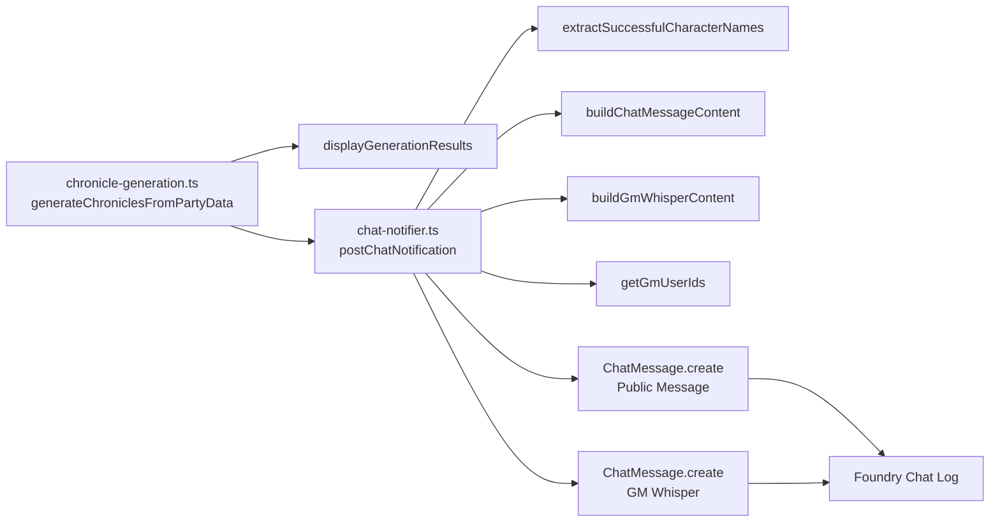

# Design Document: Chronicle Chat Notification

## Overview

This feature adds an automatic Foundry VTT chat message when chronicle generation completes successfully. After `processAllPartyMembers` finishes and `displayGenerationResults` shows the GM's `ui.notifications` toast, a new `ChatNotifier` module posts a single `ChatMessage` to the Foundry chat log. The message lists the scenario name, the character names that received chronicles, and download instructions.

The chat message is visible to all users, persists in the chat log for players who connect later, and identifies the speaker as the `pfs-chronicle-generator` module rather than the GM's user identity. If posting fails, the error is logged to the console and the generation flow completes normally — the chat notification is fire-and-forget.

Additionally, a second whispered chat message is posted to GM users only, informing them that a zip archive of all generated chronicle sheets is available for download from the Party sheet's Society tab. This whisper uses the same fire-and-forget error handling pattern and module speaker alias as the public message.

## Architecture

The feature introduces a single new module, `ChatNotifier`, with three pure functions (`buildChatMessageContent`, `buildGmWhisperContent`, and `extractSuccessfulCharacterNames`), one helper function (`getGmUserIds`), and one async function (`postChatNotification`) that calls the Foundry `ChatMessage.create` API twice — once for the public message and once for the GM whisper. The integration point is `generateChroniclesFromPartyData` in `chronicle-generation.ts`, which calls `postChatNotification` after `displayGenerationResults`.



### Integration Points

| Module | Change |
|--------|--------|
| `chronicle-generation.ts` | Call `postChatNotification` after `displayGenerationResults` in `generateChroniclesFromPartyData` |
| `chat-notifier.ts` | Module with `postChatNotification`, `buildChatMessageContent`, `buildGmWhisperContent`, `extractSuccessfulCharacterNames`, `getGmUserIds` |

### Design Decisions

1. **Separate module, not inline** — The chat notification logic is isolated in its own module (`chat-notifier.ts`) rather than embedded in `chronicle-generation.ts`. This keeps `chronicle-generation.ts` focused on PDF generation and follows the Single Responsibility Principle. It also makes the pure functions (`buildChatMessageContent`, `extractSuccessfulCharacterNames`) independently testable.

2. **Fire-and-forget with try/catch** — The `postChatNotification` call is wrapped in a try/catch inside `generateChroniclesFromPartyData`. If it throws, the error is logged via the existing `error()` logger and execution continues. This satisfies Requirement 4 (error resilience) without complicating the generation flow.

3. **Module speaker alias** — The `ChatMessage.create` call uses `speaker: { alias: 'PFS Chronicle Generator' }` to identify the message as coming from the module, not the GM. This is the standard Foundry VTT pattern for module-originated messages.

4. **HTML content with inline styles** — The message uses HTML formatting with minimal inline styles for readability within the Foundry chat sidebar's default width. No external CSS is needed since chat messages support inline HTML.

5. **Pure function for message building** — `buildChatMessageContent` is a pure function that takes a scenario name and character names array, returning an HTML string. This makes it trivially testable with property-based tests without needing Foundry VTT mocks. The same pattern is used for `buildGmWhisperContent`, which returns the GM whisper HTML.

6. **Separate GM whisper message** — The GM whisper is a second `ChatMessage.create` call with a `whisper` array containing GM user IDs. This keeps the public and private messages cleanly separated. The `getGmUserIds` helper isolates the Foundry `game.users` access for testability.

7. **`game` global type declaration** — The `game` global is declared with a minimal type covering only the `users` array needed by `getGmUserIds`. This follows the same pattern as the existing `ChatMessage` declaration — narrow types for Foundry globals used by this module.

## Components and Interfaces

### New Module: `scripts/handlers/chat-notifier.ts`

```typescript
/**
 * Extracts character names from successful generation results.
 *
 * @param results - Array of GenerationResult from processAllPartyMembers
 * @returns Array of character names where generation succeeded
 */
function extractSuccessfulCharacterNames(
  results: GenerationResult[]
): string[]

/**
 * Builds the HTML content for the chat notification message.
 *
 * The message includes:
 * - A header with the scenario name
 * - A list of character names that received chronicles
 * - Download instructions for players
 *
 * @param scenarioName - The scenario name from shared form fields
 * @param characterNames - Array of successfully generated character names
 * @returns HTML string for the ChatMessage content
 */
function buildChatMessageContent(
  scenarioName: string,
  characterNames: string[]
): string

/**
 * Builds the HTML content for the GM whisper message.
 *
 * The message informs the GM that a zip archive of all generated
 * chronicle sheets is available for download from the Party sheet's
 * Society tab.
 *
 * @returns HTML string for the whispered ChatMessage content
 */
function buildGmWhisperContent(): string

/**
 * Returns the user IDs of all GM users from the Foundry game.users global.
 *
 * @returns Array of user ID strings for GM users
 */
function getGmUserIds(): string[]

/**
 * Posts a chat notification after successful chronicle generation.
 *
 * Posts two messages:
 * 1. A public message visible to all users with scenario name,
 *    character names, and download instructions.
 * 2. A whispered message visible only to GMs about the archive download.
 *
 * Skips posting if there are zero successful results.
 * Catches and logs any errors without re-throwing.
 *
 * @param results - Array of GenerationResult from processAllPartyMembers
 * @param scenarioName - The scenario name from shared form fields
 */
async function postChatNotification(
  results: GenerationResult[],
  scenarioName: string
): Promise<void>
```

### Modified Module: `chronicle-generation.ts`

The `generateChroniclesFromPartyData` function gains a Step 5 after the existing Step 4:

```typescript
async function generateChroniclesFromPartyData(
  data: any,
  partyActors: any[],
  partyActor: FlagActor
): Promise<void> {
  // Steps 1-3: unchanged (validate, load layout, process members)

  // Step 4: Display summary notifications (existing)
  displayGenerationResults(results);

  // Step 5: Post chat notification (NEW)
  try {
    await postChatNotification(results, data.shared.scenarioName);
  } catch (err) {
    error('Failed to post chat notification', err);
  }
}
```

### HTML Message Template

The `buildChatMessageContent` function produces HTML structured as:

```html
<div>
  <p><strong>Chronicles generated for: {scenarioName}</strong></p>
  <p>The following characters have chronicles ready:</p>
  <ul>
    <li>{characterName1}</li>
    <li>{characterName2}</li>
    ...
  </ul>
  <p><em>To download: Open your character sheet → Society tab → Download Chronicle button</em></p>
</div>
```

### GM Whisper HTML Template

The `buildGmWhisperContent` function produces HTML structured as:

```html
<div>
  <p><strong>Chronicle archive available</strong></p>
  <p><em>A zip archive of all generated chronicle sheets is ready for download. Open the Party sheet → Society tab → Download Archive of Party Chronicles button.</em></p>
</div>
```

### ChatMessage.create Calls

Public message:

```typescript
await ChatMessage.create({
  content: htmlContent,
  speaker: { alias: 'PFS Chronicle Generator' },
  whisper: [],  // empty array = visible to all users
});
```

GM whisper:

```typescript
await ChatMessage.create({
  content: whisperContent,
  speaker: { alias: 'PFS Chronicle Generator' },
  whisper: getGmUserIds(),  // GM user IDs only
});
```

### `game` Global Type Declaration

```typescript
declare const game: {
  users: Array<{ id: string; isGM: boolean }>;
};
```

This follows the same pattern as the existing `ChatMessage` declaration — a narrow type covering only the fields used by this module.

## Data Models

No new data models or persistent storage are introduced. The feature uses the existing `GenerationResult` interface to determine which characters succeeded, and the existing `SharedFields.scenarioName` for the message content.

### ChatMessage.create Input

The Foundry VTT `ChatMessage.create` method accepts a data object:

```typescript
interface ChatMessageCreateData {
  content: string;           // HTML content of the message
  speaker: {
    alias: string;           // Display name for the speaker
  };
  whisper: string[];         // Empty array = visible to all; GM user IDs = GM-only whisper
}
```

This is a Foundry VTT API type, not a new type defined by this feature. The public message uses `whisper: []` and the GM whisper uses `whisper: getGmUserIds()`.


## Correctness Properties

*A property is a characteristic or behavior that should hold true across all valid executions of a system — essentially, a formal statement about what the system should do. Properties serve as the bridge between human-readable specifications and machine-verifiable correctness guarantees.*

### Property 1: Successful name extraction preserves exactly the successful results

*For any* array of `GenerationResult` objects (with arbitrary success/failure combinations), `extractSuccessfulCharacterNames` should return an array containing exactly the `characterName` values of results where `success` is `true`, in the same order they appear in the input.

**Validates: Requirements 1.1, 1.3, 1.5**

### Property 2: Message content contains all required elements

*For any* non-empty scenario name and non-empty array of character names, `buildChatMessageContent(scenarioName, characterNames)` should produce an HTML string that:
- Contains the scenario name inside a `<strong>` tag
- Contains each character name inside an `<li>` tag
- Contains the download instruction text ("character sheet", "Society tab", "Download Chronicle") inside an `<em>` tag

**Validates: Requirements 1.2, 1.3, 1.4, 3.1, 3.2, 3.3**

### Property 3: Chat notifications are posted if and only if successes exist

*For any* array of `GenerationResult` objects and any scenario name, `postChatNotification` calls `ChatMessage.create` exactly twice (once for the public message, once for the GM whisper) if the array contains at least one result with `success: true`, and does not call `ChatMessage.create` at all if all results have `success: false`.

**Validates: Requirements 1.1, 1.5, 5.1**

### Property 4: GM whisper content contains all required elements

*For any* invocation of `buildGmWhisperContent()`, the returned HTML string should contain text about a zip archive being available for download, and instructions to open the Party sheet, navigate to the Society tab, and click the Download Archive of Party Chronicles button.

**Validates: Requirements 5.2, 5.3**

## Error Handling

| Scenario | Handling |
|----------|----------|
| `ChatMessage.create` throws for public message | `postChatNotification` catches the error and calls `error()` from the logger utility. The error does not propagate to `generateChroniclesFromPartyData`. No `ui.notifications` call is made for the chat failure. The GM whisper is still attempted. |
| `ChatMessage.create` throws for GM whisper | Caught and logged separately via `error()`. Does not affect the public message (already posted) or the generation flow. |
| `ChatMessage.create` rejects with a network error | Same as above — caught and logged. |
| All generation results are failures | `postChatNotification` returns early without calling `ChatMessage.create`. No chat message or whisper is posted. |
| Scenario name is empty string | The message is still posted (the scenario name area will be empty). The generation succeeded, so players should still be notified. |
| Character name contains HTML special characters | Foundry VTT's `ChatMessage` rendering handles HTML escaping. The `buildChatMessageContent` function uses string interpolation into HTML, but Foundry sanitizes chat content. For defense-in-depth, character names should be text-escaped before insertion. |
| `game.users` is empty or contains no GMs | `getGmUserIds()` returns an empty array. The whisper `ChatMessage.create` call proceeds with `whisper: []`, making it visible to all users. This is a graceful degradation — the GM still sees the message. |

## Testing Strategy

### Property-Based Testing

The project uses `fast-check` (already in devDependencies) for property-based testing. Each correctness property above will be implemented as a single property-based test with a minimum of 100 iterations.

**Library:** `fast-check`

**Test file:** `scripts/handlers/chat-notifier.pbt.test.ts`

Each test will be tagged with a comment referencing the design property:
```typescript
// Feature: chronicle-chat-notification, Property 1: Successful name extraction preserves exactly the successful results
```

**Generators needed:**
- `GenerationResult` generator: `fc.record({ characterId: fc.string({ minLength: 1 }), characterName: fc.string({ minLength: 1, maxLength: 50 }), success: fc.boolean() })`
- Results array generator: `fc.array(generationResultArbitrary, { minLength: 1, maxLength: 10 })`
- Scenario name generator: `fc.string({ minLength: 1, maxLength: 100 })`
- Character names generator: `fc.array(fc.string({ minLength: 1, maxLength: 50 }), { minLength: 1, maxLength: 10 })`

### Unit Testing

**Test file:** `scripts/handlers/chat-notifier.test.ts`

Unit tests cover specific examples, edge cases, and integration points:

- `extractSuccessfulCharacterNames` with an empty array returns empty array (edge case)
- `buildChatMessageContent` with a single character name produces valid HTML (example)
- `buildGmWhisperContent` returns HTML containing archive and Party sheet instructions (example for 5.2, 5.3)
- `postChatNotification` calls `ChatMessage.create` with `whisper: []` for public message (example for 2.1)
- `postChatNotification` calls `ChatMessage.create` with `speaker.alias` set to `'PFS Chronicle Generator'` (example for 2.3)
- `postChatNotification` calls `ChatMessage.create` with GM user IDs in `whisper` array for the whisper message (example for 5.1)
- `postChatNotification` uses `speaker.alias` of `'PFS Chronicle Generator'` for the whisper message (example for 5.4)
- `postChatNotification` logs error when `ChatMessage.create` throws (example for 4.1)
- `postChatNotification` does not throw when `ChatMessage.create` throws (example for 4.2)
- `postChatNotification` does not call `ui.notifications` when `ChatMessage.create` throws (example for 4.3)
- `postChatNotification` logs error when whisper `ChatMessage.create` throws but public message succeeds (example for 5.6)
- `getGmUserIds` returns IDs of users where `isGM` is true (example)

### Test Organization

Following the project's existing pattern, property-based tests use the `.pbt.test.ts` suffix and unit tests use the `.test.ts` suffix. Both are co-located in `scripts/handlers/` alongside the source file they test.
