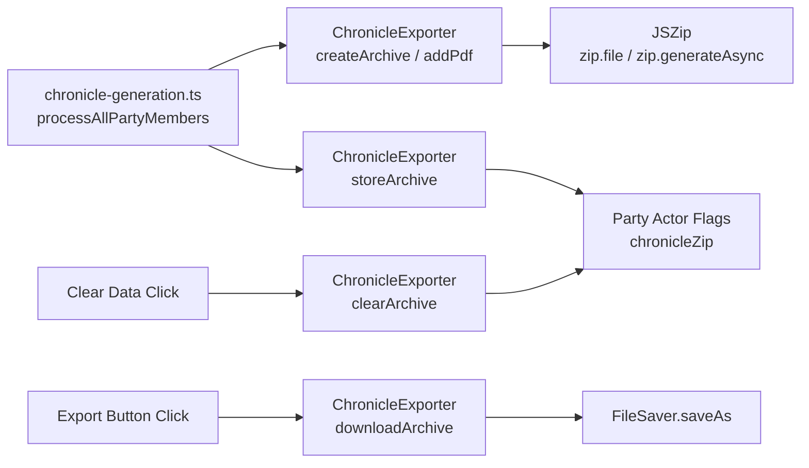

# Design Document: Chronicle Export

## Overview

This feature adds bulk chronicle export to the PFS Chronicle Generator module. During chronicle generation, each filled PDF is incrementally added to a zip archive. The finalized zip is stored as a base64 string on the Party actor's flags. A new Export button on the Society tab downloads the stored zip, giving GMs a single-click way to archive and distribute chronicles outside of Foundry VTT.

The design integrates with the existing chronicle generation pipeline (`chronicle-generation.ts`), the existing file download pattern in `main.ts` (atob → Uint8Array → Blob → `FileSaver.saveAs`), and the existing `sanitizeFilename` / `generateChronicleFilename` utilities.

## Architecture

The feature introduces a new module, `ChronicleExporter`, that encapsulates zip construction, storage, download, and lifecycle management. It hooks into two existing workflows:

1. **Chronicle Generation** — `processAllPartyMembers` in `chronicle-generation.ts` is modified to create a zip archive before the per-actor loop, add each successfully generated PDF to the zip, and store the finalized zip on the Party actor after the loop completes.
2. **Clear Data** — `handleClearButtonConfirmed` in `event-listener-helpers.ts` is modified to also clear the zip from the Party actor's flags.



### Integration Points

The feature touches these existing modules:

| Module | Change |
|--------|--------|
| `chronicle-generation.ts` | Call `ChronicleExporter` to build and store zip during `processAllPartyMembers` |
| `event-listener-helpers.ts` | Add `attachExportButtonListener`, modify `handleClearButtonConfirmed` to clear zip |
| `dom-selectors.ts` | Add `EXPORT_CHRONICLES` button selector |
| `party-chronicle-filling.hbs` | Add Export button to the actions section |
| `package.json` | Add `jszip` as a production dependency |

### Design Decisions

1. **JSZip** — Chosen as the zip library because it is the most widely used client-side zip library, supports async generation, works in all browsers, and has no server-side requirements. It is well-maintained with 9k+ GitHub stars.

2. **Zip built during generation, not on-demand** — Building the zip incrementally during generation avoids re-reading all actor flags on export click. The zip is ready the moment generation completes.

3. **Base64 storage on Party actor flags** — Consistent with how individual chronicle PDFs are already stored on actor flags. Foundry VTT flags support string storage, and base64 is the established pattern in this codebase.

4. **Filename deduplication with numeric suffix** — If two actors produce the same chronicle filename (e.g., two characters with the same name playing the same scenario), subsequent filenames get `_2`, `_3`, etc. This is simpler and more predictable than UUID-based approaches.

5. **Reuse existing download pattern** — The `atob → Uint8Array → Blob → FileSaver.saveAs` pattern from `main.ts` (lines 160-180) is proven and consistent. The only difference is the MIME type (`application/zip` instead of `application/pdf`).

## Components and Interfaces

### New Module: `scripts/handlers/chronicle-exporter.ts`

```typescript
/**
 * Creates a new empty zip archive for chronicle collection.
 * Called at the start of chronicle generation.
 */
function createArchive(): JSZip

/**
 * Adds a decoded PDF to the zip archive with a deduplicated filename.
 * Called after each successful PDF generation.
 *
 * @param archive - The JSZip instance
 * @param pdfBytes - The raw PDF bytes (Uint8Array)
 * @param filename - The desired filename (from generateChronicleFilename)
 * @param existingFilenames - Set of filenames already in the archive
 * @returns The actual filename used (may have numeric suffix)
 */
function addPdfToArchive(
  archive: JSZip,
  pdfBytes: Uint8Array,
  filename: string,
  existingFilenames: Set<string>
): string

/**
 * Deduplicates a filename by appending _2, _3, etc. if it already exists.
 *
 * @param filename - The desired filename
 * @param existingFilenames - Set of filenames already used
 * @returns A unique filename
 */
function deduplicateFilename(
  filename: string,
  existingFilenames: Set<string>
): string

/**
 * Finalizes the zip and stores it as base64 on the Party actor's flags.
 *
 * @param archive - The JSZip instance with all PDFs added
 * @param partyActor - The Foundry Party actor
 */
async function storeArchive(
  archive: JSZip,
  partyActor: any
): Promise<void>

/**
 * Downloads the stored zip archive from the Party actor's flags.
 * Uses the existing atob → Uint8Array → Blob → FileSaver.saveAs pattern.
 *
 * @param partyActor - The Foundry Party actor
 * @param scenarioName - Scenario name from shared fields
 * @param eventDate - Event date from shared fields
 */
function downloadArchive(
  partyActor: any,
  scenarioName: string,
  eventDate: string
): void

/**
 * Generates the zip filename from scenario name, event date, and current time.
 * Falls back to "chronicles.zip" if scenario name and event date are empty.
 *
 * @param scenarioName - Scenario name from shared fields
 * @param eventDate - Event date string (YYYY-MM-DD)
 * @returns Sanitized zip filename
 */
function generateZipFilename(
  scenarioName: string,
  eventDate: string
): string

/**
 * Removes the zip archive from the Party actor's flags.
 *
 * @param partyActor - The Foundry Party actor
 */
async function clearArchive(partyActor: any): Promise<void>

/**
 * Checks whether a zip archive exists on the Party actor's flags.
 *
 * @param partyActor - The Foundry Party actor
 * @returns true if a zip archive is stored
 */
function hasArchive(partyActor: any): boolean
```

### Modified Module: `chronicle-generation.ts`

The `processAllPartyMembers` function gains zip-building logic:

```typescript
async function processAllPartyMembers(
  data: any,
  partyActors: any[],
  layout: Layout,
  layoutId: string,
  blankChroniclePath: string,
  partyActor: any  // NEW: the Party actor for zip storage
): Promise<GenerationResult[]>
```

Inside the loop, after `pdfDoc.save()` produces `modifiedPdfBytes`, the bytes are also added to the zip archive. After the loop, the finalized zip is stored on the Party actor.

### Modified Module: `dom-selectors.ts`

```typescript
export const BUTTON_SELECTORS = {
  // ... existing selectors
  EXPORT_CHRONICLES: '#exportChronicles',
} as const;
```

### Modified Template: `party-chronicle-filling.hbs`

A new Export button is added to the actions section, adjacent to the existing buttons:

```handlebars
<button type="button" id="exportChronicles" 
  class="icon fa-solid fa-file-zipper" 
  data-tooltip aria-label="Export Chronicles"
  {{#unless hasChronicleZip}}disabled{{/unless}}>
</button>
```

The `PartyChronicleContext` interface gains a `hasChronicleZip: boolean` field to control the button's initial disabled state.

## Data Models

### Zip Archive Storage

The zip archive is stored as a base64-encoded string on the Party actor's flags:

```
Party Actor Flags:
  pfs-chronicle-generator.chronicleZip: string (base64-encoded zip)
```

This follows the same pattern as individual chronicle PDFs stored on actor flags under `pfs-chronicle-generator.chroniclePdf`.

### Zip Filename Format

```
{sanitized_scenario_name}_{event_date}_{download_time}.zip
```

- `sanitized_scenario_name` — Result of `sanitizeFilename(scenarioName)`
- `event_date` — The event date from shared fields (YYYY-MM-DD format, already sanitized)
- `download_time` — Current time as HHMM (e.g., `1430` for 2:30 PM)
- Fallback: `chronicles.zip` when both scenario name and event date are empty

### Filename Deduplication

When adding PDFs to the zip, filenames are tracked in a `Set<string>`. If a filename collision occurs:

```
Valeros_the_Fighter_5-01.pdf     → Valeros_the_Fighter_5-01.pdf
Valeros_the_Fighter_5-01.pdf     → Valeros_the_Fighter_5-01_2.pdf
Valeros_the_Fighter_5-01.pdf     → Valeros_the_Fighter_5-01_3.pdf
```

The suffix is inserted before the `.pdf` extension.

### Context Extension

```typescript
export interface PartyChronicleContext {
  // ... existing fields
  hasChronicleZip: boolean;  // NEW: controls Export button enabled state
}
```


## Correctness Properties

*A property is a characteristic or behavior that should hold true across all valid executions of a system — essentially, a formal statement about what the system should do. Properties serve as the bridge between human-readable specifications and machine-verifiable correctness guarantees.*

### Property 1: PDF added to zip with correct filename

*For any* valid actor name and blank chronicle path, adding a PDF to the archive should result in the archive containing exactly one file whose name equals the output of `generateChronicleFilename(actorName, blankChroniclePath)`.

**Validates: Requirements 1.2**

### Property 2: Filename deduplication produces unique names

*For any* base filename and any number of duplicate insertions (2 or more), `deduplicateFilename` should produce filenames that are all unique, preserve the `.pdf` extension, and follow the pattern `{base}_N.pdf` where N starts at 2 for the first duplicate.

**Validates: Requirements 1.3**

### Property 3: Zip archive base64 round trip

*For any* valid zip archive (containing one or more PDF entries), storing it as base64 on the Party actor and then retrieving and decoding it should produce a byte-identical zip.

**Validates: Requirements 1.5, 3.1**

### Property 4: hasArchive reflects flag presence

*For any* Party actor, `hasArchive(partyActor)` returns `true` if and only if the actor has a non-empty string stored under the `pfs-chronicle-generator.chronicleZip` flag.

**Validates: Requirements 2.2, 2.3**

### Property 5: Zip filename format

*For any* non-empty scenario name and non-empty event date, `generateZipFilename(scenarioName, eventDate)` should produce a filename matching the pattern `{sanitized_name}_{date}_{HHMM}.zip` where the name portion equals `sanitizeFilename(scenarioName)`.

**Validates: Requirements 3.2**

### Property 6: clearArchive removes the archive

*For any* Party actor that has a stored zip archive, calling `clearArchive(partyActor)` should result in `hasArchive(partyActor)` returning `false`.

**Validates: Requirements 5.1**

### Property 7: storeArchive replaces previous archive

*For any* Party actor with an existing zip archive, calling `storeArchive` with a new archive should result in the stored archive being the new one (not the old one), verifiable by retrieving and comparing the stored base64 string.

**Validates: Requirements 5.3**

## Error Handling

| Scenario | Handling |
|----------|----------|
| PDF generation fails for an actor | Skip that actor's PDF — do not add to zip. The existing `GenerationResult` tracks failures. The zip contains only successful PDFs. |
| All PDF generations fail | No zip is stored (empty zip is not stored). Export button remains disabled. |
| JSZip `generateAsync` fails | Catch the error, display a Foundry error notification (`ui.notifications.error`), and do not store a partial zip. |
| Export button clicked but no zip in flags | Button is disabled, so this shouldn't happen. Defensive check: if `chronicleZip` flag is falsy, show error notification and return early. |
| Base64 decode fails during download | Catch the error, display a Foundry error notification with the failure description. |
| `FileSaver.saveAs` fails | Catch the error, display a Foundry error notification. |
| Scenario name contains filesystem-unsafe characters | `sanitizeFilename` replaces them with underscores (existing behavior). |
| Both scenario name and event date are empty | Fall back to `chronicles.zip` filename. |

## Testing Strategy

### Property-Based Testing

The project already uses `fast-check` (v4.5.3) for property-based testing. Each correctness property above will be implemented as a single property-based test with a minimum of 100 iterations.

**Library:** `fast-check` (already in devDependencies)

**Test file:** `scripts/chronicle-export.pbt.test.ts`

Each test will be tagged with a comment referencing the design property:
```typescript
// Feature: chronicle-export, Property 1: PDF added to zip with correct filename
```

**Generators needed:**
- Actor name generator: `fc.string({ minLength: 1, maxLength: 50 })` with printable characters
- Chronicle path generator: `fc.stringMatching(/^modules\/[a-z0-9-]+\/[a-z0-9-]+\.pdf$/)` or similar
- PDF bytes generator: Use a minimal valid PDF byte array (constant, since JSZip doesn't validate PDF content)
- Scenario name generator: `fc.string({ minLength: 1, maxLength: 100 })`
- Event date generator: `fc.date()` formatted as YYYY-MM-DD

### Unit Testing

**Test file:** `scripts/chronicle-export.test.ts`

Unit tests cover specific examples, edge cases, and integration points:

- `createArchive` returns an empty JSZip instance (example for 1.1)
- Skipping failed/empty PDFs (example for 1.4)
- Export button exists in rendered template (example for 2.1)
- Button state updates after generation (example for 2.4)
- Fallback filename `chronicles.zip` when inputs are empty (edge case for 3.3)
- Error notification on download failure (example for 4.1)
- Success notification on download completion (example for 4.2)

### Test Organization

Following the project's existing pattern, property-based tests use the `.pbt.test.ts` suffix and unit tests use the `.test.ts` suffix. Both are co-located in the `scripts/` directory alongside the source files they test.
