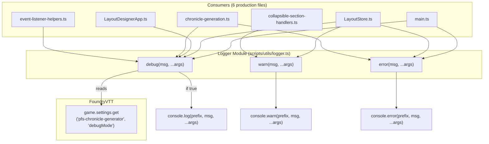

# Design Document: Debug Logging

## Overview

This feature introduces a centralized `Logger` utility module that replaces all scattered `console.log`, `console.warn`, and `console.error` calls across the codebase. The Logger provides three functions (`debug`, `warn`, `error`) and gates debug-level output behind a FoundryVTT world-scoped boolean setting (`debugMode`). Warnings and errors always emit regardless of the setting. All messages are prefixed with `[PFS Chronicle]` for easy identification in the browser console.

### Current State

Console calls are spread across 6 production files:

| File | `console.log` | `console.warn` | `console.error` |
|------|:---:|:---:|:---:|
| `main.ts` | 3 | 0 | 1 |
| `LayoutStore.ts` | 3 | 2 | 2 |
| `LayoutDesignerApp.ts` | 1 | 0 | 0 |
| `handlers/chronicle-generation.ts` | 1 | 0 | 1 |
| `handlers/event-listener-helpers.ts` | 4 | 0 | 0 |
| `handlers/collapsible-section-handlers.ts` | 0 | 13 | 0 |

All `console.log` calls are debug traces (layout browsing, form initialization, clear/re-render flow). All `console.warn` calls are defensive guards for missing DOM elements or invalid data. All `console.error` calls are genuine error conditions (initialization failures, PDF generation failures, form rendering failures).

### Design Goals

- Single import for all logging needs across the module
- Zero debug noise in the browser console by default
- GM-controllable toggle via the FoundryVTT module settings UI
- No behavioral regression — same messages at same severity levels when debug mode is on
- Graceful fallback to raw `console` calls if the Logger cannot read the setting

## Architecture

The Logger is a stateless utility module that reads the `debugMode` setting from `game.settings` on every call. It does not cache the setting value, which means changes take effect immediately without a page reload.



### Key Design Decisions

1. **Stateless reads vs. cached setting**: The Logger reads `game.settings` on every `debug()` call rather than caching the value. This avoids stale state and satisfies Requirement 3.3 (no reload needed). The overhead of a `game.settings.get()` call is negligible since it's a synchronous in-memory lookup in FoundryVTT.

2. **Module-scoped functions vs. class**: The Logger exports plain functions (`debug`, `warn`, `error`) rather than a class instance. This matches the existing codebase style (utility modules export functions) and keeps imports simple.

3. **Placement in `scripts/utils/`**: The Logger lives alongside other utility modules (`filename-utils.ts`, `pdf-utils.ts`, etc.) since it's a cross-cutting utility with no domain logic.

4. **Setting registration in `registerSettings()`**: The `debugMode` setting is registered in the existing `registerSettings()` function in `main.ts`, alongside the other visible settings (gmName, gmPfsNumber, etc.). This keeps all setting registrations in one place.

5. **Fallback behavior**: If `game.settings.get()` throws (e.g., during early initialization before settings are registered), the `debug` function falls back to emitting via `console.log`. This prevents silent failures per Requirement 5.3.

6. **No global exposure**: The Logger is imported as a standard ES module. There is no need to expose it globally as `PfsChronicleLogger` since all consumers are within the module bundle. If future need arises, the module can be attached to `game.modules.get(MODULE_ID).api`.


## Components and Interfaces

### Logger Module (`scripts/utils/logger.ts`)

```typescript
/**
 * Centralized logging utility for the PFS Chronicle Generator module.
 *
 * - debug(): gated by the debugMode setting; emits via console.log
 * - warn(): always emits via console.warn
 * - error(): always emits via console.error
 *
 * All messages are prefixed with LOG_PREFIX for console filtering.
 */

const MODULE_ID = 'pfs-chronicle-generator';
const LOG_PREFIX = '[PFS Chronicle]';

/**
 * Reads the debugMode setting. Returns true if debug output is enabled.
 * Falls back to false if the setting cannot be read (e.g., before init).
 */
function isDebugEnabled(): boolean {
  try {
    return game.settings.get(MODULE_ID, 'debugMode') === true;
  } catch {
    return false;
  }
}

/**
 * Emits a debug-level message to console.log when debugMode is enabled.
 * Falls back to console.log if game.settings is unavailable.
 */
export function debug(message: string, ...args: unknown[]): void {
  try {
    if (!isDebugEnabled()) return;
  } catch {
    // Fallback: emit anyway if we can't read the setting
  }
  console.log(LOG_PREFIX, message, ...args);
}

/**
 * Emits a warning message to console.warn unconditionally.
 */
export function warn(message: string, ...args: unknown[]): void {
  console.warn(LOG_PREFIX, message, ...args);
}

/**
 * Emits an error message to console.error unconditionally.
 */
export function error(message: string, ...args: unknown[]): void {
  console.error(LOG_PREFIX, message, ...args);
}
```

### Debug Mode Setting Registration

Added to the existing `registerSettings()` function in `main.ts`:

```typescript
game.settings.register(MODULE_ID, 'debugMode', {
  name: 'Enable Debug Logging',
  hint: 'When enabled, verbose debug messages are printed to the browser console. Useful for troubleshooting.',
  scope: 'world',
  config: true,
  type: Boolean,
  default: false,
});
```

### Import Pattern for Consumers

Each production file replaces its direct `console` calls with Logger imports:

```typescript
import { debug, warn, error } from '../utils/logger.js';

// Before:
console.log('[PFS Chronicle] Browsing for layouts in', path);
console.warn(`Layout file ${file} missing required fields`);
console.error('Failed to load layouts', err);

// After:
debug('Browsing for layouts in', path);
warn(`Layout file ${file} missing required fields`);
error('Failed to load layouts', err);
```

Note: The `[PFS Chronicle]` prefix is no longer included in the message string at the call site — the Logger prepends it automatically. Some existing calls already include the prefix (e.g., `'[PFS Chronicle] Browsing for layouts in'`), and those must be updated to remove the redundant prefix.

### File-by-File Replacement Summary

| File | Replacement |
|------|-------------|
| `main.ts` | 3× `console.log` → `debug`, 1× `console.error` → `error` |
| `LayoutStore.ts` | 3× `console.log` → `debug`, 2× `console.warn` → `warn`, 2× `console.error` → `error` |
| `LayoutDesignerApp.ts` | 1× `console.log` → `debug` |
| `handlers/chronicle-generation.ts` | 1× `console.log` → `debug`, 1× `console.error` → `error` |
| `handlers/event-listener-helpers.ts` | 4× `console.log` → `debug` |
| `handlers/collapsible-section-handlers.ts` | 13× `console.warn` → `warn` |

## Data Models

### Debug Mode Setting

| Property | Value |
|----------|-------|
| Module ID | `'pfs-chronicle-generator'` |
| Setting Key | `'debugMode'` |
| Type | `Boolean` |
| Default | `false` |
| Scope | `'world'` |
| Config | `true` (visible in module settings UI) |
| Name | `'Enable Debug Logging'` |
| Hint | `'When enabled, verbose debug messages are printed to the browser console. Useful for troubleshooting.'` |

### Logger Function Signatures

```typescript
export function debug(message: string, ...args: unknown[]): void;
export function warn(message: string, ...args: unknown[]): void;
export function error(message: string, ...args: unknown[]): void;
```

All three functions share the same signature pattern: a required message string followed by optional additional arguments (matching the `console.log/warn/error` variadic pattern). The `unknown[]` rest parameter preserves type safety while allowing any additional arguments to be passed through.


## Correctness Properties

*A property is a characteristic or behavior that should hold true across all valid executions of a system — essentially, a formal statement about what the system should do. Properties serve as the bridge between human-readable specifications and machine-verifiable correctness guarantees.*

### Property 1: Log prefix is prepended to all output

*For any* message string and any additional arguments, when any Logger function (`debug`, `warn`, or `error`) emits output, the first argument passed to the underlying console method shall be the `[PFS Chronicle]` prefix.

**Validates: Requirements 1.4**

### Property 2: Debug output is gated by the debugMode setting

*For any* message string, calling `debug()` shall emit via `console.log` if and only if the `debugMode` setting is `true`. When `debugMode` is `false`, `debug()` shall produce no console output.

**Validates: Requirements 3.1, 3.2**

### Property 3: Warn and error always emit regardless of debugMode

*For any* message string and any boolean value of the `debugMode` setting, calling `warn()` shall always emit via `console.warn`, and calling `error()` shall always emit via `console.error`.

**Validates: Requirements 1.5, 1.6**

### Property 4: Setting changes take effect immediately

*For any* sequence of `debugMode` setting changes interleaved with `debug()` calls, each `debug()` call shall respect the current value of the setting at the time of the call, not a previously cached value.

**Validates: Requirements 3.3**

### Property 5: Additional arguments are forwarded to the console method

*For any* message string and any list of additional arguments, the Logger function shall forward all additional arguments to the underlying console method in the same order, after the prefix and message.

**Validates: Requirements 4.7**

## Error Handling

### Logger Initialization Fallback

If `game.settings.get()` throws an exception (e.g., the setting has not been registered yet because the `init` hook hasn't fired), the `debug()` function falls back to emitting the message via `console.log` rather than silently swallowing it. This satisfies Requirement 5.3.

The `warn()` and `error()` functions do not read the setting at all, so they have no failure mode related to settings access.

### Implementation

```typescript
export function debug(message: string, ...args: unknown[]): void {
  try {
    if (!isDebugEnabled()) return;
  } catch {
    // Setting not available — fall back to emitting
  }
  console.log(LOG_PREFIX, message, ...args);
}
```

The `catch` block intentionally has no body — if we can't determine whether debug mode is on, we err on the side of emitting the message. This is the safest fallback because:
- During early initialization, debug messages may be valuable for diagnosing startup issues
- Once settings are registered (after `init` hook), the normal gating behavior takes over

### Invalid Setting Values

If the `debugMode` setting somehow contains a non-boolean value, the strict `=== true` check in `isDebugEnabled()` ensures that only an explicit `true` enables debug output. Any other value (including `undefined`, `null`, `0`, `''`) is treated as disabled.

## Testing Strategy

### Property-Based Testing

Property-based tests use `fast-check` (already a project dependency) to verify the five correctness properties above. Each property test generates random message strings and argument lists, then asserts the Logger's behavior against mocked `console` methods.

**Configuration:**
- Library: `fast-check` v4.x
- Minimum iterations: 100 per property
- Test file: `scripts/utils/logger.pbt.test.ts`
- Each test is tagged with a comment referencing its design property

**Tag format:** `Feature: debug-logging, Property {number}: {property_text}`

Each correctness property is implemented by a single property-based test:

| Property | Test Description |
|----------|-----------------|
| Property 1 | Generate random messages → verify `console.*` first arg is `[PFS Chronicle]` |
| Property 2 | Generate random messages × {true, false} debugMode → verify `console.log` called iff true |
| Property 3 | Generate random messages × {true, false} debugMode → verify `console.warn`/`console.error` always called |
| Property 4 | Generate random boolean sequences → toggle setting between `debug()` calls → verify each call matches current setting |
| Property 5 | Generate random messages + random arg arrays → verify all args forwarded in order |

### Unit Testing

Unit tests complement property tests with specific examples and edge cases:

**Test file:** `scripts/utils/logger.test.ts`

| Test | Description |
|------|-------------|
| Exports exist | `debug`, `warn`, `error` are exported functions |
| Setting registration | `registerSettings()` registers `debugMode` with correct config (scope, type, default, config) |
| Fallback on settings error | When `game.settings.get` throws, `debug()` still emits via `console.log` |
| Empty message | `debug('')` with debugMode true emits prefix + empty string |
| No direct console calls | Static analysis: no `console.log/warn/error` in production files except `logger.ts` |

### Test Environment Setup

Tests mock `game.settings.get()` to control the `debugMode` value and spy on `console.log`, `console.warn`, and `console.error` to verify output. The existing Jest + jsdom test environment is sufficient.

```typescript
// Example test setup
let mockDebugMode = false;
beforeEach(() => {
  global.game = {
    settings: {
      get: jest.fn((_moduleId: string, key: string) => {
        if (key === 'debugMode') return mockDebugMode;
        return undefined;
      }),
    },
  };
  jest.spyOn(console, 'log').mockImplementation();
  jest.spyOn(console, 'warn').mockImplementation();
  jest.spyOn(console, 'error').mockImplementation();
});
```

