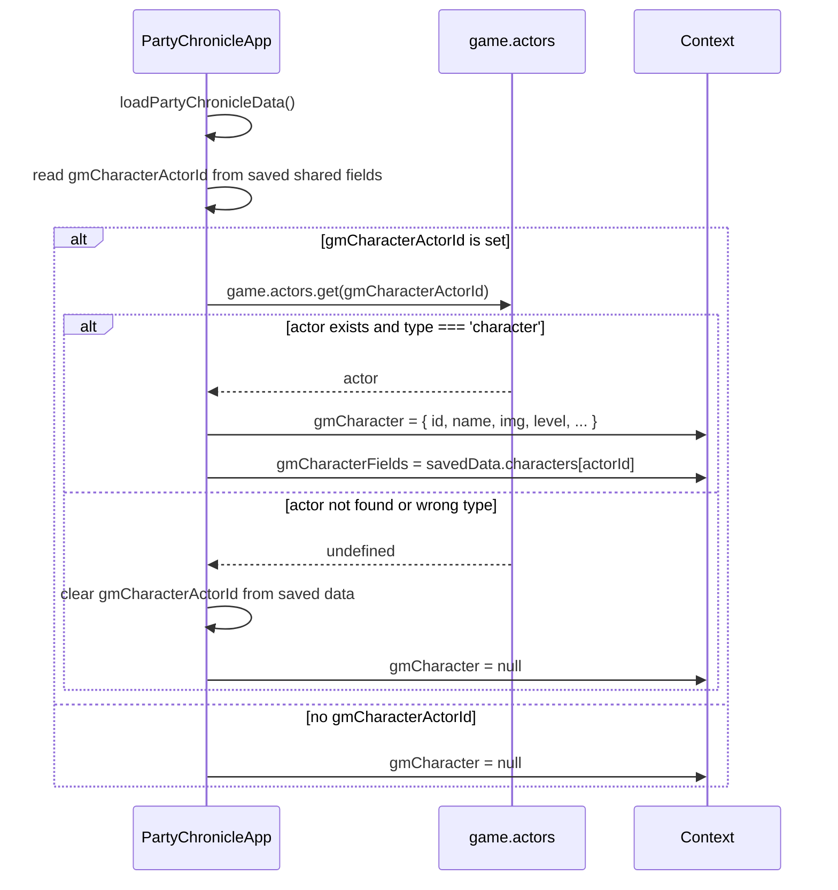
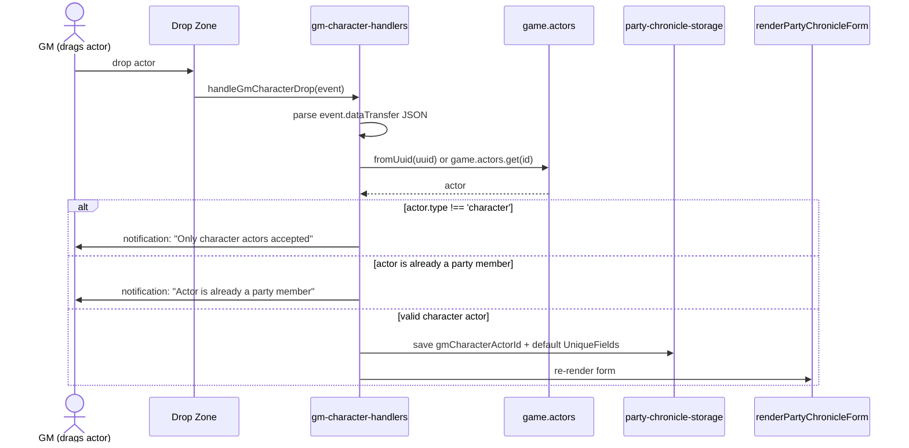

# Design Document: GM Character Party Sheet

## Overview

This feature adds a GM Character drop zone and data entry section to the Society tab of the PF2e party sheet. Currently, the chronicle generation and session reporting workflows only process party member actors. GMs who play a character for GM credit have no way to include that character in the existing pipeline.

The GM Character feature introduces a dedicated drag-and-drop target above the party member list where the GM can assign an actor as their GM credit character. Once assigned, the GM character participates in all existing workflows identically to party members: data entry, earned income calculation, chronicle PDF generation, zip archive inclusion, chat notification, and session reporting (with `isGM: true`). The GM character's PFS ID is validated against the GM PFS Number in the shared fields to catch mismatches before generation.

The design follows the existing hybrid ApplicationV2 pattern: context preparation in `PartyChronicleApp._prepareContext()`, template rendering via Handlebars, and event listener attachment in `main.ts`.

## Architecture

The GM character integrates into the existing architecture as a new data path that runs parallel to the party member path. No new top-level modules are introduced. Changes are distributed across the existing layers:

```mermaid
graph TD
    subgraph "Context Preparation"
        PCA["PartyChronicleApp._prepareContext()"]
        PCA -->|resolve gmCharacterActorId| ACTOR["Foundry game.actors.get()"]
        PCA -->|add gmCharacter to context| CTX["PartyChronicleContext"]
    end

    subgraph "Template & UI"
        HBS["party-chronicle-filling.hbs"]
        HBS -->|render| DZ["GM Character Drop Zone"]
        HBS -->|render| GMS["GM Character Section<br/>(same fields as party members)"]
    end

    subgraph "Event Handling"
        MAIN["main.ts"]
        MAIN -->|attach| DROP["Drop handler"]
        MAIN -->|attach| CLEAR_BTN["Clear GM char button"]
        MAIN -->|attach| FIELDS["GM char field listeners"]
        DROP -->|validate & save| FDE["form-data-extraction.ts"]
        CLEAR_BTN -->|remove & re-render| FDE
    end

    subgraph "Data Pipeline"
        FDE2["extractFormData()"]
        FDE2 -->|include gmCharacter| CG["chronicle-generation.ts"]
        FDE2 -->|include gmCharacter| SRH["session-report-handler.ts"]
        CG -->|generate PDF for GM char| PDF["PdfGenerator"]
        SRH -->|add SignUp with isGM:true| SRB["session-report-builder.ts"]
    end

    subgraph "Persistence"
        STORE["party-chronicle-storage.ts"]
        STORE -->|save gmCharacterActorId| WS["Foundry world settings"]
        STORE -->|save gmCharacter UniqueFields| WS
    end
```



### Key Architectural Decisions

1. **GM character stored by actor ID, not as a party member.** The GM character is persisted as `gmCharacterActorId` in `PartyChronicleData.shared` and resolved at render time via `game.actors.get()`. This avoids modifying the Foundry party membership and keeps the GM character separate from the party actor list.

2. **Reuse existing field rendering and calculation logic.** The GM character section uses the same Handlebars partial and the same earned income / treasure bundle / reputation calculation functions as party members. No duplication of business logic.

3. **GM character treated as an additional actor in generation and reporting loops.** The `processAllPartyMembers` function and `buildSessionReport` function are extended to include the GM character actor alongside the party actors, rather than creating a separate code path.

4. **Drop zone uses Foundry's native drag-and-drop data transfer.** Foundry actors dragged from the sidebar or other sheets carry a JSON payload with `{type: "Actor", uuid: "..."}`. The drop handler parses this, resolves the actor, validates it, and assigns it.

## Components and Interfaces

### Modified Interfaces

#### `SharedFields` (party-chronicle-types.ts)

Add the GM character actor ID field:

```typescript
export interface SharedFields {
  // ... existing fields ...
  
  /** Actor ID of the GM's character for GM credit (undefined if not assigned) */
  gmCharacterActorId?: string;
}
```

#### `PartyChronicleContext` (party-chronicle-types.ts)

Add the resolved GM character data for the template:

```typescript
export interface PartyChronicleContext {
  // ... existing fields ...
  
  /** Resolved GM character data for template rendering (null if not assigned) */
  gmCharacter: PartyMember | null;
  
  /** GM character's saved unique fields (null if not assigned) */
  gmCharacterFields: UniqueFields | null;
}
```

#### `PartyChronicleData` (party-chronicle-types.ts)

The `characters` map already supports arbitrary actor IDs. The GM character's unique fields are stored under its actor ID in `characters`, same as party members. The `gmCharacterActorId` in `shared` identifies which entry is the GM character.

#### `SignUp` (session-report-types.ts)

The `isGM` field is currently typed as `false` (literal). Change to `boolean`:

```typescript
export interface SignUp {
  /** Whether this sign-up is the GM's character */
  isGM: boolean;
  // ... rest unchanged ...
}
```

### New Functions

#### `handlers/gm-character-handlers.ts` (new module)

```typescript
/** Handles drop events on the GM character drop zone */
export async function handleGmCharacterDrop(
  event: DragEvent,
  container: HTMLElement,
  partyActors: PartyActor[],
  partySheet: PartySheetApp
): Promise<void>;

/** Handles the clear button click on the GM character section */
export async function handleGmCharacterClear(
  container: HTMLElement,
  partyActors: PartyActor[],
  partySheet: PartySheetApp
): Promise<void>;

/** Validates that the GM character's PFS ID matches the GM PFS Number */
export function validateGmCharacterPfsId(
  gmCharacterActor: PartyActor,
  gmPfsNumber: string
): string | null;
```

### Modified Functions

#### `extractFormData()` (form-data-extraction.ts)

Add a `gmCharacterActor` parameter (or read the GM character actor ID from the DOM) and extract its unique fields into `characters[gmActorId]`. Also extract `gmCharacterActorId` into `shared`.

#### `buildSessionReport()` (session-report-builder.ts)

Accept an optional `gmCharacterActor` and its `UniqueFields`. Build a `SignUp` entry with `isGM: true` and append it to the `signUps` array.

#### `processAllPartyMembers()` (chronicle-generation.ts)

Accept an optional GM character actor. If present, include it in the generation loop alongside party actors.

#### `validateAllCharacterFields()` (chronicle-generation.ts)

Include the GM character's unique fields in validation. Add PFS ID mismatch validation.

#### `PartyChronicleApp._prepareContext()` (PartyChronicleApp.ts)

Resolve `gmCharacterActorId` from saved data. If the actor exists and is a character type, populate `gmCharacter` and `gmCharacterFields` in the context. If the actor cannot be resolved, clear the saved ID.

#### `attachEventListeners()` (main.ts)

Attach drop zone drag/drop listeners, GM character clear button listener, and GM character field change listeners.

### DOM Selectors (dom-selectors.ts)

```typescript
export const GM_CHARACTER_SELECTORS = {
  DROP_ZONE: '#gmCharacterDropZone',
  SECTION: '#gmCharacterSection',
  CLEAR_BUTTON: '#clearGmCharacter',
  ACTOR_ID_INPUT: '#gmCharacterActorId',
} as const;
```

## Data Models

### Persistence Structure

The GM character data is stored within the existing `PartyChronicleData` structure in Foundry world settings:

```typescript
// Stored in game.settings under 'pfs-chronicle-generator.partyChronicleData'
{
  timestamp: 1234567890,
  data: {
    shared: {
      gmPfsNumber: "12345",
      gmCharacterActorId: "abc123",  // NEW: actor ID of GM character
      // ... other shared fields ...
    },
    characters: {
      "party-actor-1": { /* UniqueFields */ },
      "party-actor-2": { /* UniqueFields */ },
      "abc123": { /* UniqueFields for GM character - same structure */ }
    }
  }
}
```

### GM Character Resolution Flow



### Drop Event Data Flow



### Session Report GM Character Entry

When the GM character is assigned, the session report includes an additional `SignUp`:

```json
{
  "signUps": [
    { "isGM": false, "orgPlayNumber": 11111, "characterName": "Valeros", ... },
    { "isGM": false, "orgPlayNumber": 22222, "characterName": "Seelah", ... },
    { "isGM": true, "orgPlayNumber": 12345, "characterName": "GM's Character", ... }
  ]
}
```

The `generateGmChronicle` field in `SessionReport` remains `false` because the module generates the GM chronicle directly (it doesn't delegate to the RPG Chronicles plugin for GM chronicle generation).


## Correctness Properties

*A property is a characteristic or behavior that should hold true across all valid executions of a system — essentially, a formal statement about what the system should do. Properties serve as the bridge between human-readable specifications and machine-verifiable correctness guarantees.*

### Property 1: Valid character drop assigns GM character

*For any* Foundry actor with `type === 'character'` whose ID is not present in the party member list, dropping that actor onto the GM Character Drop Zone (whether empty or occupied) should result in that actor being assigned as the GM character, with `gmCharacterActorId` set to the actor's ID.

**Validates: Requirements 1.3, 3.3**

### Property 2: Non-character actor drop is rejected

*For any* Foundry actor with `type !== 'character'` (familiar, npc, vehicle, hazard, loot, etc.), dropping that actor onto the GM Character Drop Zone should be rejected and should not modify the current GM character assignment.

**Validates: Requirements 1.4**

### Property 3: Party member actor drop is rejected

*For any* actor whose ID exists in the current party member list, dropping that actor onto the GM Character Drop Zone should be rejected and should not modify the current GM character assignment.

**Validates: Requirements 1.5**

### Property 4: Clear removes all GM character data

*For any* assigned GM character with any set of UniqueFields values, after clearing the GM character, the saved `PartyChronicleData` should not contain `gmCharacterActorId` in `shared` and should not contain the GM character's actor ID key in `characters`.

**Validates: Requirements 3.4**

### Property 5: GM character data persistence round-trip

*For any* valid GM character actor ID and any valid set of `UniqueFields` values, saving the GM character data to storage and then loading it should produce identical `gmCharacterActorId` and `UniqueFields` values.

**Validates: Requirements 4.4, 8.1, 8.2**

### Property 6: GM character session report SignUp correctness

*For any* GM character actor with PFS data (playerNumber, characterNumber, currentFaction) and any valid `UniqueFields`, the session report's `signUps` array should contain exactly one entry where `isGM === true`, and that entry should have `orgPlayNumber`, `characterNumber`, `characterName`, `consumeReplay`, `repEarned`, and `faction` populated from the actor and UniqueFields data, while all other entries should have `isGM === false`.

**Validates: Requirements 6.1, 6.2, 6.3**

### Property 7: PFS ID mismatch produces descriptive validation error

*For any* GM character actor whose `playerNumber` differs from the `gmPfsNumber` in shared fields, validation should return an error message that contains both the GM character's PFS ID value and the expected GM PFS Number value.

**Validates: Requirements 7.1, 7.2**

### Property 8: Matching PFS IDs produce no mismatch error

*For any* PFS number string, when the GM character actor's `playerNumber` equals the `gmPfsNumber` in shared fields, validation should not return a PFS ID mismatch error.

**Validates: Requirements 7.3**

### Property 9: Stale GM character actor ID is gracefully cleared

*For any* actor ID string that cannot be resolved via `game.actors.get()` (returns undefined), the context preparation should set `gmCharacter` to `null` and clear the `gmCharacterActorId` from saved data.

**Validates: Requirements 8.3**

## Error Handling

| Scenario | Handling |
|---|---|
| Drop of non-character actor type | Reject drop, show `ui.notifications.warn()` explaining only character actors are accepted. Do not modify state. |
| Drop of actor already in party | Reject drop, show `ui.notifications.warn()` explaining the actor is already a party member. Do not modify state. |
| Drop with unparseable dataTransfer JSON | Silently ignore the drop (may be a non-actor drag). Log via `debug()`. |
| GM character actor ID cannot be resolved on load | Clear `gmCharacterActorId` from saved data, render empty drop zone. Log via `warn()`. |
| GM character PFS ID mismatch | Display inline validation error on the GM character section identifying both IDs. Do not block form interaction — only block generation/report. |
| GM character actor deleted while form is open | Next re-render (triggered by any save/change) will fail to resolve the actor and clear the assignment per the stale ID handling. |
| Error saving GM character data to world settings | Propagate error through existing `savePartyChronicleData()` error handling (logs error, throws with context). |
| PDF generation fails for GM character | Same handling as party actor failure: `GenerationResult` with `success: false` and error message. Other characters still generate. |

## Testing Strategy

### Property-Based Tests

Property-based tests use `fast-check` (already available in the project's test infrastructure via Jest). Each property test runs a minimum of 100 iterations.

Tests target the pure logic functions that can be exercised without Foundry runtime:

- **Drop validation logic** (Properties 1, 2, 3): Test the actor type check and party member duplicate check functions with generated actor objects and party lists.
- **Data cleanup on clear** (Property 4): Test that clearing removes the correct keys from a generated `PartyChronicleData` structure.
- **Persistence round-trip** (Property 5): Test save/load cycle with generated `UniqueFields` and actor IDs using a mock storage.
- **Session report SignUp** (Property 6): Test `buildSessionReport()` with generated GM character actors and UniqueFields, verifying the SignUp entry structure.
- **PFS ID validation** (Properties 7, 8): Test `validateGmCharacterPfsId()` with generated PFS number pairs.
- **Stale actor ID handling** (Property 9): Test context preparation logic with generated actor IDs against a mock `game.actors` that returns undefined.

Configuration:
- Library: `fast-check`
- Minimum iterations: 100 per property
- Tag format: `Feature: gm-character-party-sheet, Property {N}: {title}`

### Unit Tests (Example-Based)

Unit tests cover specific examples, UI rendering verification, and integration points:

- Drop zone renders with placeholder text when no GM character assigned (Req 1.2)
- GM character section displays portrait, name, Society ID, level, faction (Req 2.1)
- GM character section has "GM Credit" label and distinct CSS class (Req 2.2)
- GM character section contains all expected form fields (Req 2.3)
- Clear button exists when GM character is assigned (Req 3.1)
- Clear button handler removes assignment and re-renders (Req 3.2)
- Shared rewards apply identically to GM character (Req 4.1)
- Earned income calculation uses same formula (Req 4.2)
- GM character included in chat notification (Req 5.4)
- Validation errors display for GM character fields (Req 5.5)
- Clear Data button removes GM character data (Req 8.4)

### Integration Tests

Integration tests verify the end-to-end workflows with mocked Foundry APIs:

- Chronicle generation includes GM character PDF in zip archive (Req 5.1, 5.2)
- Chronicle generation saves PDF to GM character actor flags (Req 5.3)
- PFS ID validation runs during both generation and session report (Req 7.4)
- Auto-save includes GM character field changes (Req 4.3)
