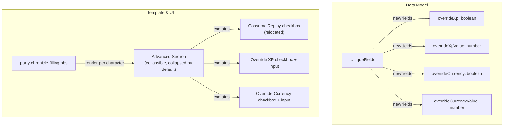
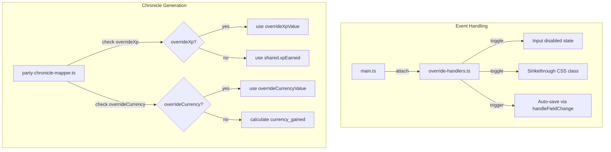
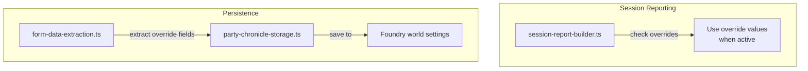
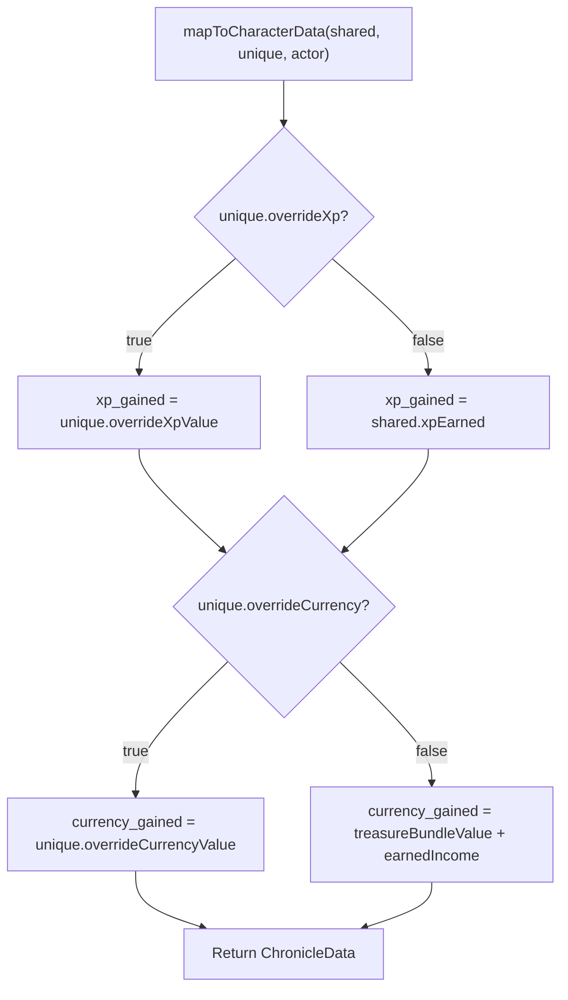
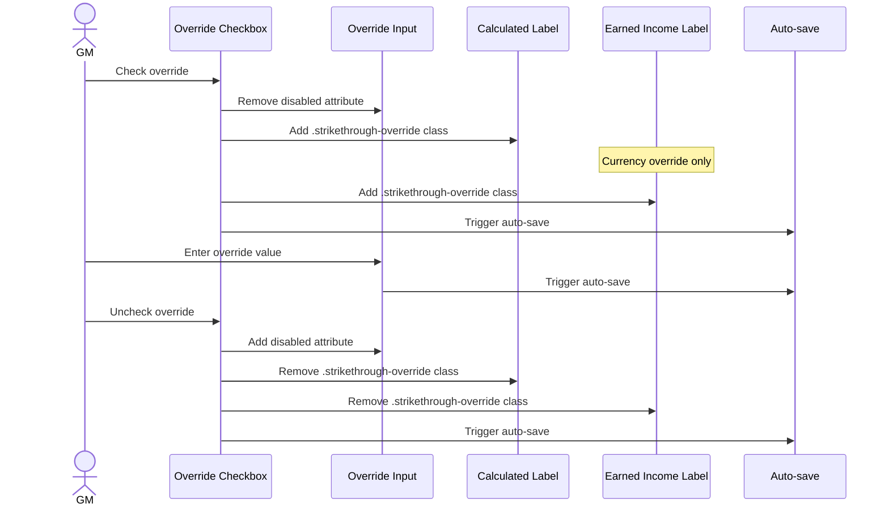

# Design Document: GM Override Values

## Overview

The PFS Chronicle Generator automatically calculates `xp_gained` and `currency_gained` for each character based on shared reward settings and per-character earned income inputs. However, feats, boons, and certain downtime activities can modify these values in ways the calculator cannot account for. This feature adds an "Advanced" collapsible section to each character card that allows the GM to override the calculated XP and currency values with explicit numeric inputs.

The design introduces override checkboxes and numeric inputs within a new collapsible "Advanced" section on each character card (both party members and GM credit character). The existing "Consume Replay" checkbox relocates into this section to reduce default-view clutter. When an override checkbox is checked, the corresponding calculated label receives strikethrough styling, and the override value replaces the calculated value in both chronicle PDF generation and session reporting. Override data persists through the existing auto-save pipeline and restores on reload.

The design follows the existing hybrid ApplicationV2 pattern: context preparation in `PartyChronicleApp._prepareContext()`, template rendering via Handlebars, and event listener attachment in `main.ts`. The collapsible section reuses the existing `Collapsible_Section_Handler` infrastructure.

## Architecture

The override feature integrates into the existing architecture by extending the per-character data model and inserting override-aware logic into the chronicle generation and session report pipelines. No new top-level modules are introduced. Changes are distributed across the existing layers:





### Key Architectural Decisions

1. **Override fields stored in `UniqueFields`, not `SharedFields`.** Overrides are per-character, so they belong in the character-specific data structure. This keeps the data model consistent — each character's overrides are stored alongside their other unique fields under `characters[actorId]`.

2. **Reuse existing `Collapsible_Section_Handler` for the Advanced section.** The Advanced section is registered as a new collapsible section ID (`advanced-{characterId}`) in the collapsible section handler infrastructure. This provides toggle, keyboard support, ARIA attributes, and collapse state persistence for free. Because each character card has its own Advanced section, the section ID includes the character ID to keep collapse states independent.

3. **Override handler as a new dedicated module.** A new `handlers/override-handlers.ts` module encapsulates the checkbox toggle logic (enable/disable input, apply/remove strikethrough). This keeps the handler logic testable and avoids bloating existing handler files.

4. **Override-aware mapping in `mapToCharacterData`.** The existing mapper function is extended to accept override fields and conditionally use override values instead of calculated values. This is the single point where the override decision is made for chronicle generation, keeping the logic centralized.

5. **Consume Replay relocation is a template-only change.** Moving the Consume Replay checkbox into the Advanced section requires no logic changes — the `name` attribute, form data extraction, and auto-save all work identically regardless of DOM position.

6. **Strikethrough applied via CSS class, not inline styles.** A `.strikethrough-override` CSS class is added to the stylesheet. The override handler toggles this class on the calculated label elements. This keeps styling concerns in CSS and behavior in JavaScript.

## Components and Interfaces

### Modified Interfaces

#### `UniqueFields` (party-chronicle-types.ts)

Add override fields:

```typescript
export interface UniqueFields {
  // ... existing fields ...

  /** Whether the XP override is active for this character */
  overrideXp: boolean;

  /** Override XP value (used when overrideXp is true) */
  overrideXpValue: number;

  /** Whether the currency override is active for this character */
  overrideCurrency: boolean;

  /** Override currency value (used when overrideCurrency is true) */
  overrideCurrencyValue: number;
}
```

### New Module: `handlers/override-handlers.ts`

```typescript
/**
 * Handles override checkbox change events.
 * Toggles the associated input's disabled state and applies/removes
 * strikethrough styling on the calculated labels.
 */
export function handleOverrideXpChange(
  characterId: string,
  container: HTMLElement
): void;

export function handleOverrideCurrencyChange(
  characterId: string,
  container: HTMLElement
): void;

/**
 * Initializes override states from saved data on form load.
 * For each character, reads the override checkbox states and applies
 * the correct disabled/enabled and strikethrough states.
 */
export function initializeOverrideStates(container: HTMLElement): void;
```

### Modified Functions

#### `mapToCharacterData()` (party-chronicle-mapper.ts)

Extended to check `overrideXp` and `overrideCurrency` flags on `UniqueFields`:

- When `overrideXp === true`: set `xp_gained = overrideXpValue` instead of `shared.xpEarned`
- When `overrideCurrency === true`: set `currency_gained = overrideCurrencyValue` instead of the calculated `treasureBundleValue + earnedIncome`

#### `extractFormData()` (form-data-extraction.ts)

Extended to read the four new override fields per character from the DOM:

- `overrideXp`: checkbox checked state from `input[name="characters.{id}.overrideXp"]`
- `overrideXpValue`: numeric value from `input[name="characters.{id}.overrideXpValue"]`
- `overrideCurrency`: checkbox checked state from `input[name="characters.{id}.overrideCurrency"]`
- `overrideCurrencyValue`: numeric value from `input[name="characters.{id}.overrideCurrencyValue"]`

#### `buildSessionReport()` (session-report-builder.ts)

The `buildSignUp` and `buildGmSignUp` functions are extended to accept override fields. When overrides are active, the session report uses override values for XP and currency instead of the shared/calculated values.

#### `buildDefaultCharacterFields()` (event-listener-helpers.ts)

Extended to include default override fields in the clear-data defaults:

```typescript
overrideXp: false,
overrideXpValue: 0,
overrideCurrency: false,
overrideCurrencyValue: 0,
```

#### `initializeCollapseSections()` (collapsible-section-handlers.ts)

The `VALID_SECTION_IDS` array is extended to support dynamic per-character Advanced section IDs. The initialization loop is updated to handle sections with IDs matching the `advanced-{characterId}` pattern.

#### `attachEventListeners()` (main.ts)

Extended to attach override checkbox change listeners and call `initializeOverrideStates()` during form initialization.

### DOM Selectors (dom-selectors.ts)

```typescript
export const CHARACTER_FIELD_SELECTORS = {
  // ... existing selectors ...
  OVERRIDE_XP: (characterId: string) => `input[name="characters.${characterId}.overrideXp"]`,
  OVERRIDE_XP_VALUE: (characterId: string) => `input[name="characters.${characterId}.overrideXpValue"]`,
  OVERRIDE_CURRENCY: (characterId: string) => `input[name="characters.${characterId}.overrideCurrency"]`,
  OVERRIDE_CURRENCY_VALUE: (characterId: string) => `input[name="characters.${characterId}.overrideCurrencyValue"]`,
  CALCULATED_XP_LABEL: (characterId: string) => `.member-activity[data-character-id="${characterId}"] .calculated-xp-label`,
  CALCULATED_CURRENCY_LABEL: (characterId: string) => `.member-activity[data-character-id="${characterId}"] .calculated-currency-label`,
  EARNED_INCOME_LABEL: (characterId: string) => `.member-activity[data-character-id="${characterId}"] .earned-income-label`,
} as const;

export const CHARACTER_FIELD_PATTERNS = {
  // ... existing patterns ...
  OVERRIDE_XP_ALL: 'input[name$=".overrideXp"]',
  OVERRIDE_CURRENCY_ALL: 'input[name$=".overrideCurrency"]',
} as const;
```

### CSS Classes

```typescript
export const CSS_CLASSES = {
  // ... existing classes ...
  STRIKETHROUGH_OVERRIDE: 'strikethrough-override',
} as const;
```

### Template Changes (party-chronicle-filling.hbs)

Each character card (both party member `{{#each partyMembers}}` loop and GM character section) gains an Advanced collapsible section. The Consume Replay checkbox moves from its current position into this section. The Advanced section structure:

```handlebars
<div class="collapsible-section advanced-section" data-section-id="advanced-{{this.id}}">
  <header class="collapsible-header" role="button" tabindex="0"
          aria-expanded="false" aria-controls="advanced-content-{{this.id}}">
    <span class="chevron"></span>
    <span class="section-title">Advanced</span>
  </header>
  <div class="collapsible-content" id="advanced-content-{{this.id}}">
    {{!-- Consume Replay (relocated) --}}
    <div class="form-group">
      <label class="checkbox-label" data-tooltip="...existing tooltip...">
        <input type="checkbox" name="characters.{{this.id}}.consumeReplay" ...>
        Consume Replay
      </label>
    </div>

    {{!-- Override XP --}}
    <div class="form-group override-group">
      <label class="checkbox-label">
        <input type="checkbox" name="characters.{{this.id}}.overrideXp" ...>
        Override XP
      </label>
      <input type="number" name="characters.{{this.id}}.overrideXpValue"
             min="0" step="1" disabled ...>
    </div>

    {{!-- Override Currency (system-aware label) --}}
    <div class="form-group override-group">
      <label class="checkbox-label">
        <input type="checkbox" name="characters.{{this.id}}.overrideCurrency" ...>
        {{#if (eq ../gameSystem "sf2e")}}Override Credits Gained{{else}}Override GP Gained{{/if}}
      </label>
      <input type="number" name="characters.{{this.id}}.overrideCurrencyValue"
             min="0" {{#if (eq ../gameSystem "sf2e")}}step="1"{{else}}step="0.01"{{/if}} disabled ...>
    </div>
  </div>
</div>
```

The existing calculated XP and currency display elements gain CSS classes for targeting by the strikethrough handler:

- XP display: add class `calculated-xp-label`
- Currency display (treasure bundle value / credits awarded): add class `calculated-currency-label`
- Earned Income label: add class `earned-income-label`

## Data Models

### Persistence Structure

Override data is stored within the existing `PartyChronicleData` structure. No new storage keys or mechanisms are needed:

```typescript
// Stored in game.settings under 'pfs-chronicle-generator.partyChronicleData'
{
  timestamp: 1234567890,
  data: {
    shared: {
      // ... existing shared fields (unchanged) ...
    },
    characters: {
      "actor-id-1": {
        // ... existing UniqueFields ...
        overrideXp: true,
        overrideXpValue: 2,
        overrideCurrency: false,
        overrideCurrencyValue: 0
      },
      "actor-id-2": {
        // ... existing UniqueFields ...
        overrideXp: false,
        overrideXpValue: 0,
        overrideCurrency: true,
        overrideCurrencyValue: 150.5
      }
    }
  }
}
```

### Override Decision Flow in Chronicle Generation



### Override Checkbox Interaction Flow



### Collapsible Section Registration

The Advanced section uses per-character section IDs to maintain independent collapse states:

| Section ID Pattern | Default State | Has Summary |
|---|---|---|
| `advanced-{characterId}` | Collapsed | No |

The collapsible section handler's `isValidSectionId()` function is updated to accept IDs matching the `advanced-` prefix pattern, in addition to the existing static section IDs.

## Correctness Properties

*A property is a characteristic or behavior that should hold true across all valid executions of a system — essentially, a formal statement about what the system should do. Properties serve as the bridge between human-readable specifications and machine-verifiable correctness guarantees.*

### Property 1: XP override checkbox controls input state and strikethrough

*For any* character card and any override XP checkbox state (checked or unchecked), the Override_XP_Input disabled attribute should be the inverse of the checkbox checked state, and the Calculated_XP_Label should have the `strikethrough-override` CSS class if and only if the checkbox is checked.

**Validates: Requirements 3.3, 3.4, 3.5, 3.6**

### Property 2: Currency override checkbox controls input state and strikethrough

*For any* character card and any override currency checkbox state (checked or unchecked), the Override_Currency_Input disabled attribute should be the inverse of the checkbox checked state, and both the Calculated_Currency_Label and the Earned_Income_Label should have the `strikethrough-override` CSS class if and only if the checkbox is checked.

**Validates: Requirements 4.5, 4.6, 4.7, 4.8**

### Property 3: XP override in chronicle generation

*For any* valid `SharedFields` with `xpEarned` and any valid `UniqueFields` with `overrideXp` and `overrideXpValue`, when `overrideXp` is true, `mapToCharacterData` should produce a `ChronicleData` with `xp_gained` equal to `overrideXpValue`; when `overrideXp` is false, `xp_gained` should equal `shared.xpEarned`.

**Validates: Requirements 5.1, 5.3**

### Property 4: Currency override in chronicle generation

*For any* valid `SharedFields` and any valid `UniqueFields` with `overrideCurrency` and `overrideCurrencyValue`, when `overrideCurrency` is true, `mapToCharacterData` should produce a `ChronicleData` with `currency_gained` equal to `overrideCurrencyValue`; when `overrideCurrency` is false, `currency_gained` should equal the standard calculated value (treasure bundle value + earned income).

**Validates: Requirements 5.2, 5.4**

### Property 5: Override data persistence round-trip

*For any* valid set of override field values (`overrideXp`, `overrideXpValue`, `overrideCurrency`, `overrideCurrencyValue`), saving a `PartyChronicleData` structure containing those values and then loading it should produce identical override field values for each character.

**Validates: Requirements 6.1, 6.2**

### Property 6: Clear resets all overrides

*For any* `PartyChronicleData` structure with any combination of override states and values across any number of characters, after applying the clear-data defaults, every character's `overrideXp` and `overrideCurrency` should be `false`, and `overrideXpValue` and `overrideCurrencyValue` should be `0`.

**Validates: Requirements 6.3**

### Property 7: Override values in session report

*For any* character with override fields, when `overrideXp` is true the session report should use `overrideXpValue` as the XP for that character, and when `overrideCurrency` is true the session report should use `overrideCurrencyValue` as the currency for that character. When overrides are not active, the standard calculated values should be used.

**Validates: Requirements 7.1, 7.2, 7.3**

### Property 8: Per-character override independence

*For any* two distinct characters in the same form, changing one character's override checkbox or value should not modify the other character's override state or value. Each character's override fields in the extracted form data should be independent.

**Validates: Requirements 8.1, 8.2, 8.3**

## Error Handling

| Scenario | Handling |
|---|---|
| Override input contains non-numeric value | HTML `type="number"` prevents non-numeric entry. If a non-numeric value somehow reaches extraction, `Number.parseFloat()` returns `NaN` which falls back to `0`. |
| Override input is empty when checkbox is checked | Treat as `0`. The override value of `0` is explicitly valid per requirements (Req 5.1, 5.2). |
| Override input has negative value | The `min="0"` attribute on the input prevents negative values in the UI. If a negative value reaches extraction, it is used as-is — the GM may have a legitimate reason (though unusual). |
| Saved data missing override fields (migration) | When loading saved data that predates this feature, the override fields will be `undefined`. The form data extraction uses `|| false` for checkboxes and `|| 0` for numeric values, providing safe defaults. No migration script needed. |
| Collapsible section ID not found for Advanced section | The collapsible section handler's `isValidSectionId()` is updated to accept `advanced-*` patterns. If a section element is missing from the DOM (e.g., character removed), the handler silently skips it per existing behavior. |
| Override checkbox change fails to auto-save | Handled by existing `saveFormData()` error handling: logs error, shows `ui.notifications.warn()`. Override state in the DOM remains correct even if persistence fails. |
| Currency override value exceeds step precision | HTML `step` attribute provides UI guidance but does not enforce server-side. The value is stored as-is. For Pathfinder, `step="0.01"` guides 2 decimal places; for Starfinder, `step="1"` guides whole numbers. |

## Testing Strategy

### Property-Based Tests

Property-based tests use `fast-check` (already available in the project). Each property test runs a minimum of 100 iterations.

Tests target the pure logic functions that can be exercised without Foundry runtime:

- **Override checkbox toggle logic** (Properties 1, 2): Test `handleOverrideXpChange` and `handleOverrideCurrencyChange` with generated character IDs and checkbox states against a mock DOM, verifying disabled attributes and CSS classes.
- **Chronicle generation mapping** (Properties 3, 4): Test `mapToCharacterData` with generated `SharedFields` and `UniqueFields` containing random override states and values, verifying `xp_gained` and `currency_gained` in the output.
- **Persistence round-trip** (Property 5): Test save/load cycle with generated `UniqueFields` containing random override values using a mock storage.
- **Clear resets overrides** (Property 6): Test `buildDefaultCharacterFields` with generated party actors, verifying all override fields are reset to defaults.
- **Session report overrides** (Property 7): Test `buildSessionReport` with generated override values, verifying the report uses override values when active and calculated values when not.
- **Per-character independence** (Property 8): Test `extractFormData` with generated multi-character forms, verifying that each character's override fields are independent.

Configuration:
- Library: `fast-check`
- Minimum iterations: 100 per property
- Tag format: `Feature: gm-override-values, Property {N}: {title}`

### Unit Tests (Example-Based)

Unit tests cover specific examples, UI rendering verification, and edge cases:

- Advanced section renders within each character card (Req 1.1)
- Advanced section has title "Advanced" (Req 1.2)
- Advanced section is collapsed by default (Req 1.3)
- Advanced section supports keyboard activation (Req 1.5)
- Advanced section has correct ARIA attributes (Req 1.6)
- Consume Replay checkbox is inside Advanced section (Req 2.1)
- Consume Replay retains name attribute format after relocation (Req 2.2)
- Override XP checkbox and input render correctly (Req 3.1, 3.2)
- Override XP input accepts numeric values (Req 3.7)
- Override Currency checkbox label is "Override GP Gained" for Pathfinder (Req 4.2)
- Override Currency checkbox label is "Override Credits Gained" for Starfinder (Req 4.3)
- Override Currency input step is 0.01 for Pathfinder, 1 for Starfinder (Req 4.9)
- GM character card has same override controls as party member cards (Req 8.4)
- Override value of zero is used (not treated as "no override") (Req 5.1, 5.2)
- Saved data without override fields loads with safe defaults (migration edge case)

### Integration Tests

Integration tests verify end-to-end workflows with mocked Foundry APIs:

- Form data extraction includes override fields for all characters
- Auto-save triggers on override checkbox and input changes
- Chronicle generation uses override values when active
- Session report uses override values when active
- Clear Data button resets all override states
- Form reload restores override states, input values, disabled states, and strikethrough styling
