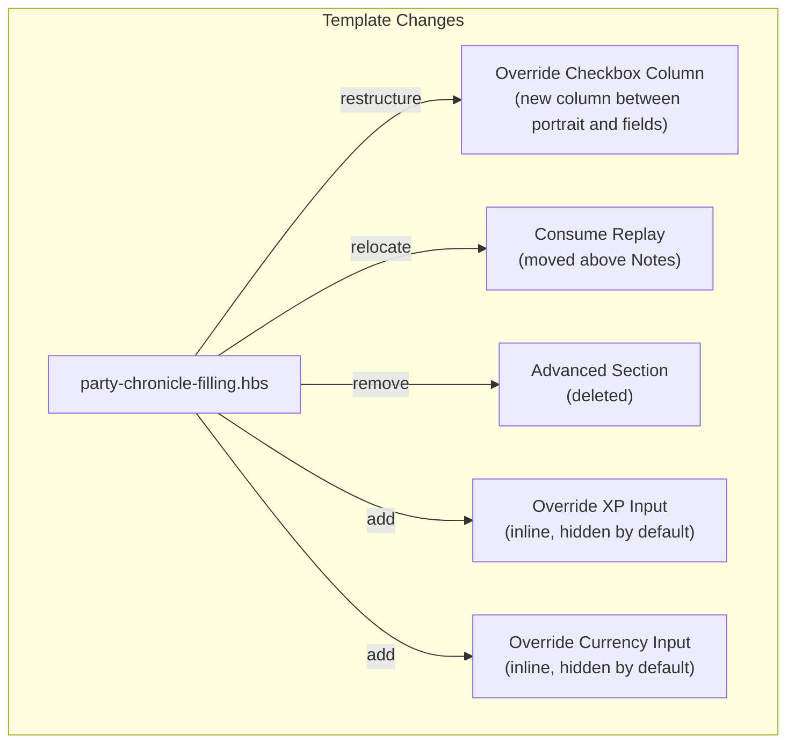
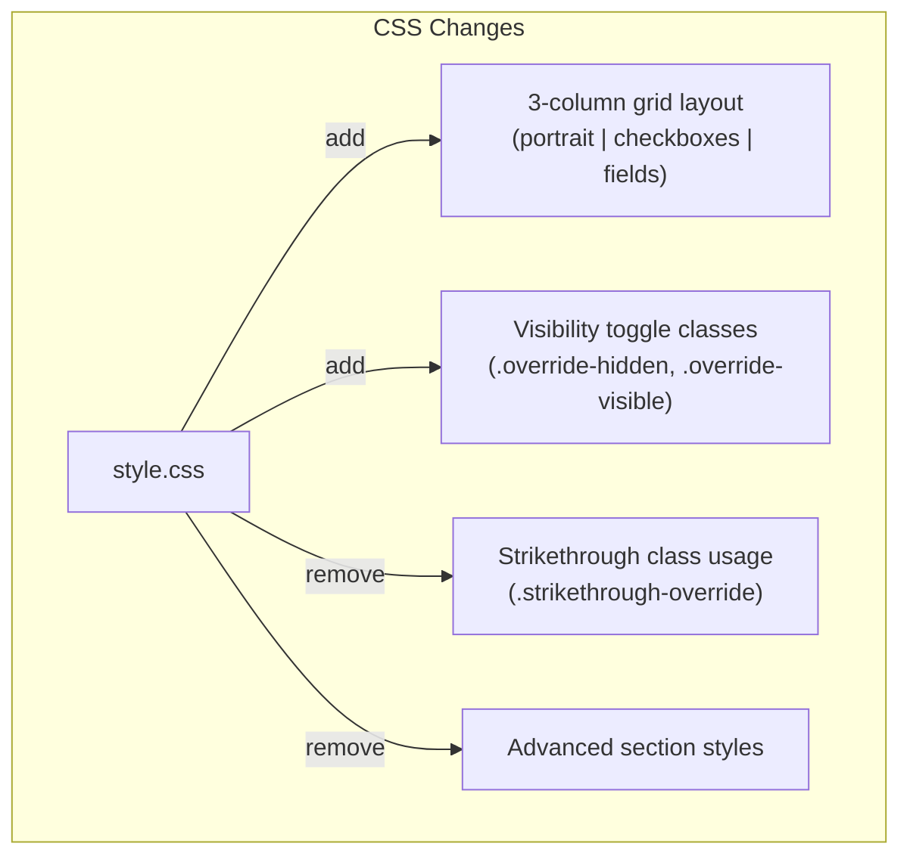
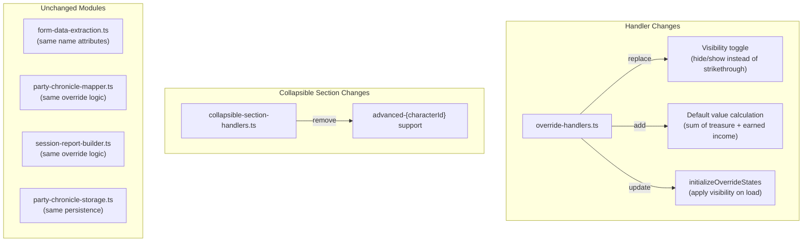
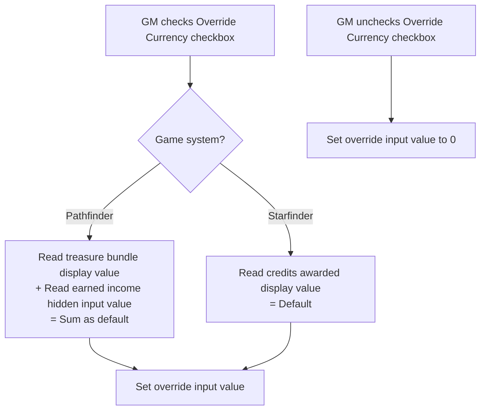

# Design Document: Override UX Redesign

## Overview

This redesign moves the override controls out of the collapsible "Advanced" section and positions them inline with the fields they affect. Override checkboxes move into a dedicated column between the character portrait and the fields grid. When an override is activated, the original calculated fields are hidden (not struck through) and replaced by editable override inputs. The currency override input pre-populates with the sum of the character's current calculated values. The Advanced section is removed entirely, with the Consume Replay checkbox relocated to just above the Notes field.

This is a UI/UX-only change. The underlying data model (`UniqueFields`), chronicle generation (`party-chronicle-mapper.ts`), session reporting (`session-report-builder.ts`), persistence (`party-chronicle-storage.ts`), and form data extraction (`form-data-extraction.ts`) remain unchanged. The same `name` attributes are used for all form fields, so existing saved data loads without migration.

## Architecture

The redesign modifies three layers: template structure, CSS layout, and override handler logic. No new modules are introduced. The existing `override-handlers.ts` module is updated to implement visibility toggling instead of strikethrough, and to calculate default currency values.





### Key Architectural Decisions

1. **Visibility toggle via CSS classes instead of strikethrough.** The current implementation adds a `.strikethrough-override` class to calculated labels. The redesign replaces this with `.override-hidden` (applied to original rows to hide them) and `.override-visible` (applied to override input rows to show them). This uses `display: none` for hidden elements, which is cleaner than strikethrough and matches the user's request for hiding rather than crossing out.

2. **Override checkbox column as a CSS grid column.** The character card currently uses a flex layout with portrait on the left and fields on the right. The redesign changes the `.member-activity` layout to a 3-column CSS grid: `[portrait] [checkbox-column] [fields]`. The checkbox column is narrow (just wide enough for checkboxes) and uses CSS grid row alignment to position each checkbox adjacent to its corresponding field row.

3. **Override inputs rendered inline but hidden by default.** The override XP and currency inputs are rendered in the template at their final positions (where the calculated fields are) but with a `.override-visible` class that defaults to `display: none`. When the checkbox is checked, the handler adds `.override-hidden` to the original rows and removes the hidden state from the override rows. This avoids DOM manipulation (creating/destroying elements) and keeps the template as the single source of truth for structure.

4. **Default value calculation in the handler.** When the currency override checkbox is checked and the override input has no existing value (or zero), the handler reads the current treasure bundle display value and earned income hidden input value from the DOM, sums them, and sets the override input value. This keeps the calculation logic in the handler layer rather than the template.

5. **Advanced section removed entirely.** Rather than keeping an Advanced section with just Consume Replay, the section is deleted. Consume Replay moves to the main fields area above Notes. This eliminates the collapsible section overhead and simplifies the character card. The `advanced-{characterId}` pattern is removed from the collapsible section handler.

6. **No data model changes.** The `UniqueFields` interface, `name` attributes on form fields, and all extraction/persistence logic remain identical. The override checkboxes and inputs keep their existing `name` patterns. This ensures backward compatibility with saved data.

## Components and Interfaces

### Modified Module: `handlers/override-handlers.ts`

The three existing exported functions are updated. No new exports are added.

```typescript
/**
 * Handles the Override XP checkbox change for a specific character.
 *
 * CHANGED: Instead of toggling strikethrough on the calculated XP label,
 * this now toggles visibility — hiding the Calculated XP Row and showing
 * the Override XP Input row (and vice versa when unchecked).
 */
export function handleOverrideXpChange(
  characterId: string,
  container: HTMLElement
): void;

/**
 * Handles the Override Currency checkbox change for a specific character.
 *
 * CHANGED: Instead of toggling strikethrough, this now:
 * 1. Hides/shows the Earned Income Row, Treasure Bundles Row (PF2e) or
 *    Credits Awarded Row (SF2e), and the Override Currency Input row.
 * 2. When checking the checkbox: calculates the default value from current
 *    DOM values (treasure bundle display + earned income hidden input for
 *    PF2e, or credits awarded display for SF2e) and sets it on the input.
 * 3. When unchecking the checkbox: resets the override input value to zero.
 */
export function handleOverrideCurrencyChange(
  characterId: string,
  container: HTMLElement
): void;

/**
 * Initializes override states from saved data on form load.
 *
 * CHANGED: Instead of applying strikethrough classes, this now applies
 * the correct visibility states (hidden/visible) based on saved checkbox
 * states. Uses the same handleOverrideXpChange and handleOverrideCurrencyChange
 * functions to ensure consistent behavior.
 */
export function initializeOverrideStates(container: HTMLElement): void;
```

### Modified Module: `handlers/collapsible-section-handlers.ts`

The `isValidSectionId()` function is updated to remove support for `advanced-{characterId}` patterns. The `initializeCollapseSections()` function no longer discovers or initializes `advanced-*` sections.

### Modified Template: `templates/party-chronicle-filling.hbs`

Each character card (both `{{#each partyMembers}}` and GM character section) is restructured:

**Before (current structure):**
```
<section class="member-activity">
  <div class="character-info">        ← portrait + identity
  <div class="character-fields">       ← fields grid
    [earned income section]
    [treasure bundles / credits awarded]
    [currency spent]
    [XP earned display]
    [notes]
    [Advanced section (collapsible)]
      [Consume Replay]
      [Override Currency checkbox + input]
      [Override XP checkbox + input]
```

**After (redesigned structure):**
```
<section class="member-activity">
  <div class="character-info">         ← portrait + identity (unchanged)
  <div class="override-checkbox-column"> ← NEW: checkbox column
    [Override Currency checkbox]          ← adjacent to Earned Income row
    [Override XP checkbox]               ← adjacent to XP Earned row
  <div class="character-fields">        ← fields grid
    [earned income section]              ← gets .override-hidden when currency override active
    [treasure bundles / credits awarded] ← gets .override-hidden when currency override active
    [Override Currency Input row]        ← NEW: .override-visible, hidden by default
    [currency spent]
    [XP earned display]                  ← gets .override-hidden when XP override active
    [Override XP Input row]              ← NEW: .override-visible, hidden by default
    [Consume Replay]                     ← MOVED from Advanced section
    [notes]
```

The override input rows use the same `name` attributes as before:
- `characters.{{id}}.overrideXp` (checkbox)
- `characters.{{id}}.overrideXpValue` (input)
- `characters.{{id}}.overrideCurrency` (checkbox)
- `characters.{{id}}.overrideCurrencyValue` (input)

### Modified Stylesheet: `css/style.css`

**New CSS classes:**

```css
/* Override visibility toggle classes */
.override-hidden {
  display: none !important;
}

.override-visible {
  /* Default state: hidden. Handler removes this class to show. */
}

/* Override checkbox column */
.override-checkbox-column {
  display: flex;
  flex-direction: column;
  /* Vertical positioning handled by explicit spacing/margins */
}
```

**Removed CSS:**
- `.strikethrough-override` class (no longer used)
- All `.advanced-section` styles (section removed)

**Modified CSS:**
- `.member-activity` layout changes from 2-column flex to accommodate the checkbox column

### Modified Constants: `constants/dom-selectors.ts`

**New selectors:**

```typescript
export const CHARACTER_FIELD_SELECTORS = {
  // ... existing selectors ...

  // Override visibility target rows
  EARNED_INCOME_SECTION: (characterId: string) =>
    `.member-activity[data-character-id="${characterId}"] .earned-income-section`,
  TREASURE_BUNDLES_ROW: (characterId: string) =>
    `.member-activity[data-character-id="${characterId}"] .treasure-bundle-row`,
  CREDITS_AWARDED_ROW: (characterId: string) =>
    `.member-activity[data-character-id="${characterId}"] .credits-awarded-row`,
  OVERRIDE_CURRENCY_ROW: (characterId: string) =>
    `.member-activity[data-character-id="${characterId}"] .override-currency-row`,
  OVERRIDE_XP_ROW: (characterId: string) =>
    `.member-activity[data-character-id="${characterId}"] .override-xp-row`,
} as const;
```

**Removed from `CSS_CLASSES`:**
- `STRIKETHROUGH_OVERRIDE` (no longer used)

**Added to `CSS_CLASSES`:**
- `OVERRIDE_HIDDEN: 'override-hidden'`

### Modified Module: `handlers/event-listener-helpers.ts`

The `attachOverrideListeners()` function is unchanged — it already attaches change listeners to all override checkboxes using `CHARACTER_FIELD_PATTERNS.OVERRIDE_XP_ALL` and `CHARACTER_FIELD_PATTERNS.OVERRIDE_CURRENCY_ALL`. The checkbox `name` attributes are the same, so the listener attachment works identically.

### Unchanged Modules

These modules require zero changes:
- `model/party-chronicle-types.ts` — `UniqueFields` interface unchanged
- `handlers/form-data-extraction.ts` — Same `name` attributes, same extraction logic
- `model/party-chronicle-mapper.ts` — Same override decision logic
- `model/session-report-builder.ts` — Same override value usage
- `model/party-chronicle-storage.ts` — Same persistence structure
- `main.ts` — Same `attachEventListeners()` and `initializeForm()` calls

## Data Models

No data model changes. The `UniqueFields` interface retains:

```typescript
export interface UniqueFields {
  // ... existing fields ...
  overrideXp: boolean;
  overrideXpValue: number;
  overrideCurrency: boolean;
  overrideCurrencyValue: number;
}
```

### Override Visibility State Machine

Each override (XP and Currency) has two states:

```mermaid
stateDiagram-v2
    [*] --> Inactive: Default / Unchecked
    Inactive --> Active: Check override checkbox
    Active --> Inactive: Uncheck override checkbox

    state Inactive {
        note right of Inactive
            Original rows: visible
            Override input row: hidden
            Override input: disabled
        end note
    }

    state Active {
        note right of Active
            Original rows: hidden
            Override input row: visible
            Override input: enabled
        end note
    }
```

### Currency Override Default Value Calculation



## Correctness Properties

### Property 1: XP override visibility toggle is consistent with checkbox state

*For any* character card and any Override XP checkbox state (checked or unchecked), the Calculated XP Row should be visible if and only if the checkbox is unchecked, and the Override XP Input row should be visible if and only if the checkbox is checked. The two visibility states are mutually exclusive.

**Validates: Requirements 2.1, 2.2, 2.3, 2.4, 2.7**

### Property 2: Currency override visibility toggle is consistent with checkbox state (Pathfinder)

*For any* Pathfinder character card and any Override Currency checkbox state, the Earned Income Row and Treasure Bundles Row should be visible if and only if the checkbox is unchecked, and the Override Currency Input row should be visible if and only if the checkbox is checked.

**Validates: Requirements 3.1, 3.2, 3.3, 3.4, 3.8**

### Property 3: Currency override visibility toggle is consistent with checkbox state (Starfinder)

*For any* Starfinder character card and any Override Currency checkbox state, the Credits Awarded Row should be visible if and only if the checkbox is unchecked, and the Override Currency Input row should be visible if and only if the checkbox is checked.

**Validates: Requirements 4.1, 4.2, 4.3, 4.4, 4.8**

### Property 4: Currency override default value equals sum of calculated values

*For any* Pathfinder character with any treasure bundle gold value (≥0) and any earned income value (≥0), when the Override Currency checkbox is checked, the override input value should equal the sum of the treasure bundle gold value and the earned income value. When the checkbox is unchecked, the override input value should be reset to zero.

**Validates: Requirements 3.6, 8.1, 8.3, 8.4**

### Property 5: Override state restoration on form load

*For any* saved override state (XP checked/unchecked, Currency checked/unchecked, with any override values), loading the form should produce the correct visibility configuration: original rows hidden and override rows visible when the override is active, and vice versa when inactive.

**Validates: Requirements 7.4**

### Property 6: Per-character override independence

*For any* two distinct characters in the same form, changing one character's override checkbox should not modify the other character's override state, field visibility, or override input value.

**Validates: Requirements 9.1, 9.2**

## Error Handling

| Scenario | Handling |
|---|---|
| Treasure bundle display element not found when calculating default | Default to 0 for the treasure bundle component. Log a debug message. |
| Earned income hidden input not found when calculating default | Default to 0 for the earned income component. Log a debug message. |
| Credits awarded display element not found when calculating default (SF2e) | Default to 0. Log a debug message. |
| Override input value is NaN after parsing display text | Default to 0. The `parseFloat` of display text like "12.50 gp" requires stripping the unit suffix first. |
| Saved data has override active but override input elements missing from DOM | `initializeOverrideStates` silently skips characters whose override elements are not found, consistent with existing behavior. |
| Character card missing override checkbox column (template rendering error) | Override functionality degrades gracefully — checkboxes not found means no toggle behavior, but form data extraction still works since it reads by `name` attribute. |

## Testing Strategy

### Property-Based Tests

Property-based tests use `fast-check` (already available in the project). Each property test runs a minimum of 100 iterations.

Tests target the override handler functions with mock DOM structures:

- **XP override visibility toggle** (Property 1): Generate random character IDs and checkbox states. Build a mock DOM with the expected elements. Call `handleOverrideXpChange`, verify that the calculated XP row has `.override-hidden` if and only if the checkbox is checked, and the override XP row visibility is the inverse.

- **Currency override visibility toggle — Pathfinder** (Property 2): Generate random character IDs and checkbox states. Build a mock DOM with earned income section, treasure bundles row, and override currency row. Call `handleOverrideCurrencyChange`, verify visibility states.

- **Currency override visibility toggle — Starfinder** (Property 3): Same as Property 2 but with credits awarded row instead of earned income + treasure bundles.

- **Currency override default value** (Property 4): Generate random treasure bundle values and earned income values. Build a mock DOM with those display values. Check the override checkbox. Verify the input value equals the sum. Then uncheck the checkbox and verify the input value is reset to zero.

- **Override state restoration** (Property 5): Generate random combinations of override states. Build a mock DOM with saved checkbox states. Call `initializeOverrideStates`, verify all visibility states match expectations.

- **Per-character independence** (Property 6): Generate two character IDs and random override states. Build a mock DOM with both characters. Toggle one character's override, verify the other character's state is unchanged.

Configuration:
- Library: `fast-check`
- Minimum iterations: 100 per property
- Tag format: `Feature: override-ux-redesign, Property {N}: {title}`

### Unit Tests (Example-Based)

- Override checkbox column renders between portrait and fields in party member cards (Req 1.1, 1.5)
- Override checkbox column renders in GM character card (Req 1.5)
- Override XP Input has label "XP Earned" and override-specific tooltip (Req 2.5, 2.6)
- Override XP Input has `min="0"` and `type="number"` (Req 2.8)
- Override Currency Input label is "GP Gained" for Pathfinder (Req 3.5)
- Override Currency Input label is "Credits Gained" for Starfinder (Req 4.5)
- Override Currency Input step is `0.01` for Pathfinder, `1` for Starfinder (Req 3.7, 4.7)
- Override Currency Checkbox tooltip is "Override GP" for Pathfinder (Req 5.1)
- Override Currency Checkbox tooltip is "Override Credits" for Starfinder (Req 5.2)
- Override XP Checkbox tooltip is "Override XP" (Req 5.3)
- Checkbox column contains only checkbox controls, no text labels (Req 5.4)
- Consume Replay checkbox is above Notes, not in a collapsible section (Req 6.1)
- No Advanced section exists in character cards (Req 6.2)
- Consume Replay retains `name` attribute format after relocation (Req 6.3)
- `isValidSectionId` rejects `advanced-{characterId}` patterns (Req 6.4)
- Existing non-zero override value is reset to zero when checkbox is unchecked (Req 8.3)
- GM character card has same override controls as party member cards (Req 9.3)

### Integration Tests

- Form data extraction produces identical output structure before and after redesign
- Auto-save triggers on override checkbox and input changes (same as before)
- Form reload restores override states with correct visibility (not strikethrough)
- Clear Data resets all overrides and restores all original field visibility
