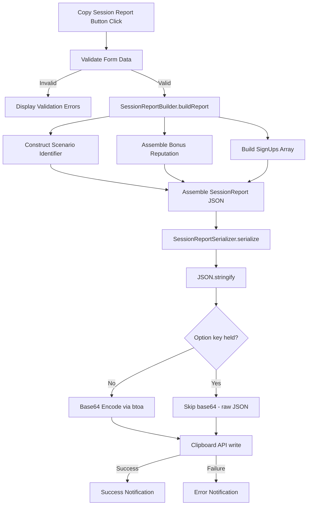
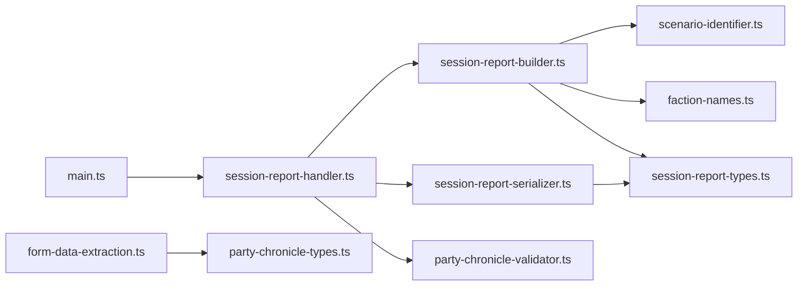

# Design Document: Paizo Session Reporting

## Overview

This feature adds a "Copy Session Report" button to the Party Chronicle form that assembles session data into a JSON structure compatible with Paizo.com session reporting, base64-encodes it, and copies it to the clipboard. The encoded data is consumed by browser plugins that automate the Paizo reporting form, so the JSON format must conform to the expected schema. The implementation extends the existing form with new UI sections, per-character fields, and a data assembly/serialization pipeline.

The design follows the existing architecture: Handlebars template for UI, form data extraction functions, a new builder module for JSON assembly, and a serializer module for encoding. New fields are persisted through the existing `game.settings` storage mechanism via extended `SharedFields` and `UniqueFields` interfaces.

### Key Design Decisions

1. **Reuse existing form data extraction pattern**: The `extractFormData` function in `form-data-extraction.ts` will be extended to capture new fields (reporting flags, consume replay), keeping the single-source-of-truth extraction approach.

2. **New modules for session report logic**: `SessionReportBuilder` and `SessionReportSerializer` are implemented as pure functions in separate modules under `scripts/model/`, following the existing pattern of `reputation-calculator.ts` and `party-chronicle-mapper.ts`.

3. **Scenario identifier derived from layout ID**: The layout `id` field (e.g., `pfs2.s5-18`) is parsed to construct the scenario identifier (e.g., `PFS2E 5-18`). This avoids free-text input and leverages the existing scenario selector.

4. **Bonus reputation assembly reuses existing faction data**: The `FACTION_NAMES` constant and `reputationValues` from `SharedFields` are reused. The chosen faction is identified from the `chosenFaction` dropdown (a new shared field) rather than per-character actor data, since bonus rep is session-level.

## Architecture



### Module Dependency Graph



## Components and Interfaces

### New Modules

#### `scripts/model/session-report-types.ts`
Defines the `SessionReport`, `SignUp`, and `BonusRep` interfaces.

#### `scripts/model/scenario-identifier.ts`
Pure function to construct a scenario identifier from a layout ID.

```typescript
// Layout ID format: "pfs2.s5-18" or "pfs2.s7-03"
// Output format: "PFS2E 5-18" or "PFS2E 7-03"
function buildScenarioIdentifier(layoutId: string): string;
```

#### `scripts/model/session-report-builder.ts`
Assembles the `SessionReport` JSON from form data, party actors, and layout metadata.

```typescript
interface SessionReportBuildParams {
  shared: SharedFields;
  characters: Record<string, UniqueFields>;
  partyActors: PartyActor[];
  layoutId: string;
}

function buildSessionReport(params: SessionReportBuildParams): SessionReport;
```

#### `scripts/model/session-report-serializer.ts`
Serializes a `SessionReport` to a base64-encoded JSON string.

```typescript
function serializeSessionReport(report: SessionReport, skipBase64?: boolean): string;
```

#### `scripts/handlers/session-report-handler.ts`
Click handler for the Copy Session Report button. Orchestrates validation, building, serialization, clipboard copy, and notifications. Detects Option/Alt key on the click event to toggle the debug mode (skip base64 encoding).

### Modified Modules

#### `scripts/model/party-chronicle-types.ts`
- `SharedFields`: Add `reportingA`, `reportingB`, `reportingC`, `reportingD` (boolean), and `chosenFaction` (string, faction abbreviation code).
- `UniqueFields`: Add `consumeReplay` (boolean).

#### `scripts/handlers/form-data-extraction.ts`
- Extract new checkbox values for reporting flags and consume replay.
- Extract the chosen faction dropdown value.

#### `scripts/model/party-chronicle-validator.ts`
- Add session-report-specific validation: event date populated, scenario selected, GM PFS number populated, each character has a faction.

#### `scripts/constants/dom-selectors.ts`
- Add selectors for new fields: reporting flag checkboxes, consume replay checkboxes, chosen faction dropdown, copy session report button, faction display elements.
#### `templates/party-chronicle-filling.hbs`
- Rename "Event Details" section title to "Session Reporting".
- Add reporting flag checkboxes (A, B, C, D) at the bottom of the section.
- Add chosen faction dropdown to the Reputation section (maps abbreviation to full name).
- Create new "Actions" section above character list with Clear Data, Generate Chronicles, and Copy Session Report buttons.
- Remove buttons from the Character-Specific Information header.
- Add per-character faction read-only text below level.
- Add per-character "Consume Replay" checkbox.

#### `scripts/main.ts`
- Attach click handler for Copy Session Report button.
- Attach change handlers for new fields (reporting flags, consume replay, chosen faction).

## Data Models

### SessionReport (JSON output structure)

```typescript
interface SessionReport {
  gameDate: string;              // ISO 8601 date from Event Date field
  gameSystem: 'PFS2E';          // Constant
  generateGmChronicle: false;   // Constant
  gmOrgPlayNumber: number;      // Read directly from GM PFS Number field
  repEarned: 0;                 // Constant
  reportingA: boolean;
  reportingB: boolean;
  reportingC: boolean;
  reportingD: boolean;
  scenario: string;             // e.g., "PFS2E 5-18"
  signUps: SignUp[];
  bonusRepEarned: BonusRep[];
}

interface SignUp {
  isGM: false;                  // Constant
  orgPlayNumber: number;        // Read from actor.system.pfs.playerNumber
  characterNumber: number;      // Read from actor.system.pfs.characterNumber
  characterName: string;
  consumeReplay: boolean;
  repEarned: number;            // From shared "Chosen Faction" reputation value
  faction: string;              // Full faction name from actor.system.pfs.currentFaction
}

interface BonusRep {
  faction: string;              // Full faction name
  reputation: number;           // Non-zero reputation value
}
```

### Extended SharedFields

```typescript
// Added to existing SharedFields interface
reportingA: boolean;    // Reporting flag A checkbox
reportingB: boolean;    // Reporting flag B checkbox
reportingC: boolean;    // Reporting flag C checkbox
reportingD: boolean;    // Reporting flag D checkbox
chosenFaction: string;  // Faction abbreviation code (EA, GA, HH, VS, RO, VW)
```

### Extended UniqueFields

```typescript
// Added to existing UniqueFields interface
consumeReplay: boolean;  // Per-character consume replay checkbox
```


## Correctness Properties

*A property is a characteristic or behavior that should hold true across all valid executions of a system — essentially, a formal statement about what the system should do. Properties serve as the bridge between human-readable specifications and machine-verifiable correctness guarantees.*

### Property 1: Scenario identifier construction

*For any* valid layout ID in the format `"pfs2.sN-MM"` (where N is a season number and MM is a scenario number), `buildScenarioIdentifier` should produce a string in the format `"PFS2E N-MM"`.

**Validates: Requirements 5.1, 4.8**

### Property 2: Session report constant fields invariant

*For any* valid form state, the assembled `SessionReport` should always have `gameSystem === "PFS2E"`, `generateGmChronicle === false`, and top-level `repEarned === 0`.

**Validates: Requirements 4.3, 4.4, 4.6**

### Property 3: Session report field mapping

*For any* valid form state with an event date, GM PFS number, and reporting flag values, the assembled `SessionReport` should have `gameDate` equal to the input event date, `gmOrgPlayNumber` equal to the numeric GM PFS number, and `reportingA`–`reportingD` equal to the input reporting flag values.

**Validates: Requirements 4.2, 4.5, 4.7**

### Property 4: SignUp entry correctness

*For any* valid party of 1–6 members, each with a playerNumber, characterNumber, character name, faction, and consume replay flag from the actor data, the assembled `signUps` array should have exactly one entry per party member, and each entry should have `isGM === false`, the correct `orgPlayNumber` (read from `actor.system.pfs.playerNumber`) and `characterNumber` read directly from the actor, the correct `characterName`, the correct `consumeReplay` flag, `repEarned` equal to the shared chosen faction reputation value, and `faction` equal to the full faction name from `actor.system.pfs.currentFaction`.

**Validates: Requirements 4.9, 4.10**

### Property 5: Bonus reputation assembly

*For any* combination of faction reputation values (0–6 each) and a chosen faction, the `bonusRepEarned` array should contain exactly one entry for each faction that has a non-zero reputation value AND is not the chosen faction. Each entry's `faction` field should be the full faction name from `FACTION_NAMES`, and each entry's `reputation` field should equal the input reputation value for that faction.

**Validates: Requirements 4.11, 9.1, 9.2, 9.3, 9.4, 9.5, 9.6**

### Property 6: Serialization round-trip

*For any* valid `SessionReport` object, serializing to JSON, base64-encoding, then base64-decoding and JSON-parsing should produce an object deeply equal to the original.

**Validates: Requirements 6.1, 6.2, 6.3, 6.4**

### Property 7: Validation rejects missing required fields

*For any* form state where at least one of the following is missing or invalid — event date, scenario selection, GM PFS number, or a character's faction — the session report validation should fail and return at least one error message.

**Validates: Requirements 8.1, 8.2, 8.3, 8.4**

## Error Handling

### Validation Errors
- Missing event date, scenario, or GM PFS number: Display specific error message per field.
- Missing faction on character: Display error identifying the character missing faction data.
- All validation errors are collected and displayed together in the existing `#validationErrors` panel before the copy operation is prevented.

### Clipboard API Errors
- If `navigator.clipboard.writeText()` rejects (e.g., permissions denied, insecure context), catch the error and display an error notification via `ui.notifications.error()`.
- The error message should indicate that the clipboard write failed and suggest the user try again.

### Scenario Identifier Errors
- If the layout ID doesn't match the expected format, `buildScenarioIdentifier` returns a fallback using the layout description directly, ensuring the report can still be assembled.

## Testing Strategy

### Property-Based Testing

The project already uses `fast-check` for property-based testing (visible in existing `.property.test.ts` and `.pbt.test.ts` files). All correctness properties will be implemented using `fast-check`.

Each property test must:
- Run a minimum of 100 iterations
- Reference the design property with a tag comment: `Feature: paizo-session-reporting, Property N: {title}`
- Use `fc.uniqueArray` with selectors when generating arrays of records with ID fields
- Use positive assertions (`toBe`, `toEqual`) over negative assertions (`not.toBe`)

Property test files:
- `scripts/model/scenario-identifier.property.test.ts` — Property 1
- `scripts/model/session-report-builder.property.test.ts` — Properties 2, 3, 4, 5
- `scripts/model/session-report-serializer.property.test.ts` — Property 6
- `scripts/model/session-report-validation.property.test.ts` — Property 7

### Unit Testing

Unit tests complement property tests for specific examples, edge cases, and integration points:

- `scripts/model/scenario-identifier.test.ts` — Specific layout ID examples, edge cases (non-standard layout IDs like bounties, quests)
- `scripts/model/session-report-builder.test.ts` — Integration test with realistic form data, edge case with zero bonus rep, edge case with all factions having non-zero rep
- `scripts/handlers/session-report-handler.test.ts` — Clipboard API success/failure mocking, notification display verification
- `scripts/handlers/form-data-extraction.test.ts` — Extraction of new fields (reporting flags, consume replay, chosen faction)
