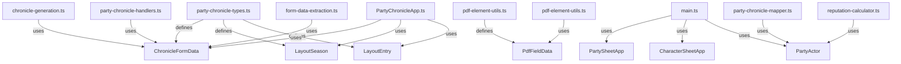
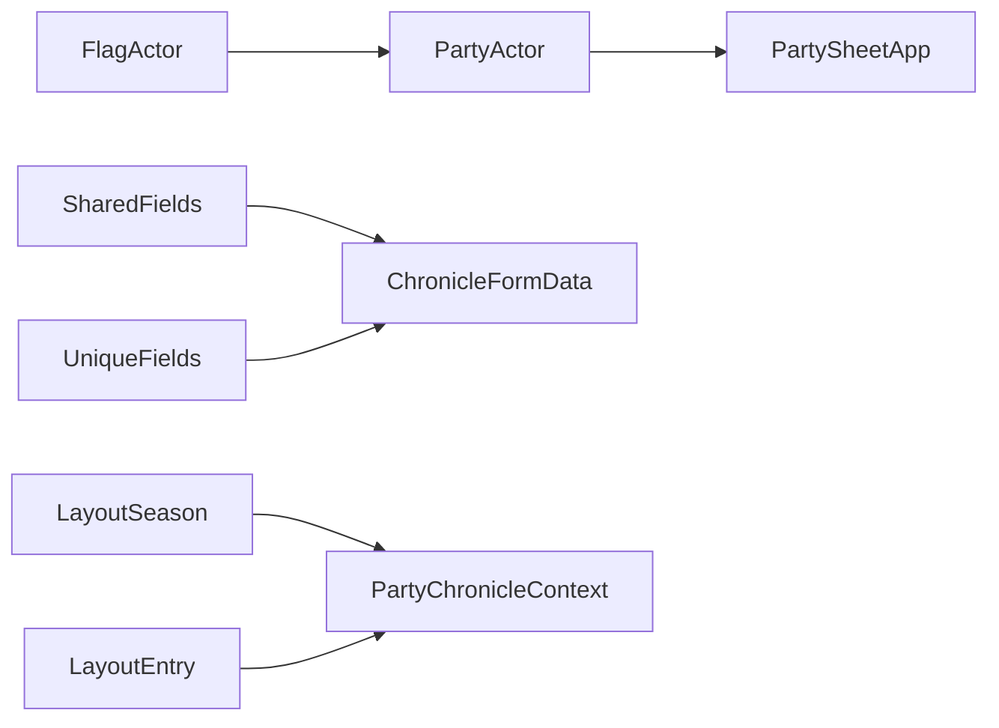

# Design Document: pf2e-type-safety

## Overview

This feature replaces `any` types across the pfs-chronicle-generator codebase with proper TypeScript interfaces, improving compile-time safety without altering runtime behavior. The refactoring leverages existing interfaces (`PartyActor`, `FlagActor`, `SessionReportActor`, `PartySheetApp`, `CharacterSheetApp`) and introduces four new types (`ChronicleFormData`, `LayoutSeason`, `LayoutEntry`, `PdfFieldData`) to cover remaining gaps.

The scope is strictly compile-time: no logic changes, no new runtime code paths, no behavioral differences. The existing test suite must continue to pass unmodified (aside from type annotation updates in test files).

### Design Rationale

The codebase already defines rich interfaces in `event-listener-helpers.ts`, `chronicle-exporter.ts`, `session-report-builder.ts`, and `party-chronicle-types.ts`. Many functions accept `any` parameters despite only accessing properties already described by these interfaces. This refactoring closes that gap by:

1. Reusing existing interfaces wherever they already describe the accessed shape
2. Defining minimal new interfaces only where no existing type covers the data shape
3. Preserving `any` in the four cases where no better alternative exists (game global, hook name strings, renderTemplate context, test mocks)

## Architecture

### Approach: Interface Reuse Over New Definitions

The primary strategy is to import and apply existing interfaces rather than create new ones. The four new types are kept minimal:



### File Change Map

| File | Change Type | Key Types Applied |
|------|------------|-------------------|
| `party-chronicle-types.ts` | Add interfaces | `ChronicleFormData`, `LayoutSeason`, `LayoutEntry` |
| `pdf-element-utils.ts` | Add type + apply | `PdfFieldData` |
| `PartyChronicleApp.ts` | Apply existing + new types | `PartyActor[]`, `PartyChronicleContext`, `ChronicleFormData`, `LayoutSeason[]`, `LayoutEntry[]` |
| `main.ts` | Apply existing types | `CharacterSheetApp`, `PartySheetApp`, `PartyActor` |
| `chronicle-generation.ts` | Apply existing + new types | `ChronicleFormData`, `PartyActor[]`, `ChronicleData` |
| `party-chronicle-mapper.ts` | Apply existing type | `PartyActor` |
| `reputation-calculator.ts` | Apply existing type | `PartyActor` |
| `collapsible-section-handlers.ts` | Remove `as any` casts | Type-safe `includes` check |
| `form-data-extraction.ts` | Apply types | `PartyActor[]`, `ChronicleFormData` |
| `party-chronicle-handlers.ts` | Apply types | `PartyActor[]`, `ChronicleFormData` |

### Preserved `any` Usages

These remain intentionally untyped:

1. `globals.d.ts`: `declare var game: any` — fvtt-types doesn't fully type the Foundry `game` global
2. Hook name strings: `'renderCharacterSheetPF2e' as any` — fvtt-types doesn't define PF2e-specific hook names
3. `renderTemplate` context: `context as any` — Foundry's `renderTemplate` expects untyped context
4. Test file mocks: `(global as any)` — global augmentation for test setup is acceptable

## Components and Interfaces

### New Interface: ChronicleFormData

Represents the expanded form data structure returned by `extractFormData` and consumed by chronicle generation and validation functions.

```typescript
/**
 * Expanded form data structure containing shared fields and per-character fields.
 * Returned by extractFormData() and consumed by chronicle generation/validation.
 */
export interface ChronicleFormData {
  shared: SharedFields;
  characters: Record<string, UniqueFields>;
}
```

**Location:** `party-chronicle-types.ts`
**Rationale:** This shape is already used implicitly by `extractFormData`, `generateChroniclesFromPartyData`, `validateAllCharacterFields`, `loadLayoutConfiguration`, `extractCharacterChronicleData`, and `processAllPartyMembers`. Making it explicit eliminates ~12 `any` annotations across these functions.

### New Interface: LayoutSeason

Represents a season entry returned by `layoutStore.getSeasons()`.

```typescript
/** A season entry from the layout store. */
export interface LayoutSeason {
  id: string;
  name: string;
}
```

**Location:** `party-chronicle-types.ts`
**Rationale:** `PartyChronicleApp.loadPartyLayoutData` returns `any[]` for seasons. This interface types the return value and the `PartyChronicleContext.seasons` array.

### New Interface: LayoutEntry

Represents a layout entry returned by `layoutStore.getLayoutsByParent()`.

```typescript
/** A layout entry from the layout store. */
export interface LayoutEntry {
  id: string;
  description: string;
}
```

**Location:** `party-chronicle-types.ts`
**Rationale:** `PartyChronicleApp.loadPartyLayoutData` returns `any[]` for layouts. This interface types the return value and the `PartyChronicleContext.layoutsInSeason` array.

### New Type: PdfFieldData

Represents the data object passed to PDF element utility functions.

```typescript
/** Chronicle field values keyed by field name, passed to PDF element utilities. */
export type PdfFieldData = Record<string, unknown>;
```

**Location:** `pdf-element-utils.ts`
**Rationale:** `resolveValue` and `extractSocietyIdPart` accept `data: any`. The data is a string-keyed object with heterogeneous values, so `Record<string, unknown>` is the correct minimal type.

### Existing Interfaces Applied

| Interface | Defined In | Applied To |
|-----------|-----------|------------|
| `PartyActor` | `event-listener-helpers.ts` | `PartyChronicleApp.partyActors`, mapper/reputation actor params, handler actor params |
| `FlagActor` | `chronicle-exporter.ts` | Already used correctly |
| `PartySheetApp` | `event-listener-helpers.ts` | `renderPartySheetPF2e` hook `app` param, `partySheet` in `renderPartyChronicleForm` |
| `CharacterSheetApp` | `event-listener-helpers.ts` | `renderCharacterSheetPF2e` hook `sheet` param |
| `PartyChronicleContext` | `party-chronicle-types.ts` | `_prepareContext` return type |
| `ChronicleData` | `party-chronicle-mapper.ts` | `extractCharacterChronicleData` return, `generateSingleCharacterPdf` param |
| `UniqueFields` | `party-chronicle-types.ts` | `validateUniqueFields` iteration cast |

### Collapsible Section Type-Safe Includes

The `as any` casts in `toggleSectionCollapse` and `updateSectionSummary` exist because `Array.prototype.includes` on a `readonly` tuple doesn't accept `string`. The fix is to use a type guard helper:

```typescript
function isValidSectionId(id: string): id is typeof VALID_SECTION_IDS[number] {
  return (VALID_SECTION_IDS as readonly string[]).includes(id);
}

function isSectionWithSummary(id: string): id is typeof SECTIONS_WITH_SUMMARY[number] {
  return (SECTIONS_WITH_SUMMARY as readonly string[]).includes(id);
}
```

### PartyChronicleContext Update

The existing `PartyChronicleContext` interface in `party-chronicle-types.ts` already uses `Array<{ id: string; name: string }>` and `Array<{ id: string; description: string }>` for seasons and layouts. These will be updated to reference `LayoutSeason[]` and `LayoutEntry[]` for consistency.

## Data Models

### Type Dependency Graph



### ChronicleFormData Flow

```
extractFormData(container, partyActors: PartyActor[]) → ChronicleFormData
    ↓
generateChroniclesFromPartyData(data: ChronicleFormData, partyActors: PartyActor[], ...)
    ↓
validateAllCharacterFields(data: ChronicleFormData, partyActors: PartyActor[])
loadLayoutConfiguration(data: ChronicleFormData)
processAllPartyMembers(data: ChronicleFormData, partyActors: PartyActor[], ...)
    ↓
extractCharacterChronicleData(data: ChronicleFormData, actor: PartyActor, ...) → ChronicleData
    ↓
generateSingleCharacterPdf(chronicleData: ChronicleData, ..., actor: PartyActor)
```

### PdfFieldData Flow

```
mapToCharacterData(shared, unique, actor: PartyActor) → ChronicleData
    ↓
PdfGenerator uses ChronicleData as PdfFieldData
    ↓
resolveValue(value, data: PdfFieldData, elementType?)
extractSocietyIdPart(data: PdfFieldData, extractor)
```


## Correctness Properties

*A property is a characteristic or behavior that should hold true across all valid executions of a system — essentially, a formal statement about what the system should do. Properties serve as the bridge between human-readable specifications and machine-verifiable correctness guarantees.*

Since this feature is a pure compile-time refactoring, most acceptance criteria are verified by the TypeScript compiler itself (type annotations, return types, parameter types). The testable properties focus on the three areas where runtime behavior could be affected by the type changes: parameter resolution with `Record<string, unknown>`, type-safe array membership checks, and data structure extraction through the new `ChronicleFormData` interface.

### Property 1: Parameter resolution preserves behavior with PdfFieldData

*For any* string value starting with `"param:"` and any `Record<string, unknown>` data object containing the referenced key, `resolveValue` should return the same result regardless of whether the data parameter is typed as `any` or `PdfFieldData`. Specifically: for any data record and any param name, if `data[paramName]` is a string, `resolveValue` returns that string; if it's an array, `resolveValue` returns the joined result; if the param name matches a society ID extractor pattern, the correct part is extracted.

**Validates: Requirements 5.1**

### Property 2: Type-safe membership check equivalence

*For any* string, the type-safe membership check functions (`isValidSectionId`, `isSectionWithSummary`) should return `true` if and only if the string is a member of the corresponding readonly tuple (`VALID_SECTION_IDS` or `SECTIONS_WITH_SUMMARY`). This ensures the type guard replacement produces identical behavior to the previous `as any` cast approach.

**Validates: Requirements 6.1, 6.2**

### Property 3: ChronicleFormData extraction round-trip

*For any* valid `ChronicleFormData` object (with populated `shared: SharedFields` and `characters: Record<string, UniqueFields>`), passing `data.shared` through `extractSharedFields` should produce a `SharedFields` object where all string fields match the input and all numeric fields are coerced correctly, and passing `data.characters` through `extractUniqueFields` for each actor should produce `UniqueFields` objects with matching field values.

**Validates: Requirements 7.1**

## Error Handling

This feature introduces no new error paths. All changes are compile-time type annotations. The error handling strategy is:

1. **Compile errors from type narrowing:** When changing `any` to `Record<string, unknown>`, property access returns `unknown` instead of `any`. Functions that already perform runtime type checks (e.g., `typeof societyid === 'string'` in `extractSocietyIdPart`) will continue to work. Functions that don't will need explicit narrowing added — but this is a compile-time fix, not a runtime change.

2. **Type guard functions:** The new `isValidSectionId` and `isSectionWithSummary` type guards return `boolean` and cannot throw. They replace `as any` casts that also cannot throw.

3. **No new exceptions:** No new `throw` statements, try-catch blocks, or error return paths are introduced.

4. **Compiler as gatekeeper:** Per Requirement 9.3, if a type replacement causes a compile error, the resolution is to adjust the type definition — never to add a new `any` cast.

## Testing Strategy

### Dual Testing Approach

This feature uses both unit tests and property-based tests, though the balance is heavily weighted toward compilation verification given the nature of the changes.

**Unit tests** (specific examples):
- Verify the codebase compiles without errors after all type replacements (`tsc --noEmit`)
- Verify the existing test suite passes without modification
- Verify that `resolveValue` handles specific edge cases (undefined values, missing keys, society ID extraction) with `PdfFieldData` typing
- Verify type guard functions return correct results for known valid and invalid section IDs

**Property-based tests** (universal properties):
- Property 1: `resolveValue` with random `Record<string, unknown>` data objects and random param references
- Property 2: Type-safe membership checks with random strings against the readonly tuples
- Property 3: `ChronicleFormData` extraction round-trip with random valid form data objects

### Property-Based Testing Configuration

- **Library:** [fast-check](https://github.com/dubzzz/fast-check) (already available in the Node.js/Jest ecosystem used by this project)
- **Minimum iterations:** 100 per property test
- **Tag format:** `Feature: pf2e-type-safety, Property {number}: {property_text}`
- Each correctness property is implemented by a single property-based test
- Property tests are placed alongside existing tests in the `tests/` directory

### Test File Organization

| Test | Type | File |
|------|------|------|
| Compilation check | Example (unit) | Manual `tsc --noEmit` verification |
| Existing test suite | Example (unit) | Existing `tests/` files — must pass unmodified |
| resolveValue with PdfFieldData | Property | `tests/pdf-element-utils.property.test.ts` |
| Type-safe membership checks | Property | `tests/collapsible-section-handlers.property.test.ts` |
| ChronicleFormData extraction | Property | `tests/chronicle-generation.property.test.ts` |

### What Not to Test

- Type annotations themselves (the compiler verifies these)
- Preserved `any` usages (Requirements 8.1–8.4) — these are intentionally untyped
- Foundry runtime integration (requires the Foundry VTT runtime environment)

