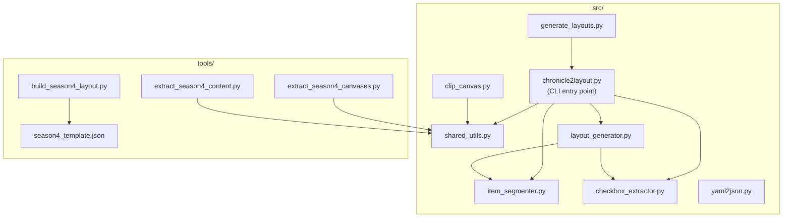

# Design Document: Refactor chronicle2layout

## Overview

This design describes the refactoring of the `chronicle2layout` Python codebase — a set of scripts that extract checkboxes and text from PDF chronicle sheets (Pathfinder Society RPG) and generate layout JSON files. The refactoring addresses code duplication (DRY violations), excessive file sizes, high cyclomatic complexity, missing type hints, magic numbers, hardcoded paths, and documentation gaps — all while preserving identical functional behavior.

The refactoring is purely structural. No new features are added. The CLI interface, JSON output format, and all existing behavior remain unchanged.

### Key Design Decisions

1. **New `shared_utils.py` module** in `src/` consolidates all duplicated functions (`find_layout_file`, `transform_canvas_coordinates`, `render_page_to_image`, `words_positions`, `find_grey_boxes`) into a single source of truth.
2. **`chronicle2layout.py` is split** into four focused modules: the main CLI entry point, an item segmentation module, a checkbox extraction module, and a layout generation module.
3. **The TEMPLATE dict** in `build_season4_layout.py` is moved to a JSON data file to reduce script size.
4. **`generate_layouts.py`** replaces hardcoded absolute paths with CLI arguments and sensible defaults.
5. **All changes are on a dedicated `refactor/chronicle2layout` branch** with atomic Conventional Commits.

## Architecture

### Current Module Structure

```
chronicle2layout/
├── src/
│   ├── chronicle2layout.py   (741 lines — CLI + all logic)
│   ├── clip_canvas.py        (107 lines — duplicates find_layout_file, transform_canvas_coordinates)
│   ├── generate_layouts.py   (228 lines — hardcoded paths)
│   └── yaml2json.py          (42 lines — no changes needed)
└── tools/
    ├── build_season4_layout.py          (290 lines — huge TEMPLATE dict inline)
    ├── extract_season4_canvases.py      (380 lines — duplicates render_page_to_image, words_positions)
    ├── extract_season4_content.py       (340 lines — old version, to delete)
    ├── extract_season4_content_v2.py    (370 lines — duplicates render_page_to_image, words_positions, find_grey_boxes)
    └── temp_reputation.py               (45 lines — throwaway, to delete)
```

### Target Module Structure

```
chronicle2layout/
├── src/
│   ├── shared_utils.py        (NEW — ~120 lines: find_layout_file, transform_canvas_coordinates,
│   │                            render_page_to_image, words_positions, find_grey_boxes)
│   ├── item_segmenter.py      (NEW — ~80 lines: token streaming, finalize_buffer, segment_items)
│   ├── checkbox_extractor.py  (NEW — ~100 lines: image_checkboxes, extract_checkbox_labels)
│   ├── layout_generator.py    (NEW — ~120 lines: generate_layout_json, clean_text, has_unmatched_parens)
│   ├── chronicle2layout.py    (REDUCED — ~120 lines: CLI entry point, extract_text_lines, main)
│   ├── clip_canvas.py         (REDUCED — ~60 lines: imports from shared_utils, removes duplicates)
│   ├── generate_layouts.py    (MODIFIED — ~230 lines: CLI args replace hardcoded paths)
│   └── yaml2json.py           (UNCHANGED — 42 lines)
├── tools/
│   ├── season4_template.json  (NEW — TEMPLATE dict extracted from build_season4_layout.py)
│   ├── build_season4_layout.py          (REDUCED — ~60 lines: loads template from JSON)
│   ├── extract_season4_canvases.py      (MODIFIED — imports from shared_utils)
│   ├── extract_season4_content.py       (RENAMED from _v2.py — imports from shared_utils)
│   └── (temp_reputation.py DELETED)
│   └── (extract_season4_content.py old version DELETED)
└── requirements.txt           (UPDATED — remove PyPDF2, opencv-python-headless; add Pillow, PyYAML)
```

### Dependency Flow (Mermaid)



## Components and Interfaces

### 1. `shared_utils.py` — Shared Utility Module

Consolidates all functions that were duplicated across multiple files.

```py
rom typing import Optional

import fitz
from PIL import Image
import numpy as np


def find_layout_file(layout_dir: str, layout_id: str) -> Path: ...

def transform_canvas_coordinates(layout_json: dict, canvas_name: str) -> list[float]: ...

def render_page_to_image(pdf_path: str, zoom: int = 2) -> tuple[fitz.Page, Image.Image]: ...

def words_positions(page: fitz.Page, zoom: int = 2) -> list[tuple[str, int, int, int, int]]: ...

def find_grey_boxes(
    img: Image.Image,
    grey_min: int = 200,
    grey_max: int = 240,
    min_width: int = 50,
    min_height: int = 20,
) -> list[tuple[int, int, int, int]]: ...
```

**Design notes:**
- `find_layout_file` from `clip_canvas.py` has a minor behavioral difference: it checks for `.generated.json` fallback. The shared version will include this check, since it's a superset of the `chronicle2layout.py` version and doesn't break any existing callers.
- `import re` is moved to module level (Requirement 10).
- `find_grey_boxes` is extracted from both `extract_season4_content.py` and `extract_season4_content_v2.py` where it was identically duplicated.

### 2. `item_segmenter.py` — Item Segmentation Module

Extracted from `generate_layout_json()` in `chronicle2layout.py`.

```python
"""Item segmentation for chronicle text extraction.

Splits extracted text lines into individual item entries using parenthesis-based
heuristics. An item is finalized when:
  - Two complete parenthesis groups have been seen and parens are balanced, OR
  - End-of-line is reached with balanced parentheses.
"""

MAX_PAREN_GROUPS_PER_ITEM: int = 2

def finalize_buffer(
    item_tokens: list[str],
    items_accum: list[dict],
    y_start: float,
    y_end: float,
) -> None: ...

def segment_items(lines: list[dict]) -> list[dict]: ...
```

**Design notes:**
- `clean_text` and `has_unmatched_parens` are promoted to module-level functions inside `layout_generator.py` (not here) since they are used by the layout generation logic, not the segmenter itself.
- The magic number `2` (max parenthesis groups) becomes `MAX_PAREN_GROUPS_PER_ITEM`.

### 3. `checkbox_extractor.py` — Checkbox Extraction Module

Extracted from `chronicle2layout.py`.

```python
"""Checkbox detection and label extraction from PDF chronicle sheets.

Detects checkbox Unicode characters (□, ☐, ☑, ☒) in PDF text and extracts
their associated text labels by scanning subsequent words.
"""

CHECKBOX_CHARS: list[str] = ['□', '☐', '☑', '☒']

def image_checkboxes(
    pdf_path: str,
    debug_dir: Optional[str] = None,
    region_pct: Optional[list[float]] = None,
) -> list[dict]: ...

def extract_checkbox_labels(
    pdf_path: str,
    checkboxes: list[dict],
    region_pct: list[float],
    debug_dir: Optional[str] = None,
) -> list[dict]: ...
```

**Design notes:**
- Unused parameters (`zoom`, `min_box_size_pct`, `max_box_size_pct`, `max_fill_ratio`, `min_mean_inner`, `min_box_size_px`, `max_box_size_px`) are removed from `image_checkboxes` per Requirement 5.6. A comment explains the simplified signature.
- The `zoom` parameter is also removed from `extract_checkbox_labels` since it was documented as unused.
- `CHECKBOX_CHARS` replaces the inline list literal (Requirement 4.4).

### 4. `layout_generator.py` — Layout JSON Generation Module

Extracted from `chronicle2layout.py`.

```python
"""Layout JSON generation from extracted items and checkboxes.

Assembles the final layout JSON structure including parameters, presets,
and content entries for strikeout items and checkbox choices.
"""

import re

STRIKEOUT_X_START: float = 0.5
STRIKEOUT_X_END: float = 95.0

def clean_text(text: str) -> str: ...

def has_unmatched_parens(text: str) -> bool: ...

def generate_layout_json(
    pdf_path: str,
    region_pct: Optional[list[float]] = None,
    debug_dir: Optional[str] = None,
    layout_dir: Optional[str] = None,
    parent_id: Optional[str] = None,
    scenario_id: Optional[str] = None,
    description: Optional[str] = None,
    parent: Optional[str] = None,
    checkbox_region_pct: Optional[list[float]] = None,
    item_canvas_name: str = "items",
    checkbox_canvas_name: str = "summary",
    default_chronicle_location: Optional[str] = None,
) -> dict: ...
```

**Design notes:**
- `clean_text` moves `import re` to module level (Requirement 10.2).
- `STRIKEOUT_X_START` and `STRIKEOUT_X_END` replace the magic numbers `0.5` and `95` (Requirement 4.5).
- `generate_layout_json` calls `segment_items()` from `item_segmenter` and `image_checkboxes()`/`extract_checkbox_labels()` from `checkbox_extractor`.

### 5. `chronicle2layout.py` — CLI Entry Point (Reduced)

After extraction, this file retains only:
- `extract_text_lines()` — text extraction with word grouping
- `main()` — CLI argument parsing and orchestration
- Named constants for defaults

```python
"""chronicle2layout — CLI entry point.

Detect checkboxes and extract text lines from a single-page PDF
and output layout-compatible JSON.
"""

DEFAULT_REGION_PCT: list[float] = [0.5, 50.8, 40.0, 83.0]
Y_COORDINATE_GROUPING_TOLERANCE: float = 2.0

def extract_text_lines(
    pdf_path: str,
    region_pct: Optional[list[float]] = None,
    zoom: int = 6,
    debug_dir: Optional[str] = None,
    layout_dir: Optional[str] = None,
    parent_id: Optional[str] = None,
    canvas_name: str = "items",
) -> list[dict]: ...

def main() -> None: ...
```

**Design notes:**
- `DEFAULT_REGION_PCT` replaces the hardcoded `[0.5, 50.8, 40.0, 83.0]` (Requirement 4.1).
- `Y_COORDINATE_GROUPING_TOLERANCE` replaces the magic `2.0` (Requirement 4.2).
- `extract_text_lines` stays here because it uses `find_layout_file` and `transform_canvas_coordinates` from `shared_utils` and is called by `layout_generator.py`. Moving it to `layout_generator` would create a circular dependency since `main()` also calls it directly.

### 6. `generate_layouts.py` — Modified for CLI Arguments

```python
def main() -> None:
    parser = argparse.ArgumentParser(...)
    parser.add_argument("--base-dir", type=Path, default=None,
                        help="Project root directory (default: parent of chronicle2layout/)")
    parser.add_argument("--python", type=str, default=None,
                        help="Python executable path (default: sys.executable)")
    # ... existing --season and --scenarios args ...
    args = parser.parse_args()

    base_dir = args.base_dir or Path(__file__).resolve().parents[2]
    python_exe = args.python or sys.executable
    # Derive MODULES_DIR, LAYOUTS_DIR, DEBUG_DIR from base_dir
```

### 7. `tools/` Cleanup

- **Delete** `temp_reputation.py` and old `extract_season4_content.py`.
- **Rename** `extract_season4_content_v2.py` → `extract_season4_content.py`.
- **Extract** `TEMPLATE` dict from `build_season4_layout.py` into `tools/season4_template.json`.
- **Update** `build_season4_layout.py` to load the template: `json.load(open(SCRIPT_DIR / "season4_template.json"))`.
- **Update** all tools scripts to import `render_page_to_image`, `words_positions`, `find_grey_boxes` from `src/shared_utils` instead of defining local copies.
- **Replace** hardcoded `BASE` paths with `Path(__file__)`-relative derivation.

### 8. `requirements.txt` Update

Remove unused dependencies, add actually-used ones:

```
PyMuPDF>=1.22.0
numpy>=1.21.0
Pillow>=9.0.0
PyYAML>=6.0
```

**Removed:** `PyPDF2` (never imported), `opencv-python-headless` (never imported).
**Added:** `Pillow` (used by tools scripts via `from PIL import Image`), `PyYAML` (used by `yaml2json.py` via `import yaml`).

## Data Models

This refactoring does not introduce new data models. The existing data structures are implicit Python dicts and lists. Key shapes for reference:

### Checkbox Dict
```python
{
    "x": float,    # x-coordinate as percentage of region width
    "y": float,    # y-coordinate as percentage of region height
    "x2": float,   # right x-coordinate as percentage
    "y2": float    # bottom y-coordinate as percentage
}
```

### Text Line Dict
```python
{
    "text": str,                          # extracted text content
    "top_left_pct": [float, float],       # [x%, y%] relative to region
    "bottom_right_pct": [float, float]    # [x%, y%] relative to region
}
```

### Segmented Item Dict
```python
{
    "text": str,    # cleaned item text
    "y": float,     # top y-coordinate as percentage
    "y2": float     # bottom y-coordinate as percentage
}
```

### Layout JSON (output)
```python
{
    "id": str,                          # optional scenario ID
    "description": str,                 # optional description
    "parent": str,                      # optional parent layout ID
    "defaultChronicleLocation": str,    # optional PDF path
    "parameters": { ... },             # parameter definitions
    "presets": { ... },                # coordinate presets
    "content": [ ... ]                 # content entries
}
```


## Correctness Properties

*A property is a characteristic or behavior that should hold true across all valid executions of a system — essentially, a formal statement about what the system should do. Properties serve as the bridge between human-readable specifications and machine-verifiable correctness guarantees.*

Since this is a pure refactoring, the core correctness concern is **behavioral equivalence**: the refactored code must produce identical results to the original code for all valid inputs. Most requirements (code organization, type hints, docstrings, git workflow) are structural and not amenable to automated property testing.

### Property 1: Layout file resolution equivalence

*For any* valid layout ID string (matching the patterns `<system>`, `<system>.season<N>`, `<system>.season<N><variant>`, or `<system>.s<N>-<NN>`), calling `find_layout_file` from `shared_utils` shall return the same `Path` as the original implementation in `chronicle2layout.py` would have returned.

**Validates: Requirements 1.9**

### Property 2: CLI output equivalence after refactoring

*For any* PDF file and set of CLI arguments, running the refactored `chronicle2layout.py` shall produce byte-identical JSON output to the original implementation.

**Validates: Requirements 2.6**

### Property 3: Base directory path derivation

*For any* valid filesystem path provided as `--base-dir`, the derived `MODULES_DIR`, `LAYOUTS_DIR`, and `DEBUG_DIR` paths shall be the expected subdirectories of that base path (i.e., `base_dir / "modules"`, `base_dir / "layouts" / "pfs2"`, and `base_dir / "debug"` respectively).

**Validates: Requirements 6.2**

## Error Handling

Error handling behavior is preserved from the original implementation. No new error paths are introduced by this refactoring.

Key existing error behaviors that must be maintained:

1. **`find_layout_file`**: Raises `ValueError` when a layout file does not exist on disk. This behavior is preserved in `shared_utils.py`.
2. **`transform_canvas_coordinates`**: Raises `ValueError` when the requested canvas name is not found in the layout JSON.
3. **`main()` in `chronicle2layout.py`**: Catches all exceptions and outputs `{"error": "..."}` as JSON to stdout. This top-level error handling remains in the CLI entry point.
4. **`generate_layouts.py`**: Catches `subprocess.CalledProcessError` and generic `Exception` per scenario, prints error messages, and continues processing remaining scenarios.

No new exception types or error codes are introduced.

## Testing Strategy

### Dual Testing Approach

This refactoring uses both unit tests and property-based tests:

- **Property-based tests** verify behavioral equivalence across many generated inputs (the core concern for a refactoring).
- **Unit tests** verify specific examples, edge cases, and error conditions.

### Property-Based Testing

**Library:** [Hypothesis](https://hypothesis.readthedocs.io/) (Python's standard PBT library)

**Configuration:** Each property test runs a minimum of 100 examples.

**Property tests to implement:**

1. **Feature: refactor-chronicle2layout, Property 1: Layout file resolution equivalence**
   - Generate random valid layout ID strings matching known patterns.
   - Call `shared_utils.find_layout_file()` and compare against the original function's output.
   - Strategy: custom Hypothesis strategy generating layout IDs like `pfs2`, `pfs2.season5`, `pfs2.season4a`, `pfs2.s5-07`.

2. **Feature: refactor-chronicle2layout, Property 2: CLI output equivalence after refactoring**
   - This is best tested as an integration test using a small set of fixture PDFs rather than pure property-based generation (since generating valid PDFs is impractical).
   - Run both original and refactored code on the same fixture PDFs and assert JSON equality.
   - While not a pure PBT, the fixture set should cover multiple seasons and layout variants.

3. **Feature: refactor-chronicle2layout, Property 3: Base directory path derivation**
   - Generate random valid `Path` objects.
   - Verify that `MODULES_DIR == base_dir / "modules"`, `LAYOUTS_DIR == base_dir / "layouts" / "pfs2"`, `DEBUG_DIR == base_dir / "debug"`.

### Unit Tests

Unit tests focus on:

- **Edge cases for `find_layout_file`**: missing layout files (expect `ValueError`), single-part IDs, variant suffixes (`season4a`, `season4b`).
- **`transform_canvas_coordinates`**: missing canvas name (expect `ValueError`), nested parent chains, single-level canvas.
- **`segment_items`**: empty input, single-line items, multi-line items with unmatched parentheses, items with exactly 2 parenthesis groups.
- **`clean_text`**: hair space removal, trailing artifact cleanup, empty string.
- **`has_unmatched_parens`**: balanced parens, unmatched open, no parens at all.
- **`image_checkboxes`**: empty PDF (no pages), PDF with no checkbox characters in region.
- **CLI argument defaults in `generate_layouts.py`**: verify `--base-dir` defaults to parent of `chronicle2layout/`, `--python` defaults to `sys.executable`.

### What Is NOT Tested

- Structural requirements (file sizes, cyclomatic complexity, import placement, docstrings) are verified by code review and static analysis tools (e.g., `flake8`, `radon`, `mypy`), not by automated tests.
- Git workflow requirements (branch naming, commit format) are verified during code review.
