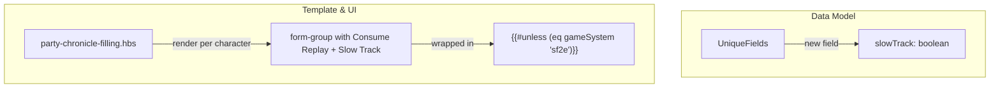
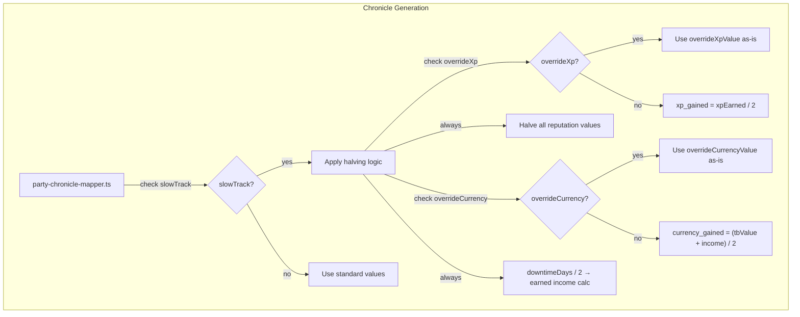
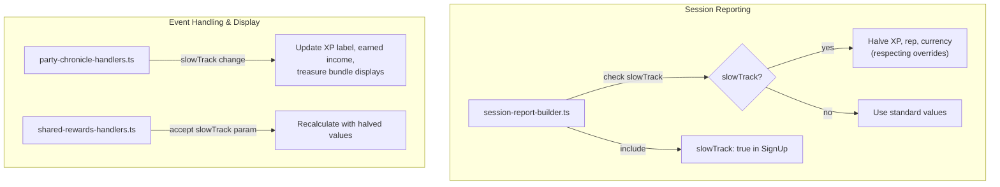
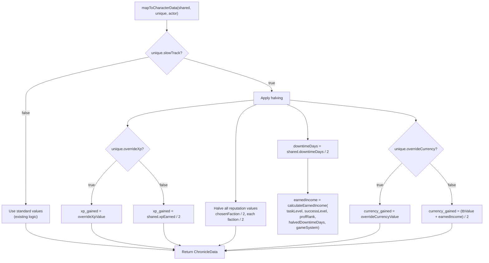
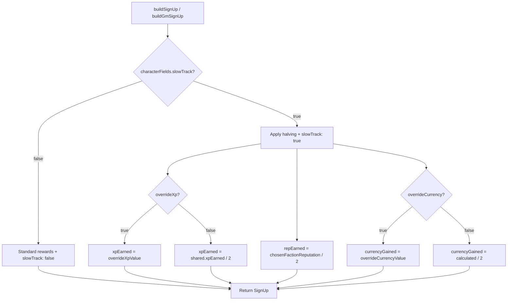

# Design Document: Slow Track

## Overview

Pathfinder Society Organized Play allows characters to advance at a "slow track" rate, earning half the standard rewards. This feature adds a per-character "Slow Track" checkbox to the party chronicle form that halves XP, all reputation values, gold (currency gained), and downtime days for that character. Halving preserves fractional values — no rounding is applied (e.g., 3 reputation → 1.5 reputation, 7 downtime days → 3.5 downtime days).

The Slow Track checkbox appears on the same line as the existing "Consume Replay" checkbox in each character card (both party members and GM character). Both checkboxes are hidden when the game system is Starfinder Society (`sf2e`), as these options are not part of Starfinder rules.

Override interactions: when Override XP is checked, the override XP value is used as-is (not halved). When Override Currency is checked, the override currency value is used as-is (not halved). Only reputation and downtime days are still halved when overrides are active.

Gold halving applies to the final `currency_gained` total (treasure bundle value + earned income), not to the individual components separately. Downtime days halving propagates through the earned income calculation, so earned income is naturally reduced when slow track is active.

The design follows the existing hybrid ApplicationV2 pattern: the `slowTrack` boolean is added to `UniqueFields`, extracted from the DOM in `form-data-extraction.ts`, and consumed by `party-chronicle-mapper.ts` (for PDF generation) and `session-report-builder.ts` (for session reporting). Display updates are handled by extending the existing change handlers.

## Architecture

The slow track feature integrates into the existing architecture by extending the per-character data model and inserting halving logic into the chronicle generation and session report pipelines. No new top-level modules are introduced. Changes are distributed across the existing layers:





### Key Architectural Decisions

1. **`slowTrack` stored in `UniqueFields`, not `SharedFields`.** Slow track is a per-character option — one player may choose slow track while others do not. This keeps the data model consistent with the existing per-character override pattern.

2. **Halving applied in `mapToCharacterData` and `calculateCharacterRewards`.** The mapper is the single point where chronicle data is assembled for PDF generation, and `calculateCharacterRewards` is the single point for session report reward calculation. Applying halving in these two locations keeps the logic centralized rather than scattered across display handlers.

3. **Downtime days halved before earned income calculation.** Rather than halving earned income directly, the halved downtime days value is passed to `calculateEarnedIncome()`. This naturally produces the correct reduced earned income because earned income is a function of downtime days. The final `currency_gained` (treasure bundle value + earned income) is then halved as a whole, per the rules.

4. **Gold halving applies to the total, not components.** Per the requirements, `currency_gained = (treasureBundleValue + earnedIncome) / 2`. The earned income is calculated with halved downtime days, but the treasure bundle value is not halved individually — only the final sum is halved. This matches the Lorespire rule: "half the rewards."

5. **Checkbox placement on the same line as Consume Replay.** Both checkboxes share a single `form-group` element. This is a template-only change — the `name` attribute pattern (`characters.{id}.slowTrack`) follows the existing convention and integrates with the existing form data extraction loop.

6. **Starfinder exclusion wraps both checkboxes.** The existing `{{#unless (eq gameSystem "sf2e")}}` block is extended to wrap the entire form-group containing both Consume Replay and Slow Track. When the game system is `sf2e`, neither checkbox renders, and the extraction/generation code treats `slowTrack` as `false` via the existing `Boolean()` coercion of `undefined`.

7. **`SignUp` interface extended with `slowTrack` boolean.** The session report includes `slowTrack: true` in each SignUp entry where slow track is active. This allows the browser plugin that consumes the report to know the character is on slow track.

## Components and Interfaces

### Modified Interfaces

#### `UniqueFields` (party-chronicle-types.ts)

Add slow track field:

```typescript
export interface UniqueFields {
  // ... existing fields ...

  /** Whether this character is using slow track advancement (slow-track 1.1, 6.1) */
  slowTrack: boolean;
}
```

#### `SignUp` (session-report-types.ts)

Add slow track field:

```typescript
export interface SignUp {
  // ... existing fields ...

  /** Whether this character is using slow track advancement (slow-track 7.1) */
  slowTrack: boolean;
}
```

### Modified Functions

#### `mapToCharacterData()` (party-chronicle-mapper.ts)

Extended to apply slow track halving when `unique.slowTrack` is `true`:

- **XP**: When `slowTrack && !overrideXp`: `xp_gained = shared.xpEarned / 2`. When `overrideXp`: use `overrideXpValue` as-is.
- **Reputation**: When `slowTrack`: halve `shared.chosenFactionReputation` and each value in `shared.reputationValues` before passing to `calculateReputation()`. This requires creating a modified copy of `shared` with halved reputation values.
- **Downtime / Earned Income**: When `slowTrack`: pass `shared.downtimeDays / 2` to `calculateEarnedIncome()` instead of `shared.downtimeDays`.
- **Currency**: When `slowTrack && !overrideCurrency`: `currency_gained = (treasureBundleValue + earnedIncome) / 2`. When `overrideCurrency`: use `overrideCurrencyValue` as-is.

#### `calculateCharacterRewards()` (session-report-builder.ts)

Extended to accept `slowTrack` from `UniqueFields` and apply the same halving logic as the mapper:

- **XP**: When `slowTrack && !overrideXp`: `xpEarned / 2`. When `overrideXp`: use `overrideXpValue` as-is.
- **Currency**: When `slowTrack && !overrideCurrency`: halve the calculated `currencyGained`. When `overrideCurrency`: use `overrideCurrencyValue` as-is.

#### `buildSignUp()` and `buildGmSignUp()` (session-report-builder.ts)

Extended to:
- Include `slowTrack` boolean in the returned `SignUp` object.
- Halve `repEarned` when `slowTrack` is true: `repEarned = shared.chosenFactionReputation / 2`.

#### `extractFormData()` (form-data-extraction.ts)

Extended to read the slow track checkbox per character:

```typescript
slowTrack: (container.querySelector(
  `input[name="characters.${actorId}.slowTrack"]`
) as HTMLInputElement)?.checked || false,
```

#### `extractUniqueFields()` (chronicle-generation.ts)

Extended to include `slowTrack` in the extracted unique fields:

```typescript
slowTrack: Boolean(uniqueFields.slowTrack),
```

#### `handleFieldChange()` (party-chronicle-handlers.ts)

Extended to detect slow track checkbox changes and trigger display updates:

- When a `slowTrack` checkbox changes, update the XP label, earned income display, and treasure bundle/gold display for that character.

#### Display update functions (shared-rewards-handlers.ts)

The `updateEarnedIncomeDisplay` and `updateTreasureBundleDisplay` functions are extended to accept an optional `slowTrack` parameter. When `true`, the displayed values reflect the halved amounts.

Alternatively, a new `updateSlowTrackDisplays(characterId, container)` function reads the current shared values and the slow track state, then updates all three display elements (XP label, earned income, gold) for that character.

#### `buildDefaultCharacterFields()` (event-listener-helpers.ts)

Extended to include the default slow track field:

```typescript
slowTrack: false,
```

### Template Changes (party-chronicle-filling.hbs)

#### GM Character Section

The existing Consume Replay form-group is replaced with a form-group containing both checkboxes, wrapped in the Starfinder exclusion block:

```handlebars
{{#unless (eq gameSystem "sf2e")}}
<div class="form-group">
    <label data-tooltip="Check this if the player is consuming a replay credit.">
        <input type="checkbox" class="override-icon-checkbox"
               name="characters.{{gmCharacter.id}}.consumeReplay"
               {{#if (lookup gmCharacterFields 'consumeReplay')}}checked{{/if}}>
        Consume Replay
    </label>
    <label data-tooltip="Slow track halves XP, reputation, gold, and downtime days for this character.">
        <input type="checkbox" class="override-icon-checkbox"
               name="characters.{{gmCharacter.id}}.slowTrack"
               {{#if (lookup gmCharacterFields 'slowTrack')}}checked{{/if}}>
        Slow Track
    </label>
</div>
{{/unless}}
```

#### Party Member Section

Same pattern within the `{{#each partyMembers}}` loop:

```handlebars
{{#unless (eq ../gameSystem "sf2e")}}
<div class="form-group">
    <label data-tooltip="Check this if the player is consuming a replay credit.">
        <input type="checkbox" class="override-icon-checkbox"
               name="characters.{{this.id}}.consumeReplay"
               {{#if (lookup (lookup ../savedData.characters this.id) 'consumeReplay')}}checked{{/if}}>
        Consume Replay
    </label>
    <label data-tooltip="Slow track halves XP, reputation, gold, and downtime days for this character.">
        <input type="checkbox" class="override-icon-checkbox"
               name="characters.{{this.id}}.slowTrack"
               {{#if (lookup (lookup ../savedData.characters this.id) 'slowTrack')}}checked{{/if}}>
        Slow Track
    </label>
</div>
{{/unless}}
```

## Data Models

### Persistence Structure

Slow track data is stored within the existing `PartyChronicleData` structure. No new storage keys or mechanisms are needed:

```typescript
// Stored in game.settings under 'pfs-chronicle-generator.partyChronicleData'
{
  timestamp: 1234567890,
  data: {
    shared: {
      // ... existing shared fields (unchanged) ...
    },
    characters: {
      "actor-id-1": {
        // ... existing UniqueFields ...
        slowTrack: true
      },
      "actor-id-2": {
        // ... existing UniqueFields ...
        slowTrack: false
      }
    }
  }
}
```

### Halving Decision Flow in Chronicle Generation



### Session Report Halving Flow




## Correctness Properties

*A property is a characteristic or behavior that should hold true across all valid executions of a system — essentially, a formal statement about what the system should do. Properties serve as the bridge between human-readable specifications and machine-verifiable correctness guarantees.*

### Property 1: XP halving in chronicle generation respects slow track and override states

*For any* valid `SharedFields` with `xpEarned` and any valid `UniqueFields` with `slowTrack`, `overrideXp`, and `overrideXpValue`, the `xp_gained` field in the `ChronicleData` returned by `mapToCharacterData` should equal:
- `overrideXpValue` when `overrideXp` is true (regardless of `slowTrack`)
- `xpEarned / 2` when `slowTrack` is true and `overrideXp` is false
- `xpEarned` when `slowTrack` is false and `overrideXp` is false

**Validates: Requirements 2.1, 2.2, 2.3**

### Property 2: Reputation halving in chronicle generation

*For any* valid `SharedFields` with `chosenFactionReputation` and `reputationValues`, and any valid `UniqueFields` with `slowTrack`, the reputation lines produced by `mapToCharacterData` should reflect halved reputation values when `slowTrack` is true, and standard reputation values when `slowTrack` is false. Specifically, each faction's contribution to the reputation output should be halved (not rounded) when slow track is active.

**Validates: Requirements 3.1, 3.2, 3.3**

### Property 3: Currency halving in chronicle generation respects slow track, downtime, and override states

*For any* valid `SharedFields` with `treasureBundles`, `downtimeDays`, and any valid `UniqueFields` with `slowTrack`, `overrideCurrency`, `overrideCurrencyValue`, `taskLevel`, `successLevel`, and `proficiencyRank`, the `currency_gained` field in the `ChronicleData` returned by `mapToCharacterData` should equal:
- `overrideCurrencyValue` when `overrideCurrency` is true (regardless of `slowTrack`)
- `(treasureBundleValue + earnedIncome) / 2` when `slowTrack` is true and `overrideCurrency` is false, where `earnedIncome` is calculated using `downtimeDays / 2`
- `treasureBundleValue + earnedIncome` when `slowTrack` is false and `overrideCurrency` is false

**Validates: Requirements 4.1, 4.2, 4.3, 5.1, 5.2, 5.3, 5.4**

### Property 4: Slow track persistence round-trip

*For any* valid `PartyChronicleData` structure containing characters with any combination of `slowTrack` boolean values, saving the data and then loading it should produce identical `slowTrack` values for each character.

**Validates: Requirements 6.1, 6.2**

### Property 5: Clear resets all slow track states

*For any* `PartyChronicleData` structure with any combination of `slowTrack` states across any number of characters, after applying the clear-data defaults, every character's `slowTrack` should be `false`.

**Validates: Requirements 6.3**

### Property 6: Session report reward halving respects slow track and override states

*For any* valid `SharedFields` and `UniqueFields` with `slowTrack`, `overrideXp`, `overrideXpValue`, `overrideCurrency`, and `overrideCurrencyValue`, the `SignUp` entry produced by `buildSignUp` (or `buildGmSignUp`) should have:
- `xpEarned` equal to `overrideXpValue` when `overrideXp` is true, `xpEarned / 2` when `slowTrack && !overrideXp`, or `xpEarned` when `!slowTrack && !overrideXp`
- `repEarned` equal to `chosenFactionReputation / 2` when `slowTrack` is true, or `chosenFactionReputation` when `slowTrack` is false
- `currencyGained` equal to `overrideCurrencyValue` when `overrideCurrency` is true, halved calculated value when `slowTrack && !overrideCurrency`, or standard calculated value when `!slowTrack && !overrideCurrency`

**Validates: Requirements 7.2, 7.3, 7.4, 7.5, 7.6**

### Property 7: Session report includes slowTrack flag

*For any* character with `slowTrack` set to true or false, the `SignUp` entry in the session report should include a `slowTrack` field matching the character's `slowTrack` value.

**Validates: Requirements 7.1**

### Property 8: Per-character slow track independence

*For any* set of two or more characters with different `slowTrack` states, the `ChronicleData` produced by `mapToCharacterData` for each character should reflect only that character's `slowTrack` state. Enabling slow track for one character should not affect the rewards calculated for any other character.

**Validates: Requirements 9.1, 9.2, 9.4**

## Error Handling

| Scenario | Handling |
|---|---|
| Saved data missing `slowTrack` field (migration from older version) | When loading saved data that predates this feature, `slowTrack` will be `undefined`. The form data extraction uses `|| false` for checkboxes, and `Boolean(undefined)` returns `false`. No migration script needed — the checkbox defaults to unchecked. |
| `slowTrack` is `true` but game system is `sf2e` | The template does not render the checkbox for `sf2e`, so `slowTrack` cannot be checked via the UI. If stale saved data has `slowTrack: true` for an `sf2e` game, the extraction returns `false` because the checkbox element does not exist in the DOM. The generation code uses `Boolean(uniqueFields.slowTrack)` which safely handles this. |
| Halving produces fractional XP (e.g., 1 XP → 0.5 XP) | Per the Lorespire rules, fractional values are preserved — no rounding. The `xp_gained` field in `ChronicleData` is typed as `number` and supports fractional values. The PDF generator writes the numeric value as-is. |
| Halving produces fractional reputation (e.g., 3 → 1.5) | Fractional reputation values are preserved in the reputation string (e.g., "Envoy's Alliance: +1.5"). The reputation calculator formats the value using string interpolation, which handles decimals. |
| Halving produces fractional downtime days (e.g., 7 → 3.5) | The halved downtime days value is passed to `calculateEarnedIncome()` which accepts `number` and handles fractional days. The earned income table lookup uses the integer portion for the daily rate, and the fractional day produces a proportional income. |
| Halving produces fractional currency (e.g., 15.6 → 7.8) | Currency values are already stored as `number` with decimal precision. The `currency_gained` field supports fractional values. The PDF generator formats currency with 2 decimal places. |
| Override active with slow track — both checked simultaneously | By design, overrides bypass slow track halving. The override value is used as-is. This is the correct behavior per requirements 2.2 and 5.2. |
| Slow track checkbox change fails to auto-save | Handled by existing `saveFormData()` error handling: logs error, shows `ui.notifications.warn()`. The slow track state in the DOM remains correct even if persistence fails. |

## Testing Strategy

### Property-Based Tests

Property-based tests use `fast-check` (already available in the project at version ^4.5.3). Each property test runs a minimum of 100 iterations. Tests are written in Jest with the `@jest-environment jsdom` annotation where DOM interaction is needed.

Tests target the pure logic functions that can be exercised without the Foundry runtime:

- **XP halving in chronicle generation** (Property 1): Test `mapToCharacterData` with generated `SharedFields` and `UniqueFields` containing random `slowTrack`, `overrideXp`, `overrideXpValue`, and `xpEarned` values. Verify `xp_gained` matches the expected value based on the slow track and override state combination.
  - Tag: `Feature: slow-track, Property 1: XP halving in chronicle generation respects slow track and override states`

- **Reputation halving in chronicle generation** (Property 2): Test `mapToCharacterData` with generated reputation values and `slowTrack` states. Verify the reputation lines in the output reflect halved values when slow track is active.
  - Tag: `Feature: slow-track, Property 2: Reputation halving in chronicle generation`

- **Currency halving in chronicle generation** (Property 3): Test `mapToCharacterData` with generated treasure bundles, downtime days, earned income parameters, and `slowTrack`/`overrideCurrency` states. Verify `currency_gained` matches the expected halving logic.
  - Tag: `Feature: slow-track, Property 3: Currency halving in chronicle generation respects slow track, downtime, and override states`

- **Persistence round-trip** (Property 4): Test save/load cycle with generated `PartyChronicleData` containing random `slowTrack` values using a mock storage backend.
  - Tag: `Feature: slow-track, Property 4: Slow track persistence round-trip`

- **Clear resets slow track** (Property 5): Test `buildDefaultCharacterFields` with generated party actors, verifying all `slowTrack` fields are reset to `false`.
  - Tag: `Feature: slow-track, Property 5: Clear resets all slow track states`

- **Session report reward halving** (Property 6): Test `buildSignUp` and `buildGmSignUp` with generated `SharedFields` and `UniqueFields` containing random slow track and override states. Verify XP, reputation, and currency in the `SignUp` match the expected halving logic.
  - Tag: `Feature: slow-track, Property 6: Session report reward halving respects slow track and override states`

- **Session report slowTrack flag** (Property 7): Test `buildSignUp` with generated characters, verifying the `slowTrack` field in the `SignUp` matches the input.
  - Tag: `Feature: slow-track, Property 7: Session report includes slowTrack flag`

- **Per-character independence** (Property 8): Test `mapToCharacterData` called for multiple characters with different `slowTrack` states, verifying each character's output reflects only its own state.
  - Tag: `Feature: slow-track, Property 8: Per-character slow track independence`

Configuration:
- Library: `fast-check`
- Minimum iterations: 100 per property
- Tag format: `Feature: slow-track, Property {N}: {title}`

### Unit Tests (Example-Based)

Unit tests cover specific examples, UI rendering verification, and edge cases:

- Slow Track checkbox renders in each character card when gameSystem is `pf2e` (Req 1.1)
- Slow Track checkbox is labeled "Slow Track" (Req 1.2)
- Slow Track and Consume Replay checkboxes share the same form-group element (Req 1.3)
- Slow Track checkbox is unchecked by default (Req 1.4)
- Slow Track checkbox has a tooltip describing the halving behavior (Req 1.5)
- Neither Slow Track nor Consume Replay renders when gameSystem is `sf2e` (Req 1.6)
- Slow track is treated as false when gameSystem is `sf2e` regardless of stored data (Req 1.7)
- XP label updates immediately when Slow Track is checked (Req 8.1)
- XP label reverts when Slow Track is unchecked (Req 8.2)
- Earned income display updates when Slow Track is checked (Req 8.3)
- Earned income display reverts when Slow Track is unchecked (Req 8.4)
- Gold display updates when Slow Track is checked (Req 8.5)
- Gold display reverts when Slow Track is unchecked (Req 8.6)
- GM character card has the same Slow Track checkbox as party member cards (Req 9.3)
- Halving 1 XP produces 0.5 XP (fractional edge case)
- Halving 3 reputation produces 1.5 reputation (fractional edge case)
- Halving 7 downtime days produces 3.5 downtime days (fractional edge case)

### Integration Tests

Integration tests verify end-to-end workflows with mocked Foundry APIs:

- Form data extraction includes `slowTrack` field for all characters
- Auto-save triggers on slow track checkbox change (Req 6.1)
- Form reload restores slow track checkbox state from saved data (Req 6.2)
- Clear Data button resets all slow track checkboxes to unchecked (Req 6.3)
- Chronicle generation applies halving for slow track characters and standard values for non-slow-track characters in the same party
- Session report includes `slowTrack: true` for slow track characters and `slowTrack: false` for others
