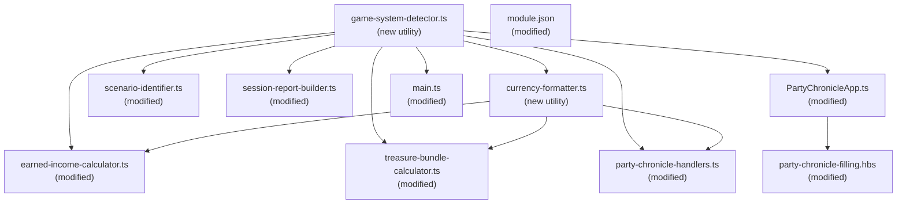

# Design Document: Starfinder Support

## Overview

This feature extends the PFS Chronicle Generator to support Starfinder Society (SFS) alongside Pathfinder Society (PFS). The module detects the active game system at runtime via `game.system.id` and adapts currency labels, income tables, reward calculations, XP/downtime rules, and template rendering accordingly. The design follows a strategy pattern: a thin detection layer selects system-specific behavior, and each calculator/formatter accepts the system identifier to branch logic. No separate Starfinder codebase is needed — the existing modules gain system-awareness through a shared `GameSystem` type and a centralized detector utility.

Key design decisions:
- **Single codebase, runtime branching** — avoids code duplication; system-specific constants live in lookup tables alongside existing PF2e tables.
- **`calculateDowntimeDays` remains the single call path** — Starfinder hardcodes 8 days inside the function (not in the UI), preserving the seam for a future spec that decouples earn income days from downtime days.
- **Currency_Formatter is a new utility** — replaces all hardcoded `"gp"` formatting with system-aware functions, used by both `formatIncomeValue` and `formatCurrencyValue`.
- **Credits Awarded replaces Treasure Bundles** — in Starfinder mode, a flat per-level lookup replaces the TB count × per-level value calculation. The template hides all TB UI elements and shows a read-only "Credits Awarded" value.

## Architecture



The detection layer (`game-system-detector.ts`) is the single source of truth for the active game system. All other modules import from it rather than reading `game.system.id` directly. This ensures consistent behavior and makes testing straightforward — tests can mock the detector without touching Foundry globals.

## Components and Interfaces

### 1. Game System Detector (`scripts/utils/game-system-detector.ts`) — NEW

A small utility module that reads `game.system.id` and checks for the `sf2e-anachronism` module, then exposes the result.

```typescript
/** Supported game system identifiers */
export type GameSystem = 'pf2e' | 'sf2e';

/**
 * Returns the active game system.
 * Returns 'sf2e' if game.system.id === 'sf2e' OR if the sf2e-anachronism module is active.
 * Otherwise returns 'pf2e'.
 */
export function getGameSystem(): GameSystem;

/** Convenience predicate: true when running Starfinder 2e */
export function isStarfinder(): boolean;

/** Convenience predicate: true when running Pathfinder 2e */
export function isPathfinder(): boolean;
```

Implementation: returns `'sf2e'` if `game.system.id === 'sf2e'` or `game.modules.get('sf2e-anachronism')?.active === true`, otherwise returns `'pf2e'`. The function is called at usage sites (not cached at module load time) so it works correctly in test environments where the global may be swapped.

### 2. Currency Formatter (`scripts/utils/currency-formatter.ts`) — NEW

Replaces all hardcoded `"gp"` formatting throughout the codebase.

```typescript
import { GameSystem } from './game-system-detector';

/**
 * Formats a currency value for display using the system-appropriate unit.
 *
 * Pathfinder: "10.50 gp" (2 decimal places)
 * Starfinder: "105 Credits" (whole number, no decimals)
 *
 * @param value - Numeric currency value
 * @param gameSystem - The active game system
 * @returns Formatted display string
 */
export function formatCurrency(value: number, gameSystem: GameSystem): string;

/**
 * Returns the currency unit label for the active game system.
 * Pathfinder: "gp"
 * Starfinder: "Credits"
 */
export function getCurrencyLabel(gameSystem: GameSystem): string;

/**
 * Returns the zero-value display string for the active game system.
 * Pathfinder: "0.00 gp"
 * Starfinder: "0 Credits"
 */
export function getZeroCurrencyDisplay(gameSystem: GameSystem): string;
```

Design rationale: The `gameSystem` parameter is passed explicitly rather than calling `getGameSystem()` internally. This makes the formatter a pure function — easy to test without mocking globals, and allows callers to pass the system from template context.

### 3. Earned Income Calculator (`scripts/utils/earned-income-calculator.ts`) — MODIFIED

Changes:
- **New export: `STARFINDER_INCOME_TABLE`** — derived from `INCOME_TABLE` using `Math.ceil(value * 10)` for every entry. Computed once at module load time as a constant.
- **`getIncomePerDay`** gains an optional `gameSystem` parameter (defaults to result of `getGameSystem()`). When Starfinder, looks up from `STARFINDER_INCOME_TABLE` instead of `INCOME_TABLE`.
- **`calculateEarnedIncome`** gains an optional `gameSystem` parameter. When Starfinder, applies `Math.ceil()` to the final result to ensure whole-number Credits.
- **`calculateDowntimeDays`** gains an optional `gameSystem` parameter. When Starfinder, always returns `8` (since XP is always 4 and downtime = XP × 2). The function signature and call sites remain unchanged — callers still invoke `calculateDowntimeDays(xpEarned, treasureBundles)` and the function internally checks the game system.
- **`formatIncomeValue`** delegates to `formatCurrency` from the new currency-formatter module.

```typescript
// New Starfinder income table (computed from INCOME_TABLE)
export const STARFINDER_INCOME_TABLE: Record<number, Record<string, number | Record<string, number>>>;

// Modified signatures (gameSystem parameter added, optional with default)
export function getIncomePerDay(
  taskLevel: number | string,
  successLevel: string,
  proficiencyRank: string,
  gameSystem?: GameSystem
): number;

export function calculateEarnedIncome(
  taskLevel: number | string,
  successLevel: string,
  proficiencyRank: string,
  downtimeDays: number,
  gameSystem?: GameSystem
): number;

export function calculateDowntimeDays(
  xpEarned: number,
  treasureBundles?: number,
  gameSystem?: GameSystem
): number;

export function formatIncomeValue(value: number, gameSystem?: GameSystem): string;
```

The `STARFINDER_INCOME_TABLE` is built programmatically from `INCOME_TABLE` at module load:

```typescript
function buildStarfinderIncomeTable(): typeof INCOME_TABLE {
  const sfTable: Record<number, Record<string, number | Record<string, number>>> = {};
  for (const [levelStr, ranks] of Object.entries(INCOME_TABLE)) {
    const level = Number(levelStr);
    sfTable[level] = {};
    for (const [rank, value] of Object.entries(ranks)) {
      if (rank === 'critical' && typeof value === 'object') {
        const critTable: Record<string, number> = {};
        for (const [critRank, critValue] of Object.entries(value as Record<string, number>)) {
          critTable[critRank] = Math.ceil(critValue * 10);
        }
        sfTable[level][rank] = critTable;
      } else {
        sfTable[level][rank] = Math.ceil((value as number) * 10);
      }
    }
  }
  return sfTable;
}

export const STARFINDER_INCOME_TABLE = buildStarfinderIncomeTable();
```

### 4. Credits Awarded Table & Calculator (`scripts/utils/treasure-bundle-calculator.ts`) — MODIFIED

Changes:
- **New export: `CREDITS_AWARDED_TABLE`** — a `Record<number, number>` mapping levels 1-10 to flat credit amounts.
- **New export: `getCreditsAwarded(level: number): number`** — looks up the credits for a character level. Returns 0 for levels outside 1-10.
- **`calculateCurrencyGained`** gains an optional `gameSystem` parameter. When Starfinder, uses `getCreditsAwarded(level) + earnedIncome` instead of `treasureBundleValue + earnedIncome`.
- **`formatCurrencyValue`** delegates to `formatCurrency` from the new currency-formatter module.

```typescript
/** Starfinder Credits Awarded by character level (SFS Guide, levels 1-10 only) */
export const CREDITS_AWARDED_TABLE: Record<number, number> = {
  1: 140,
  2: 220,
  3: 380,
  4: 640,
  5: 1000,
  6: 1500,
  7: 2200,
  8: 3000,
  9: 4400,
  10: 6000,
};

export function getCreditsAwarded(level: number): number;

export function calculateCurrencyGained(
  treasureBundleValueOrCreditsAwarded: number,
  incomeEarned: number,
  gameSystem?: GameSystem
): number;

export function formatCurrencyValue(value: number, gameSystem?: GameSystem): string;
```

### 5. Scenario Identifier (`scripts/model/scenario-identifier.ts`) — MODIFIED

Changes:
- Add a new regex pattern for Starfinder layout IDs: `/^sfs2\.s(\d+-\d+)$/`
- `buildScenarioIdentifier` checks the Starfinder pattern first, then falls back to the existing PF2e pattern.

```typescript
const PF_SCENARIO_PATTERN = /^pfs2\.s(\d+-\d+)$/;
const SF_SCENARIO_PATTERN = /^sfs2\.s(\d+-\d+)$/;

export function buildScenarioIdentifier(layoutId: string): string {
  const sfMatch = SF_SCENARIO_PATTERN.exec(layoutId);
  if (sfMatch) return `SFS2E ${sfMatch[1]}`;

  const pfMatch = PF_SCENARIO_PATTERN.exec(layoutId);
  if (pfMatch) return `PFS2E ${pfMatch[1]}`;

  // Fallback: strip known prefixes
  if (layoutId.startsWith('sfs2.')) return layoutId.substring(5);
  if (layoutId.startsWith('pfs2.')) return layoutId.substring(5);
  return layoutId;
}
```

### 6. Session Report Builder (`scripts/model/session-report-builder.ts`) — MODIFIED

Changes:
- Import `getGameSystem` from the detector.
- `buildSessionReport` sets `gameSystem` to `'PFS2E'` or `'SFS2E'` based on the detected system.
- The `SessionReport.gameSystem` type widens from `'PFS2E'` to `'PFS2E' | 'SFS2E'`.

```typescript
// In session-report-types.ts:
export interface SessionReport {
  gameSystem: 'PFS2E' | 'SFS2E';
  // ... rest unchanged
}

// In session-report-builder.ts:
import { getGameSystem } from '../utils/game-system-detector';

export function buildSessionReport(params: SessionReportBuildParams): SessionReport {
  const gameSystem = getGameSystem() === 'sf2e' ? 'SFS2E' : 'PFS2E';
  // ... rest of assembly, using gameSystem variable
}
```

### 7. Party Chronicle Template (`templates/party-chronicle-filling.hbs`) — MODIFIED

The template receives `gameSystem` in its Handlebars context (added to `PartyChronicleContext`). Conditional blocks use `{{#if (eq gameSystem "sf2e")}}` to switch rendering.

Key template changes:

**XP Earned section:**
```handlebars
{{#if (eq gameSystem "sf2e")}}
  <div class="form-group">
    <label>XP Earned</label>
    <div class="xp-fixed-value">4 XP</div>
    <input type="hidden" name="shared.xpEarned" value="4">
  </div>
{{else}}
  {{!-- existing XP dropdown --}}
{{/if}}
```

**Treasure Bundles / Credits Awarded (shared sidebar):**
```handlebars
{{#unless (eq gameSystem "sf2e")}}
  {{!-- existing treasure bundles dropdown --}}
{{/unless}}
```

**Per-character treasure bundle / credits awarded:**
```handlebars
{{#if (eq gameSystem "sf2e")}}
  <div class="form-group">
    <label><i class="fas fa-coins"></i> Credits Awarded</label>
    <div class="credits-awarded-value">{{getCreditsAwarded this.level}} Credits</div>
  </div>
{{else}}
  {{!-- existing treasure bundle value display --}}
{{/if}}
```

**Earned income initial value:**
```handlebars
<div class="earned-income-value" ...>{{getZeroCurrencyDisplay gameSystem}}</div>
```

**Currency Spent label:**
```handlebars
<label>
  <i class="fas fa-money-bill-wave"></i>
  {{#if (eq gameSystem "sf2e")}}Credits Spent{{else}}Currency Spent{{/if}}
</label>
```

**Downtime tooltip (Starfinder-specific):**
```handlebars
{{#if (eq gameSystem "sf2e")}}
  data-tooltip="Starfinder Society scenarios always grant 8 Downtime Days."
{{else}}
  data-tooltip="Scenarios and Quests grant two days of Downtime per XP earned. Bounties are missions the PC undertakes during their Downtime and thus grant no Downtime."
{{/if}}
```

### 8. PartyChronicleApp (`scripts/PartyChronicleApp.ts`) — MODIFIED

Changes:
- Import `getGameSystem` from the detector.
- `_prepareContext` adds `gameSystem: getGameSystem()` to the returned `PartyChronicleContext`.
- Register new Handlebars helpers: `getCreditsAwarded`, `getZeroCurrencyDisplay`.

### 9. Party Chronicle Handlers (`scripts/handlers/party-chronicle-handlers.ts`) — MODIFIED

Changes:
- `updateEarnedIncomeDisplay` passes `getGameSystem()` to `calculateEarnedIncome` and `formatIncomeValue`.
- `updateTreasureBundleDisplay` passes `getGameSystem()` to `formatCurrencyValue`. In Starfinder mode, this function is not called (TB UI is hidden), but the system parameter ensures correctness if called.
- `updateDowntimeDaysDisplay` passes `getGameSystem()` to `calculateDowntimeDays`.
- New function `updateAllCreditsAwardedDisplays(container)` — iterates character sections and sets the credits awarded value from `getCreditsAwarded(level)` formatted via `formatCurrency`.

### 10. Main Entry Point (`scripts/main.ts`) — MODIFIED

Changes:
- Register hooks for both `renderPartySheetPF2e` and `renderPartySheetSF2e` (Starfinder party sheet hook name).
- Register hooks for both `renderCharacterSheetPF2e` and `renderCharacterSheetSF2e`.
- Register new Handlebars helpers: `getCreditsAwarded`, `getZeroCurrencyDisplay`, `getCurrencyLabel`.
- `initializeForm` calls `updateAllCreditsAwardedDisplays` when in Starfinder mode (instead of `updateAllTreasureBundleDisplays`).

### 11. Module Manifest (`module.json`) — MODIFIED

Add `sf2e` to the `relationships.systems` array:

```json
"relationships": {
  "systems": [
    { "id": "pf2e", "type": "system", "compatibility": {} },
    { "id": "sf2e", "type": "system", "compatibility": {} }
  ]
}
```

### 12. Party Chronicle Types (`scripts/model/party-chronicle-types.ts`) — MODIFIED

Add `gameSystem` to `PartyChronicleContext`:

```typescript
export interface PartyChronicleContext {
  // ... existing fields
  /** Active game system identifier for conditional template rendering */
  gameSystem: 'pf2e' | 'sf2e';
}
```

### 13. Party Chronicle Mapper (`scripts/model/party-chronicle-mapper.ts`) — MODIFIED

`mapToCharacterData` gains system-awareness:
- When Starfinder, uses `getCreditsAwarded(level)` instead of `calculateTreasureBundleValue(bundles, level)` for the `treasure_bundle_value` field (which becomes `credits_awarded` semantically).
- Passes `gameSystem` to `calculateEarnedIncome` and `calculateCurrencyGained`.

## Data Models

### GameSystem Type

```typescript
type GameSystem = 'pf2e' | 'sf2e';
```

### CREDITS_AWARDED_TABLE

```typescript
const CREDITS_AWARDED_TABLE: Record<number, number> = {
  1: 140,   2: 220,   3: 380,   4: 640,   5: 1000,
  6: 1500,  7: 2200,  8: 3000,  9: 4400,  10: 6000,
};
```

### STARFINDER_INCOME_TABLE

Derived programmatically from `INCOME_TABLE`. Example entries:

| Task Level | Failure | Trained | Expert | Master | Legendary |
|-----------|---------|---------|--------|--------|-----------|
| 0         | 1       | 1       | 1      | 1      | 1         |
| 1         | 1       | 2       | 2      | 2      | 2         |
| 5         | 2       | 9       | 10     | 10     | 10        |
| 10        | 7       | 40      | 50     | 60     | 60        |
| 20        | 80      | 400     | 750    | 1500   | 2000      |

All values are `Math.ceil(pf_value * 10)`. For example, PF level 0 failure = 0.01 gp → SF = Math.ceil(0.01 * 10) = Math.ceil(0.1) = 1 Credit.

### SessionReport.gameSystem

Widened from `'PFS2E'` to `'PFS2E' | 'SFS2E'`.

## Correctness Properties

*A property is a characteristic or behavior that should hold true across all valid executions of a system — essentially, a formal statement about what the system should do. Properties serve as the bridge between human-readable specifications and machine-verifiable correctness guarantees.*

### Property 1: Anachronism Module Triggers Starfinder Detection

*For any* `game.system.id` value, if the `sf2e-anachronism` module is active, the Game System Detector SHALL return `'sf2e'` regardless of the system ID. Conversely, if `game.system.id` is not `'sf2e'` and the anachronism module is not active, the detector SHALL return `'pf2e'`.

**Validates: Requirements 1.1, 1.2, 1.3**

### Property 2: Pathfinder Currency Format

*For any* non-negative number, `formatCurrency(value, 'pf2e')` SHALL return a string matching the pattern `<number with 2 decimal places> gp` (e.g., `"10.50 gp"`).

**Validates: Requirements 3.1**

### Property 3: Starfinder Currency Format

*For any* non-negative number, `formatCurrency(value, 'sf2e')` SHALL return a string matching the pattern `<whole number> Credits` (e.g., `"105 Credits"`).

**Validates: Requirements 3.2**

### Property 4: Starfinder Income Table Derivation

*For any* valid task level (0-20), proficiency rank, and success level, the Starfinder income-per-day value SHALL equal `Math.ceil(pathfinder_value * 10)` where `pathfinder_value` is the corresponding Pathfinder income-per-day value.

**Validates: Requirements 4.1, 4.2, 4.6, 9.1**

### Property 5: Starfinder Earned Income Whole Number

*For any* valid combination of task level (0-20), proficiency rank, success level, and downtime days (0-8), `calculateEarnedIncome` in Starfinder mode SHALL return a value where `value % 1 === 0` (a whole number with no fractional part).

**Validates: Requirements 4.3, 4.5, 9.2**

### Property 6: Starfinder Currency Gained from Credits Awarded

*For any* character level (1-10) and any non-negative earned income value, `calculateCurrencyGained` in Starfinder mode SHALL return `CREDITS_AWARDED_TABLE[level] + earnedIncome`, and the Credits Awarded component SHALL be a positive whole number.

**Validates: Requirements 5.2, 5.4, 5.6, 9.3**

### Property 7: Starfinder Downtime Days Fixed at 8

*For any* XP value and any treasure bundle count, `calculateDowntimeDays` in Starfinder mode SHALL return `8`.

**Validates: Requirements 6.3**

### Property 8: Session Report Game System Matches Detected System

*For any* valid session report build parameters, when the detected game system is `'pf2e'` the `gameSystem` field SHALL be `'PFS2E'`, and when the detected game system is `'sf2e'` the `gameSystem` field SHALL be `'SFS2E'`.

**Validates: Requirements 8.1, 8.2**

### Property 9: Starfinder Scenario Identifier Parsing

*For any* valid season number (1-99) and scenario number (01-99), `buildScenarioIdentifier("sfs2.s{season}-{scenario}")` SHALL return `"SFS2E {season}-{scenario}"`.

**Validates: Requirements 8.3**

## Error Handling

- **Unknown game system ID**: `getGameSystem()` defaults to `'pf2e'` when neither `game.system.id === 'sf2e'` nor the `sf2e-anachronism` module is active. No error is thrown — the module gracefully falls back to Pathfinder behavior.
- **Character level outside Credits Awarded range (1-10)**: `getCreditsAwarded()` returns `0` for levels outside the valid range. SFS caps at level 10, so levels 11-20 are not expected but handled gracefully.
- **Invalid task level in Starfinder mode**: Same error handling as Pathfinder — `getIncomePerDay` returns `0` for invalid inputs.
- **Template rendering with missing gameSystem**: The template defaults to Pathfinder rendering when `gameSystem` is falsy (using `{{#if (eq gameSystem "sf2e")}}` which is false for undefined/null).

## Testing Strategy

### Test Framework

- **Unit tests**: Jest (existing framework)
- **Property-based tests**: fast-check (already a dev dependency, extensively used in the project)

### Dual Testing Approach

**Unit tests** cover:
- Specific examples with known inputs/outputs (e.g., Credits Awarded table exact values)
- Template rendering conditional visibility (Starfinder hides TB, shows Credits Awarded)
- Integration points (handler → calculator → formatter chain)
- Edge cases (level 0, level 21, empty strings, unknown system IDs)

**Property-based tests** cover:
- Universal properties across all valid inputs (Properties 1-9 above)
- Each property test runs a minimum of 100 iterations
- Each test is tagged with a comment referencing the design property

### Property Test Configuration

- Library: `fast-check` (v4.5.3, already installed)
- Minimum iterations: 100 per property (`{ numRuns: 100 }`)
- Tag format: `Feature: starfinder-support, Property {number}: {property_text}`

### Test Files

| Test File | Scope |
|-----------|-------|
| `tests/utils/game-system-detector.test.ts` | Unit tests for detector |
| `tests/utils/game-system-detector.pbt.test.ts` | Property 1 (unknown IDs default) |
| `tests/utils/currency-formatter.test.ts` | Unit tests for formatter |
| `tests/utils/currency-formatter.pbt.test.ts` | Properties 2, 3 (format patterns) |
| `tests/utils/earned-income-calculator-starfinder.test.ts` | Unit tests for SF income |
| `tests/utils/earned-income-calculator-starfinder.pbt.test.ts` | Properties 4, 5, 7 (SF income table, whole numbers, downtime) |
| `tests/utils/treasure-bundle-calculator-starfinder.test.ts` | Unit tests for Credits Awarded |
| `tests/utils/treasure-bundle-calculator-starfinder.pbt.test.ts` | Property 6 (currency gained) |
| `tests/model/scenario-identifier-starfinder.test.ts` | Unit tests for SF scenario IDs |
| `tests/model/scenario-identifier-starfinder.pbt.test.ts` | Property 9 (SF parsing) |
| `tests/model/session-report-builder-starfinder.test.ts` | Unit tests for SF session report |
| `tests/model/session-report-builder-starfinder.pbt.test.ts` | Property 8 (gameSystem field) |

### Existing Test Preservation

All existing tests must continue to pass unchanged. The optional `gameSystem` parameter defaults to the detected system, which in test environments (where `game.system.id` is undefined) defaults to `'pf2e'`. This means existing tests automatically exercise the Pathfinder code path without modification.
