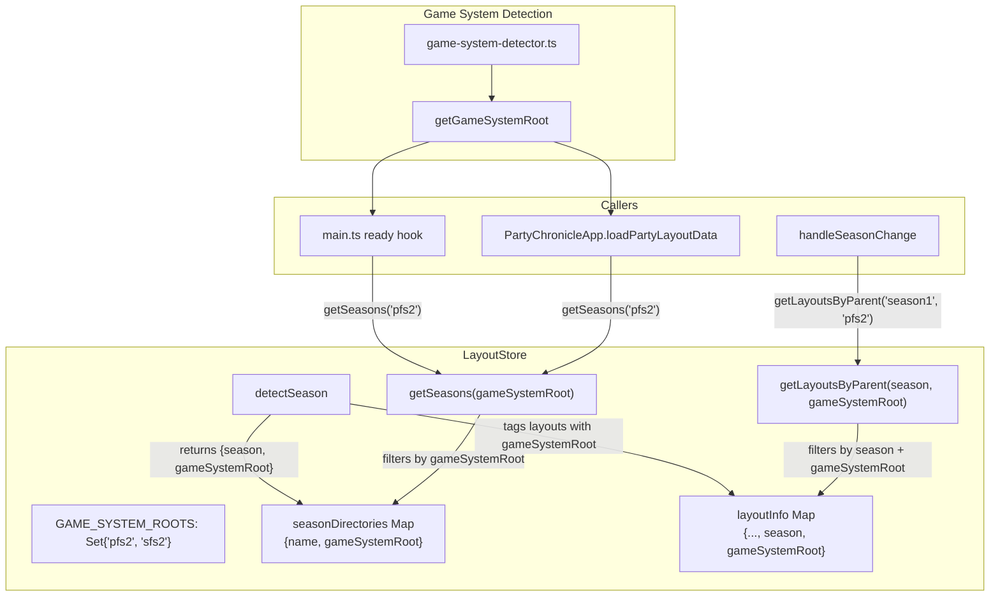

# Design Document: System Season Filtering

## Overview

This design makes the `LayoutStore` system-aware so that seasons and chronicle layouts are filtered by the active game system. Currently, all seasons from every game system root are mixed together — `getSeasons()` returns seasons from both PF2e and SF2e, and `getLayoutsByParent()` matches by bare directory name without considering which game system root the season belongs to. This causes season ID collisions (e.g., both `pfs2/season1` and `sfs2/season1` produce a single `season1` entry) and shows GMs seasons/layouts from the wrong system.

Layout IDs already encode the game system (e.g., `pfs2.s5-18`, `sfs2.s1-01`), so the system information is inherently present in the data. The fix leverages this by tagging each season and layout entry with its `gameSystemRoot` during discovery, then filtering on that tag in the public query methods. Season IDs remain bare directory names — the `gameSystemRoot` field disambiguates them. Additionally, the `GAME_SYSTEM_ROOTS` constant is corrected from `'sfs'` to `'sfs2'`.

## Architecture

The change is localized to the LayoutStore's internal data model (adding a `gameSystemRoot` field to season and layout entries) and its two public query methods, plus a small mapping utility and caller updates.



### Data Flow

1. During `initialize()`, `findAllLayouts` recursively browses `assets/layouts/`. When `detectSeason` identifies a season directory (immediate child of a game system root), it returns both the season directory name AND the game system root (e.g., `{season: 'season1', gameSystemRoot: 'pfs2'}`).
2. The `gameSystemRoot` is stored alongside each season entry in `seasonDirectories` and each layout entry in `layoutInfo`.
3. `getSeasons(gameSystemRoot)` filters `seasonDirectories` entries by matching the `gameSystemRoot` field.
4. `getLayoutsByParent(season, gameSystemRoot)` filters `layoutInfo` entries by matching both the `season` field and the `gameSystemRoot` field.
5. Callers use `getGameSystemRoot()` to translate the detected game system (`'pf2e'`/`'sf2e'`) into the directory root (`'pfs2'`/`'sfs2'`).

## Components and Interfaces

### 1. `LayoutStore` (scripts/LayoutStore.ts)

**Constant change:**
```typescript
// Before
const GAME_SYSTEM_ROOTS = new Set(['pfs2', 'sfs']);
// After
const GAME_SYSTEM_ROOTS = new Set(['pfs2', 'sfs2']);
```

**Internal data model changes:**

The `seasonDirectories` map value gains a `gameSystemRoot` field:
```typescript
// Before: Map<string, string>  (key: dirName, value: displayName)
// After:  Map<string, { name: string, gameSystemRoot: string }>
// Key remains the bare directory name, but is now a composite key
// using `${gameSystemRoot}/${dirName}` to prevent collisions
```

Wait — since two roots can have the same directory name (e.g., `season1`), we need the map key to be unique. The simplest approach: use `${gameSystemRoot}/${dirName}` as the key (e.g., `pfs2/season1`), but the *display name* and *season matching* still use the bare directory name. This is a composite key for storage only — callers pass the composite key from the dropdown value.

Actually, the even simpler approach: change `seasonDirectories` to store entries with a `gameSystemRoot` field, and change the key to `${gameSystemRoot}/${dirName}`. The `getSeasons()` method filters by prefix and returns the composite key as the `id`. The `getLayoutsByParent()` method matches on the composite key stored in each layout's `season` field.

This means:
- Season IDs become `pfs2/season1`, `sfs2/season1` (composite keys)
- Layout entries store `season: 'pfs2/season1'` (composite key)
- `getSeasons('pfs2')` filters entries starting with `pfs2/`
- `getLayoutsByParent('pfs2/season1')` does exact match (unchanged logic)
- Display names remain `Season 1` (extracted from the directory name portion)

**`detectSeason` change:**
Returns composite season ID `${parentDir}/${dirName}` instead of bare `dirName`, plus the `gameSystemRoot`.

```typescript
private detectSeason(target: string, inheritedSeason?: string): { season?: string, gameSystemRoot?: string, isNewSeason: boolean } {
    if (inheritedSeason) return { season: inheritedSeason, isNewSeason: false };

    const segments = target.split('/').filter(Boolean);
    const dirName = segments.pop() ?? '';
    const parentDir = segments.pop();

    if (parentDir && GAME_SYSTEM_ROOTS.has(parentDir) && dirName !== parentDir) {
        const compositeId = `${parentDir}/${dirName}`;
        return { season: compositeId, gameSystemRoot: parentDir, isNewSeason: true };
    }
    return { season: undefined, isNewSeason: false };
}
```

**`findAllLayouts` change:**
Passes the `gameSystemRoot` through to `registerLayoutFile` and stores it in `seasonDirectories`:

```typescript
if (isNewSeason && season && gameSystemRoot) {
    const dirName = season.split('/').pop()!;
    this.seasonDirectories.set(season, { name: this.getDisplayNameForDirectory(dirName), gameSystemRoot });
}
```

**`registerLayoutFile` change:**
Stores `gameSystemRoot` in `layoutInfo`:

```typescript
this.layoutInfo.set(id, { path: file, description, season, gameSystemRoot, hidden });
```

**`getSeasons` signature change:**
```typescript
// Before
public getSeasons(): Array<{ id: string, name: string }>
// After
public getSeasons(gameSystemRoot: string): Array<{ id: string, name: string }>
```

Filters entries whose stored `gameSystemRoot` matches. The parameter is required — all callers must pass it explicitly. Sorting logic extracts the directory name portion from the composite key for numeric detection.

```typescript
public getSeasons(gameSystemRoot: string): Array<{ id: string, name: string }> {
    return Array.from(this.seasonDirectories.entries())
        .filter(([_id, entry]) => entry.gameSystemRoot === gameSystemRoot)
        .map(([id, entry]) => ({ id, name: entry.name }))
        .sort((a, b) => {
            // Extract directory name from composite key for sorting
            const aDir = a.id.includes('/') ? a.id.split('/').pop()! : a.id;
            const bDir = b.id.includes('/') ? b.id.split('/').pop()! : b.id;
            const aNum = Number.parseInt(aDir);
            const bNum = Number.parseInt(bDir);
            if (!Number.isNaN(aNum) && !Number.isNaN(bNum)) return aNum - bNum;
            if (!Number.isNaN(aNum)) return -1;
            if (!Number.isNaN(bNum)) return 1;
            return a.name.localeCompare(b.name);
        });
}
```

**`getLayoutsByParent`** — no signature change needed. It already does exact match on the `season` field. Since the season field now stores composite keys (e.g., `pfs2/season1`), and callers pass the composite key from the dropdown value, matching works correctly.

### 2. `getGameSystemRoot` (scripts/utils/game-system-detector.ts)

New exported function:

```typescript
/** Maps game system IDs to layout directory root names. */
export function getGameSystemRoot(gameSystem?: GameSystem): string {
  const system = gameSystem ?? getGameSystem();
  return system === 'sf2e' ? 'sfs2' : 'pfs2';
}
```

### 3. Caller Updates

**`main.ts` (ready hook):**
```typescript
import { getGameSystemRoot } from './utils/game-system-detector.js';
// ...
const seasons = layoutStore.getSeasons(getGameSystemRoot());
```

**`PartyChronicleApp.ts` (loadPartyLayoutData):**
```typescript
import { getGameSystemRoot } from './utils/game-system-detector.js';
// ...
const seasons = layoutStore.getSeasons(getGameSystemRoot());
```

**`party-chronicle-handlers.ts` (handleSeasonChange):**
No change needed — the season dropdown `value` already contains the composite key (set during rendering), which is passed directly to `getLayoutsByParent()`.

**`party-chronicle-handlers.ts` (updateXpForSeason):**
Needs to extract the directory name from the composite key for XP auto-selection logic:
```typescript
// Extract directory name from composite key (e.g., "pfs2/bounties" -> "bounties")
const dirName = seasonId.includes('/') ? seasonId.split('/').pop()! : seasonId;
const normalizedSeason = dirName.toLowerCase();
```

## Data Models

### Season Entry (in `seasonDirectories` Map)

| Field | Before | After | Example |
|-------|--------|-------|---------|
| Key | `season1` | `pfs2/season1` | `pfs2/season1`, `sfs2/season1` |
| Value | `"Season 1"` (string) | `{ name: "Season 1", gameSystemRoot: "pfs2" }` | Object with name and root |

### Layout Entry (in `layoutInfo` Map)

| Field | Before | After | Example |
|-------|--------|-------|---------|
| `season` | `season1` | `pfs2/season1` | Composite key matching seasonDirectories |
| `gameSystemRoot` | *(not present)* | `pfs2` | The game system root directory |

### Game System Root Mapping

| Game System ID | Directory Root |
|---------------|---------------|
| `pf2e` | `pfs2` |
| `sf2e` | `sfs2` |

## Correctness Properties

### Property 1: Season detection tags with correct game system root

*For any* recognized game system root and *for any* valid directory name that is an immediate child of that root, `detectSeason` SHALL return a composite season ID in the format `root/dirName` and the correct `gameSystemRoot`.

**Validates: Requirements 1.3, 2.1, 2.2**

### Property 2: Same-named seasons under different roots are distinct

*For any* directory name that exists under two different game system roots (e.g., `pfs2/season1` and `sfs2/season1`), the LayoutStore SHALL store them as distinct season entries, and retrieving seasons for one root SHALL NOT include seasons from the other root.

**Validates: Requirements 2.3, 3.2**

### Property 3: Layout entries are tagged with correct game system root

*For any* layout file discovered under a season directory, the layout's `season` field SHALL equal the composite season ID of its parent season directory, and its `gameSystemRoot` field SHALL equal the game system root, ensuring that `getLayoutsByParent` with that composite ID returns the layout.

**Validates: Requirements 2.2, 2.4, 4.1**

### Property 4: getLayoutsByParent returns correct, filtered, sorted results

*For any* composite season ID and *for any* set of layout entries (including hidden layouts and layouts from other seasons), `getLayoutsByParent` SHALL return only non-hidden layouts whose season field matches the composite ID exactly, sorted alphabetically by description.

**Validates: Requirements 2.4, 4.1, 4.2, 4.3**

### Property 5: getSeasons returns filtered, correctly sorted results

*For any* game system root and *for any* set of season entries across multiple roots, `getSeasons(root)` SHALL return only seasons whose `gameSystemRoot` matches the specified root, sorted with numbered seasons first (ascending by number) followed by non-numbered seasons in alphabetical order.

**Validates: Requirements 3.2, 3.5**

## Error Handling

- `getSeasons()` called with an unrecognized root returns an empty array.
- When a previously saved season ID (bare format like `season1`) doesn't match any composite key in the filtered list, `loadPartyLayoutData` falls back to the first available season.
- If a game system root directory contains no season subdirectories, `getSeasons()` returns an empty array.

## Testing Strategy

### Property-Based Tests (fast-check)

5 properties validated with minimum 100 iterations each. Tag format: `Feature: system-season-filtering, Property N: <text>`

### Unit Tests (Jest)

- `GAME_SYSTEM_ROOTS` contains exactly `{'pfs2', 'sfs2'}`
- `getGameSystemRoot('pf2e')` returns `'pfs2'`, `getGameSystemRoot('sf2e')` returns `'sfs2'`
- `getSeasons('pfs2')` with mixed seasons returns only pfs2 seasons
- `getLayoutsByParent('pfs2/season1')` returns only layouts from that composite season
- Fallback when saved season ID doesn't match filtered list
- `updateXpForSeason` extracts directory name from composite key
- Existing `LayoutStore.test.ts` updated for composite season keys
