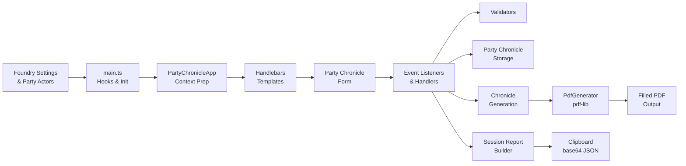
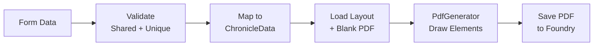
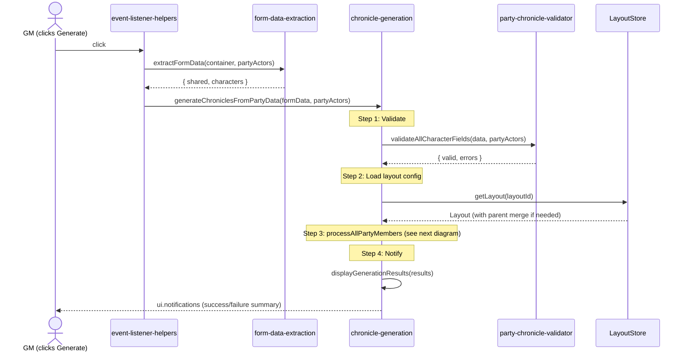
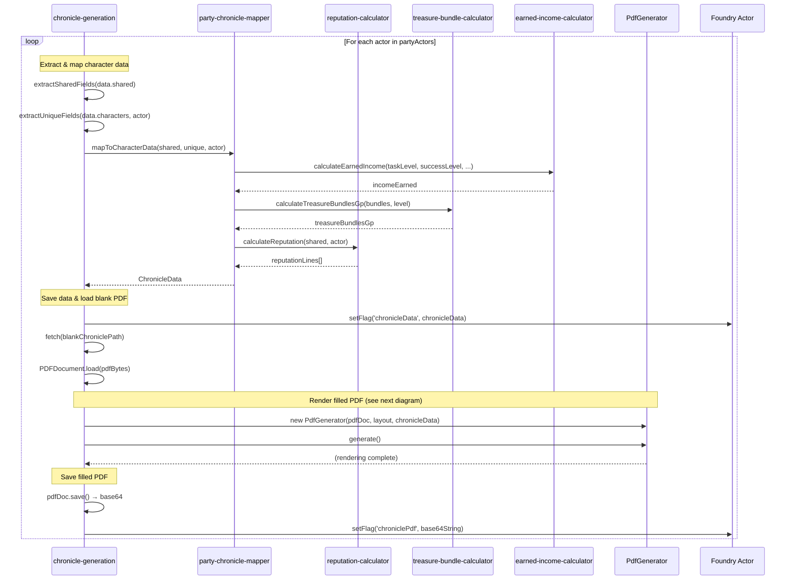
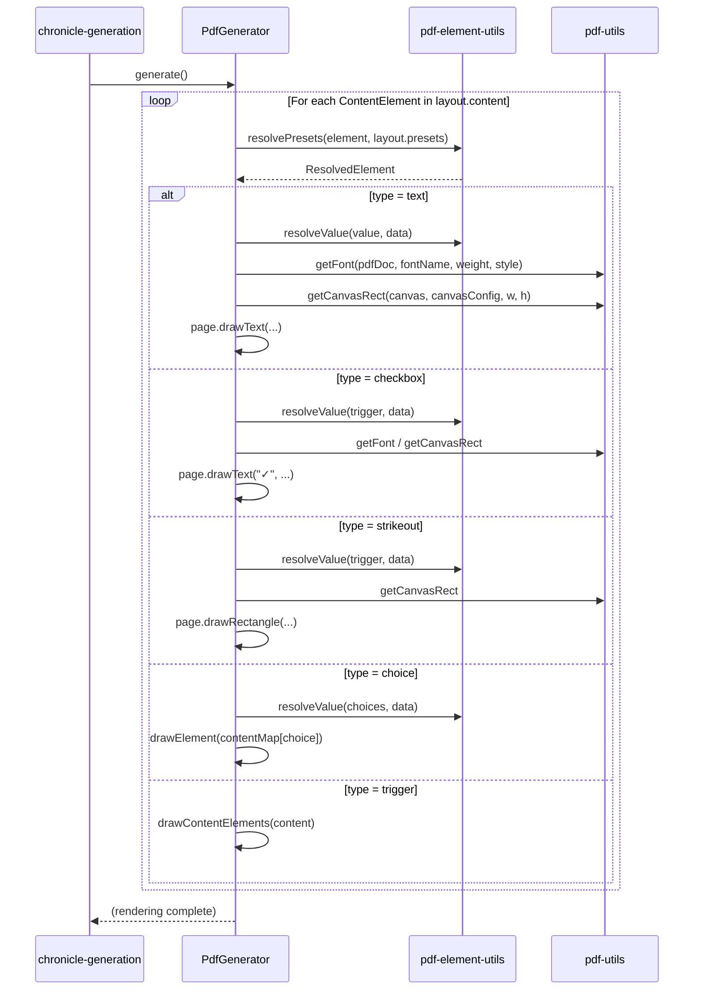

# Foundry VTT Module Architecture

## Purpose

The PFS Chronicle Generator is a Foundry VTT module that lets Game Masters fill in and generate Pathfinder Society chronicle sheets as PDFs for each party member. It renders a form inside the Foundry party sheet, validates input, calculates derived values (earned income, reputation, treasure bundles), generates filled PDFs using `pdf-lib`, and exports session reports for Paizo.com.

## High-Level Data Flow

## Module Roles

### Entry Points

| Module | Role |
|--------|------|
| `main.ts` | Foundry `Hooks.on('init')` and `Hooks.on('ready')` entry point. Registers settings, initializes `LayoutStore`, injects the party chronicle form into the party sheet via `renderPartyChronicleForm()`, and wires up all event listeners. |
| `LayoutDesignerApp.ts` | Foundry ApplicationV2 dialog for selecting season, layout, and blank chronicle PDF. Provides a grid/box preview mode for layout debugging. |
| `PartyChronicleApp.ts` | Prepares the Handlebars template context for the party chronicle form. Loads saved data, maps party actors to form fields, and resolves layout-specific options. |

### Handlers (`scripts/handlers/`)

| Module | Role |
|--------|------|
| `event-listener-helpers.ts` | Attaches all DOM event listeners (season/layout dropdowns, form fields, buttons, file pickers, collapsible sections). Central wiring point between the form and handler functions. |
| `party-chronicle-handlers.ts` | Core form interaction handlers: season/layout changes, field auto-save, treasure bundle display updates, downtime days calculation, earned income display, chronicle path file picker, and form data persistence. |
| `chronicle-generation.ts` | Orchestrates PDF generation for all party members. Validates fields, loads layout configuration, extracts shared/unique fields, maps to chronicle data, and invokes `PdfGenerator` per character. |
| `form-data-extraction.ts` | Reads all form DOM elements and constructs a structured `PartyChronicleData` object with shared fields and per-character fields. |
| `validation-display.ts` | Renders validation errors inline on the form, manages the error panel, and enables/disables the Generate button based on validation state. |
| `session-report-handler.ts` | Handles the "Copy Session Report" button click. Orchestrates: validate → build → serialize → clipboard copy. |
| `collapsible-section-handlers.ts` | Manages collapsible form sections: toggle collapse state, persist state to storage, update summary text in collapsed headers. |

### Model (`scripts/model/`)

| Module | Role |
|--------|------|
| `party-chronicle-types.ts` | TypeScript interfaces for `SharedFields`, `UniqueFields`, `PartyChronicleData`, `PartyMember`, and `PartyChronicleContext`. |
| `layout.ts` | TypeScript interfaces for `Layout`, `Parameter`, `Canvas`, `Preset`, and `ContentElement` — the layout JSON schema. |
| `party-chronicle-validator.ts` | Validates shared fields and per-character unique fields. Also validates session report fields. Returns `{ valid, errors }`. |
| `validation-helpers.ts` | Reusable validation primitives: date format, society ID format, number range, required string, optional array. |
| `party-chronicle-mapper.ts` | Maps form data (`SharedFields` + `UniqueFields`) into `ChronicleData` objects consumed by `PdfGenerator`. Handles reputation calculation and society ID splitting. |
| `party-chronicle-storage.ts` | Persists and loads `PartyChronicleData` to/from Foundry world settings (`game.settings`). |
| `reputation-calculator.ts` | Calculates multi-line reputation strings per character by combining faction-specific values with the chosen faction bonus. |
| `faction-names.ts` | Lookup table mapping faction abbreviation codes (EA, GA, HH, VS, RO, VW) to full names. |
| `scenario-identifier.ts` | Parses layout IDs (e.g., `pfs2.s5-18`) into Paizo scenario identifiers (e.g., `PFS2E 5-18`). |
| `session-report-types.ts` | TypeScript interfaces for `SessionReport`, `SignUp`, and `BonusRep` — the Paizo session report JSON schema. |
| `session-report-builder.ts` | Assembles a `SessionReport` from shared fields, per-character fields, actor PFS data, and layout metadata. |
| `session-report-serializer.ts` | Serializes a `SessionReport` to JSON, optionally base64-encoded for browser plugin consumption. |
| `collapse-state-storage.ts` | Persists collapsible section expand/collapse state to `localStorage`. |

### Utils (`scripts/utils/`)

| Module | Role |
|--------|------|
| `earned-income-calculator.ts` | Calculates earned income per day based on task level, success level, and proficiency rank. Also calculates downtime days from XP and task level options from character level. |
| `earned-income-form-helpers.ts` | DOM helpers for earned income form fields: parameter extraction, character ID parsing, and change handler factory. |
| `filename-utils.ts` | Sanitizes actor names for filenames and generates chronicle output filenames from actor name + blank chronicle path. |
| `layout-utils.ts` | Extracts checkbox and strikeout choices from a layout, and dynamically updates layout-specific form fields when the layout selection changes. |
| `pdf-utils.ts` | PDF rendering utilities: font resolution (standard + web fonts via CDN), color mapping, and canvas rectangle calculation with parent chain resolution. |
| `pdf-element-utils.ts` | Resolves preset inheritance chains for content elements, resolves `param:` value references, and provides content element search/collection helpers. |
| `summary-utils.ts` | Generates summary text for collapsible section headers (event details, reputation, shared rewards). |
| `treasure-bundle-calculator.ts` | Calculates gold piece values from treasure bundle counts. |

### Constants (`scripts/constants/`)

| Module | Role |
|--------|------|
| `dom-selectors.ts` | Centralized DOM selector constants for all form elements, buttons, character fields, and CSS classes. Prevents selector typos across the codebase. |

### Core Classes

| Module | Role |
|--------|------|
| `PdfGenerator.ts` | Renders a filled chronicle PDF using `pdf-lib`. Draws text, multiline text, checkboxes, redactions, lines, choice elements, and trigger elements. Resolves presets and parameter references. Also supports grid overlay and box highlighting for layout debugging. |
| `LayoutStore.ts` | Singleton that discovers, loads, and caches layout JSON files from the Foundry data directory. Supports layout inheritance (child layouts merge with parent layouts). Provides season/layout browsing APIs. |

## Dependency Flow

```mermaid
graph TD
    MAIN["main.ts<br/>(Foundry Hooks entry point)"]
    LDA["LayoutDesignerApp.ts"]
    PCA["PartyChronicleApp.ts"]
    LS["LayoutStore.ts"]
    PG["PdfGenerator.ts"]

    subgraph Handlers
        ELH["event-listener-helpers.ts"]
        PCH["party-chronicle-handlers.ts"]
        CG["chronicle-generation.ts"]
        FDE["form-data-extraction.ts"]
        VD["validation-display.ts"]
        SRH["session-report-handler.ts"]
        CSH["collapsible-section-handlers.ts"]
    end

    subgraph Model
        PCT["party-chronicle-types.ts"]
        LT["layout.ts"]
        PCV["party-chronicle-validator.ts"]
        VH["validation-helpers.ts"]
        PCM["party-chronicle-mapper.ts"]
        PCS["party-chronicle-storage.ts"]
        RC["reputation-calculator.ts"]
        FN["faction-names.ts"]
        SI["scenario-identifier.ts"]
        SRT["session-report-types.ts"]
        SRB["session-report-builder.ts"]
        SRS["session-report-serializer.ts"]
        CSS_ST["collapse-state-storage.ts"]
    end

    subgraph Utils
        EIC["earned-income-calculator.ts"]
        EIFH["earned-income-form-helpers.ts"]
        FU["filename-utils.ts"]
        LU["layout-utils.ts"]
        PU["pdf-utils.ts"]
        PEU["pdf-element-utils.ts"]
        SU["summary-utils.ts"]
        TBC["treasure-bundle-calculator.ts"]
    end

    subgraph Constants
        DS["dom-selectors.ts"]
    end

    MAIN --> LS
    MAIN --> LDA
    MAIN --> PCA
    MAIN --> ELH
    MAIN --> PCH
    MAIN --> CSH
    MAIN --> VD
    MAIN --> DS
    MAIN --> PCS
    MAIN --> FU
    MAIN --> LU
    MAIN --> EIC

    LDA --> LS
    LDA --> PG

    PCA --> LS
    PCA --> PCS
    PCA --> LU
    PCA --> EIC

    ELH --> PCH
    ELH --> VD
    ELH --> CG
    ELH --> SRH
    ELH --> CSH
    ELH --> FDE
    ELH --> DS

    PCH --> FDE
    PCH --> PCS
    PCH --> LS
    PCH --> LU
    PCH --> EIC
    PCH --> EIFH
    PCH --> TBC

    CG --> PG
    CG --> LS
    CG --> PCM
    CG --> PCV
    CG --> FU

    SRH --> FDE
    SRH --> PCV
    SRH --> SRB
    SRH --> SRS

    PG --> PU
    PG --> PEU
    PG --> LT

    PCV --> VH
    PCV --> PCT

    PCM --> RC
    PCM --> PCT

    RC --> FN

    SRB --> FN
    SRB --> SI
    SRB --> SRT
    SRB --> PCT

    SRS --> SRT

    CSH --> CSS_ST
    CSH --> SU

    PEU --> LT
```

## Key Concepts

### Foundry VTT Integration

The module hooks into Foundry VTT at two lifecycle points:

- **`Hooks.on('init')`** — Registers world settings (GM name, PFS number, event info, party chronicle data storage) and the Layout Designer menu entry.
- **`Hooks.on('ready')`** — Initializes `LayoutStore` by scanning the `layouts/` directory tree, then registers hidden settings for season, layout, and blank chronicle path.

The party chronicle form is injected into the PF2e party sheet via `Hooks.on('renderActorSheet')`, which calls `renderPartyChronicleForm()` to prepare context, render the Handlebars template, attach event listeners, and initialize form state.

### Layout System

Layouts are JSON files organized under `layouts/pfs2/` by season (e.g., `s5/`, `s6/`) and category (bounties, quests, specials). Each layout describes:

- **parameters** — User-facing choices (which items to strike out, which checkboxes to check)
- **presets** — Named coordinate/style sets reused across content entries
- **canvas** — Named rectangular regions with percentage-based coordinates, supporting parent-child nesting
- **content** — Rendering instructions that reference parameters and presets

Layouts support inheritance: a child layout specifies a `parent` ID, and `LayoutStore.mergeLayouts()` combines parent and child properties (presets, canvases, parameters, and content arrays are merged).

### PDF Generation Pipeline

For each party member, the pipeline:
1. Validates shared and character-specific fields
2. Maps form data to `ChronicleData` (including reputation calculation)
3. Loads the selected layout and blank chronicle PDF
4. Creates a `PdfGenerator` instance that iterates over layout content elements
5. Resolves preset inheritance and parameter references for each element
6. Draws text, checkboxes, redactions, lines, and choice elements onto the PDF
7. Saves the filled PDF to the Foundry data directory

#### PDF Generation Sequence

#### Per-Character Processing (processAllPartyMembers)

#### PdfGenerator.generate() Detail

### Session Report Export

The session report feature assembles a JSON payload matching the schema expected by browser plugins that automate the Paizo.com session reporting form:

1. **Validate** — `validateSessionReportFields()` checks required fields
2. **Build** — `buildSessionReport()` assembles `SessionReport` from form data, actor PFS data, and layout metadata
3. **Serialize** — `serializeSessionReport()` converts to JSON, optionally base64-encoded
4. **Copy** — Written to clipboard via `navigator.clipboard.writeText()`

Holding Option/Alt while clicking copies raw JSON instead of base64 (useful for debugging).

### Form State Management

Form data is auto-saved to Foundry world settings on every field change via `saveFormData()`. On form render, saved data is loaded and used to pre-populate fields. The Clear button resets to defaults while preserving layout selection. Collapsible section states are persisted separately to `localStorage`.

### Coordinate System

All layout positions use percentage-based coordinates relative to a canvas region. Canvases can be nested (a canvas positioned relative to its parent canvas). `getCanvasRect()` in `pdf-utils.ts` resolves the parent chain to produce absolute page coordinates for PDF rendering.

## Templates

| Template | Purpose |
|----------|---------|
| `party-chronicle-filling.hbs` | Main party chronicle form rendered inside the Foundry party sheet. Contains shared fields, per-character sections, and action buttons. |
| `layout-designer.hbs` | Layout Designer dialog for selecting season/layout and previewing grid/box overlays. |

## Static Assets

| Directory | Purpose |
|-----------|---------|
| `layouts/` | Layout JSON files organized by game system (`pfs2/`, `sfs/`) and season. |
| `modules/` | Chronicle PDF assets organized by season module (year 5, 6, 7). |
| `css/` | Stylesheet for the party chronicle form and layout designer. |
| `dist/` | Compiled JavaScript output (entry point: `dist/main.js`). |
