# Foundry VTT Module Architecture

## Purpose

The PFS Chronicle Generator is a Foundry VTT module (Foundry v13, PF2e system) that lets Game Masters fill in and generate Pathfinder Society chronicle sheets as PDFs for each party member. It renders a form inside the Foundry party sheet's "Society" tab, validates input, calculates derived values (earned income, reputation, treasure bundles), generates filled PDFs using `pdf-lib`, bundles them into a downloadable zip archive via `jszip`, posts chat notifications, and exports session reports for Paizo.com.

## High-Level Data Flow

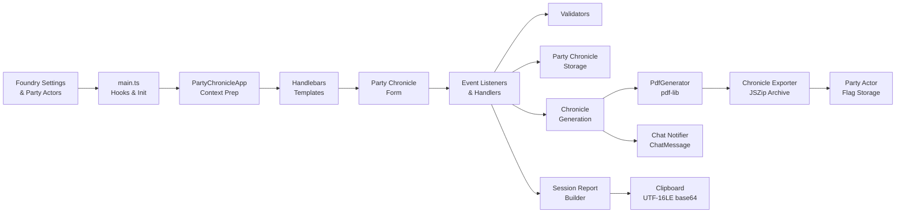

## Source Tree

```
scripts/
├── main.ts                          Entry point (Hooks, settings, form rendering)
├── LayoutStore.ts                   Layout discovery, loading, caching, inheritance
├── PartyChronicleApp.ts             Handlebars context preparation (ApplicationV2)
├── PdfGenerator.ts                  PDF rendering engine (pdf-lib)
├── globals.d.ts                     Ambient global declarations (game)
│
├── constants/
│   └── dom-selectors.ts             Centralized DOM selector constants
│
├── handlers/
│   ├── chat-notifier.ts             Chat messages after chronicle generation
│   ├── chronicle-exporter.ts        Zip archive construction, storage, download
│   ├── chronicle-generation.ts      PDF generation orchestrator
│   ├── collapsible-section-handlers.ts  Collapsible form section toggle/persist
│   ├── event-listener-helpers.ts    DOM event listener wiring
│   ├── form-data-extraction.ts      DOM → PartyChronicleData extraction
│   ├── party-chronicle-handlers.ts  Core form interaction handlers
│   ├── session-report-handler.ts    "Copy Session Report" button handler
│   └── validation-display.ts        Inline validation error rendering
│
├── model/
│   ├── collapse-state-storage.ts    localStorage persistence for collapse state
│   ├── faction-names.ts             Faction abbreviation → full name lookup
│   ├── layout.ts                    Layout JSON schema interfaces
│   ├── party-chronicle-mapper.ts    Form data → ChronicleData mapping
│   ├── party-chronicle-storage.ts   Foundry world settings persistence
│   ├── party-chronicle-types.ts     Core type definitions
│   ├── party-chronicle-validator.ts Shared + per-character field validation
│   ├── reputation-calculator.ts     Multi-line reputation string calculation
│   ├── scenario-identifier.ts       Layout ID → Paizo scenario ID parsing
│   ├── session-report-builder.ts    SessionReport assembly
│   ├── session-report-serializer.ts JSON → UTF-16LE base64 serialization
│   ├── session-report-types.ts      SessionReport/SignUp/BonusRep interfaces
│   └── validation-helpers.ts        Reusable validation primitives
│
└── utils/
    ├── earned-income-calculator.ts  Earned income + downtime days calculation
    ├── earned-income-form-helpers.ts  DOM helpers for earned income fields
    ├── filename-utils.ts            Filename sanitization and generation
    ├── layout-utils.ts              Layout-specific form field updates
    ├── logger.ts                    Centralized logging (debug/warn/error)
    ├── pdf-element-utils.ts         Preset resolution and param references
    ├── pdf-utils.ts                 Font loading, color mapping, canvas rects
    ├── summary-utils.ts             Collapsible section summary text
    └── treasure-bundle-calculator.ts  Gold piece calculation from bundles
```


## Module Roles

### Entry Points

| Module | Role |
|--------|------|
| `main.ts` | Foundry `Hooks.on('init')` and `Hooks.on('ready')` entry point. Registers world settings (GM name, PFS number, event info, debug mode). Initializes `LayoutStore`. Injects the "Society" tab into the PF2e party sheet via `Hooks.on('renderPartySheetPF2e')` and individual character sheets via `Hooks.on('renderCharacterSheetPF2e')`. Renders the party chronicle form, attaches all event listeners, and initializes form state. Registers Handlebars helpers for task level options and treasure bundle values. |
| `PartyChronicleApp.ts` | Prepares the Handlebars template context for the party chronicle form. Loads saved data, maps party actors to form fields, resolves layout-specific options, and checks whether a zip archive exists on the Party actor. Used only for context preparation (`_prepareContext`), not for rendering — event listeners are attached in `main.ts` (hybrid ApplicationV2 pattern). |

### Handlers (`scripts/handlers/`)

| Module | Role |
|--------|------|
| `event-listener-helpers.ts` | Attaches all DOM event listeners: season/layout dropdowns, form fields, treasure bundle/downtime/earned income selects, buttons (save, clear, generate, copy session report, export archive), portrait clicks, file picker, and collapsible sections. Exports `PartyActor` interface. Also contains `determineAdventureDefaults()` for smart clear-button defaults based on adventure type (bounty/quest/scenario) and `createDefaultChronicleData()` for building reset data structures. |
| `party-chronicle-handlers.ts` | Core form interaction handlers: season/layout changes, field auto-save, treasure bundle display updates, downtime days calculation, earned income display, chronicle path file picker, and form data persistence. |
| `chronicle-generation.ts` | Orchestrates PDF generation for all party members. Validates fields, loads layout configuration, extracts shared/unique fields, maps to chronicle data, invokes `PdfGenerator` per character, collects each PDF into a zip archive via `chronicle-exporter`, stores the archive on the Party actor, and posts chat notifications via `chat-notifier`. |
| `chronicle-exporter.ts` | Zip archive lifecycle: `createArchive()` → `addPdfToArchive()` (with filename deduplication) → `storeArchive()` (base64 on Party actor flags) → `downloadArchive()` (atob → Blob → FileSaver.saveAs). Also provides `hasArchive()`, `clearArchive()`, and `generateZipFilename()`. |
| `chat-notifier.ts` | Posts Foundry VTT chat messages after chronicle generation. Sends a public message listing the scenario name and character names with download instructions, plus a GM-only whisper about the zip archive download. Each message has independent error handling. |
| `form-data-extraction.ts` | Reads all form DOM elements and constructs a structured `PartyChronicleData` object with shared fields and per-character fields. |
| `validation-display.ts` | Renders validation errors inline on the form, manages the error panel, and enables/disables the Generate button based on validation state. |
| `session-report-handler.ts` | Handles the "Copy Session Report" button click. Orchestrates: validate → build → serialize → clipboard copy. |
| `collapsible-section-handlers.ts` | Manages collapsible form sections: toggle collapse state, persist state to storage, update summary text in collapsed headers. |

### Model (`scripts/model/`)

| Module | Role |
|--------|------|
| `party-chronicle-types.ts` | TypeScript interfaces for `SharedFields` (includes `reportingA`–`reportingD` booleans, `downtimeDays`), `UniqueFields` (includes `consumeReplay`), `PartyChronicleData`, `PartyMember`, `PartyChronicleContext` (includes `hasChronicleZip`), `ValidationResult`, and `GenerationResult` (includes optional `pdfBytes: Uint8Array` for zip archive collection). |
| `layout.ts` | TypeScript interfaces for `Layout`, `Parameter`, `Canvas`, `Preset`, and `ContentElement` — the layout JSON schema. |
| `party-chronicle-validator.ts` | Validates shared fields and per-character unique fields. Also validates session report fields. Returns `{ valid, errors }`. |
| `validation-helpers.ts` | Reusable validation primitives: date format, society ID format, number range, required string, optional array. |
| `party-chronicle-mapper.ts` | Maps form data (`SharedFields` + `UniqueFields`) into `ChronicleData` objects consumed by `PdfGenerator`. Handles reputation calculation, treasure bundle gold calculation, and society ID splitting. |
| `party-chronicle-storage.ts` | Persists and loads `PartyChronicleData` to/from Foundry world settings (`game.settings`). |
| `reputation-calculator.ts` | Calculates multi-line reputation strings per character by combining faction-specific values with the chosen faction bonus. |
| `faction-names.ts` | Lookup table mapping faction abbreviation codes (EA, GA, HH, VS, RO, VW) to full names. |
| `scenario-identifier.ts` | Parses layout IDs (e.g., `pfs2.s5-18`) into Paizo scenario identifiers (e.g., `PFS2E 5-18`). |
| `session-report-types.ts` | TypeScript interfaces for `SessionReport` (includes `reportingA`–`reportingD`, `bonusRepEarned`), `SignUp` (includes `consumeReplay`), and `BonusRep`. |
| `session-report-builder.ts` | Assembles a `SessionReport` from `SessionReportBuildParams` (shared fields, per-character fields, actor PFS data, layout ID). Builds sign-ups with faction names, assembles bonus reputation entries for non-zero factions, and generates ISO 8601 datetime with half-hour rounding via `buildGameDateTime()`. |
| `session-report-serializer.ts` | Serializes a `SessionReport` to JSON. Default mode encodes to UTF-16LE bytes then base64 via `encodeUtf16LeBase64()` for consumption by the RPG Chronicles browser plugin. Option/Alt-click returns raw JSON for debugging. |
| `collapse-state-storage.ts` | Persists collapsible section expand/collapse state to `localStorage`. |


### Utils (`scripts/utils/`)

| Module | Role |
|--------|------|
| `earned-income-calculator.ts` | Calculates earned income per day based on task level, success level, and proficiency rank. Also calculates downtime days from XP and task level options from character level. |
| `earned-income-form-helpers.ts` | DOM helpers for earned income form fields: parameter extraction, character ID parsing, and `createEarnedIncomeChangeHandler()` factory for shared event handler logic. |
| `filename-utils.ts` | Sanitizes actor names for filenames and generates chronicle output filenames from actor name + blank chronicle path. |
| `layout-utils.ts` | Extracts checkbox and strikeout choices from a layout, and dynamically updates layout-specific form fields when the layout selection changes. |
| `logger.ts` | Centralized logging with `[PFS Chronicle]` prefix. `debug()` is gated by the `debugMode` Foundry setting; `warn()` and `error()` always emit. All console output flows through this module. |
| `pdf-utils.ts` | PDF rendering utilities: font resolution (standard + web fonts via CDN), color mapping, and canvas rectangle calculation with parent chain resolution. |
| `pdf-element-utils.ts` | Resolves preset inheritance chains for content elements, resolves `param:` value references, and provides content element search/collection helpers. |
| `summary-utils.ts` | Generates summary text for collapsible section headers (event details, reputation, shared rewards). |
| `treasure-bundle-calculator.ts` | Calculates gold piece values from treasure bundle counts. |

### Constants (`scripts/constants/`)

| Module | Role |
|--------|------|
| `dom-selectors.ts` | Centralized DOM selector constants for all form elements, buttons, character fields, and CSS classes. Prevents selector typos across the codebase. |

### Core Classes

| Module | Role |
|--------|------|
| `PdfGenerator.ts` | Renders a filled chronicle PDF using `pdf-lib`. Draws text, multiline text, checkboxes, redactions, lines, choice elements, and trigger elements. Resolves presets and parameter references. Also supports grid overlay and box highlighting for layout debugging. |
| `LayoutStore.ts` | Singleton that discovers, loads, and caches layout JSON files from the Foundry data directory via `FilePicker.browse()`. Supports layout inheritance (child layouts merge with parent layouts via `mergeLayouts()`). Provides season/layout browsing APIs. Uses `logger.ts` for all console output. |

### Type Declarations

| Module | Role |
|--------|------|
| `globals.d.ts` | Declares `game` as an ambient global variable. Required because Foundry VTT injects `game` at runtime and it is not available through normal module imports. |

## Dependency Flow

The dependency graph is split into focused diagrams by concern. Each diagram shows one slice of the architecture with its immediate dependencies.

### Entry Points → Top-Level Modules

`main.ts` is the sole Foundry Hooks entry point. It delegates to PartyChronicleApp, the layout store, and the handler/util layer.

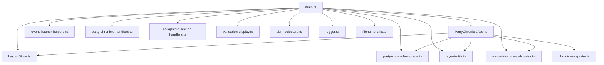

### Event Listener Wiring

`event-listener-helpers.ts` is the central wiring point between the form and all handler modules. It attaches DOM listeners and delegates to specialized handlers.

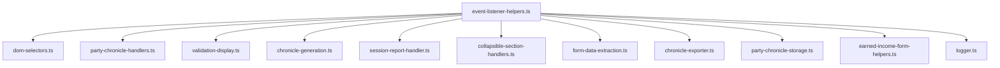

### Chronicle Generation Pipeline

`chronicle-generation.ts` orchestrates validation, PDF rendering, zip archiving, and chat notification.

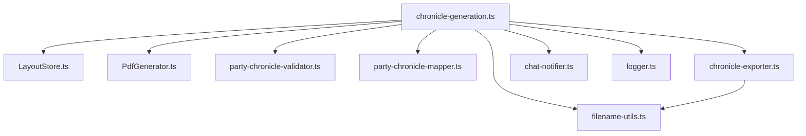

### PDF Rendering

`PdfGenerator.ts` draws content elements onto PDF pages using layout definitions, preset resolution, and font/color utilities.

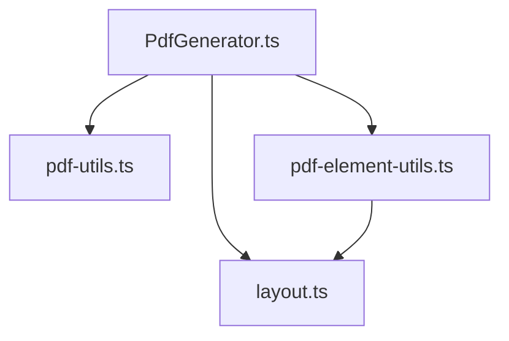

### Form Interaction Handlers

`party-chronicle-handlers.ts` handles field changes, auto-save, and display updates. It reads form data and writes to storage.

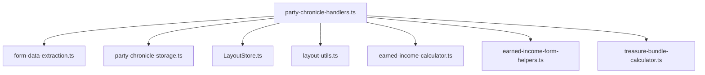

### Session Report Pipeline

`session-report-handler.ts` validates, builds, serializes, and copies the session report to the clipboard.

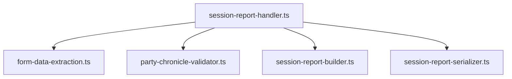

### Model Layer Internal Dependencies

Validation, mapping, and session report assembly depend on types, helpers, and lookup tables.

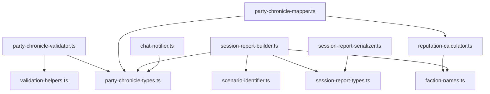

### Collapsible Sections

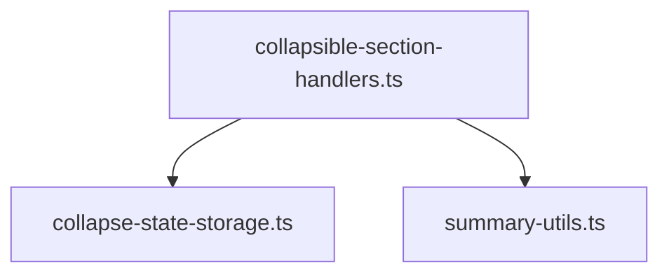

### Cross-Cutting: Logger

`logger.ts` is imported by modules across all layers. It provides `debug()` (gated by `debugMode` setting), `warn()`, and `error()` with a `[PFS Chronicle]` prefix.

```
main.ts, LayoutStore.ts, chronicle-generation.ts, chat-notifier.ts, event-listener-helpers.ts
    └── all import from → logger.ts
```


## Key Concepts

### Foundry VTT Integration

The module hooks into Foundry VTT at two lifecycle points:

- **`Hooks.on('init')`** — Registers world settings (GM name, PFS number, event name, event code, debug mode, party chronicle data storage) and the Layout Designer menu entry. Registers Handlebars helpers for task level options and treasure bundle values.
- **`Hooks.on('ready')`** — Initializes `LayoutStore` by scanning the `layouts/` directory tree via `FilePicker.browse()`, then registers hidden settings for season, layout, and blank chronicle path.

The module injects UI into two Foundry sheet types:

- **`Hooks.on('renderPartySheetPF2e')`** — Adds a GM-only "Society" tab to the PF2e party sheet. Creates the tab button in the sub-nav, creates the tab content container, filters party members to character actors, and calls `renderPartyChronicleForm()` to render the full chronicle form with event listeners.
- **`Hooks.on('renderCharacterSheetPF2e')`** — Adds "Download Chronicle" and "Delete Chronicle" (GM-only) buttons to the PFS tab of individual character sheets. Downloads use `file-saver` to trigger browser save dialogs.

### Hybrid ApplicationV2 Pattern

`PartyChronicleApp` extends Foundry's `ApplicationV2` but is used only for context preparation, not for rendering or event binding. The form is rendered manually via `foundry.applications.handlebars.renderTemplate()` and injected into the party sheet's Society tab. Event listeners are attached in `main.ts` after rendering, not in `_onRender()`.

This pattern exists because the party chronicle form is embedded inside another application's sheet (the party sheet), not rendered as a standalone dialog. `PartyChronicleApp._prepareContext()` handles the complex logic of loading saved data, mapping party actors to form fields, resolving layout options, and checking for existing zip archives.

### Layout System

Layouts are JSON files organized under `layouts/pfs2/` by season (e.g., `s5/`, `s6/`) and category (bounties, quests, specials). Each layout describes:

- **parameters** — User-facing choices (which items to strike out, which checkboxes to check)
- **presets** — Named coordinate/style sets reused across content entries
- **canvas** — Named rectangular regions with percentage-based coordinates, supporting parent-child nesting
- **content** — Rendering instructions that reference parameters and presets

Layouts support inheritance: a child layout specifies a `parent` ID, and `LayoutStore.mergeLayouts()` combines parent and child properties (presets, canvases, parameters, and content arrays are merged). See `LAYOUT_FORMAT.md` for the complete layout JSON specification covering Seasons 1–7.

### PDF Generation Pipeline

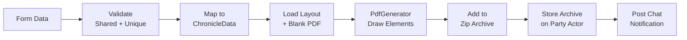

For each party member, the pipeline:
1. Validates shared and character-specific fields
2. Maps form data to `ChronicleData` (including reputation calculation, treasure bundle gold, earned income)
3. Loads the selected layout and blank chronicle PDF
4. Creates a `PdfGenerator` instance that iterates over layout content elements
5. Resolves preset inheritance and parameter references for each element
6. Draws text, checkboxes, redactions, lines, and choice elements onto the PDF
7. Saves the filled PDF as base64 to the character actor's flags
8. Adds the raw PDF bytes to a `JSZip` archive (with filename deduplication)

After all characters are processed:
9. Stores the finalized zip archive as base64 on the Party actor's flags
10. Posts a public chat message listing characters with ready chronicles
11. Posts a GM-only whisper about the zip archive download

#### PDF Generation Sequence

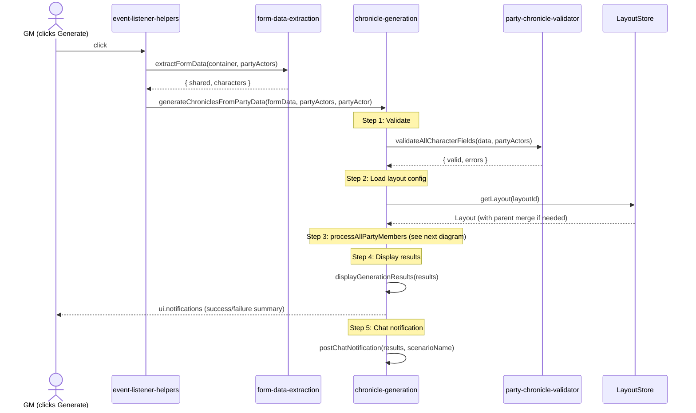

#### Per-Character Processing (processAllPartyMembers)

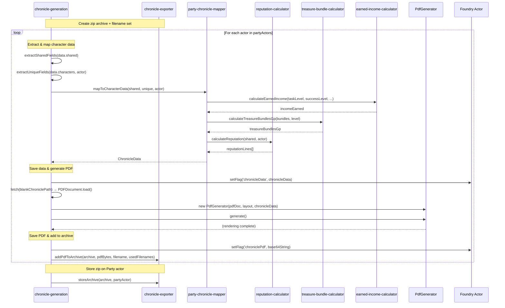


#### PdfGenerator.generate() Detail

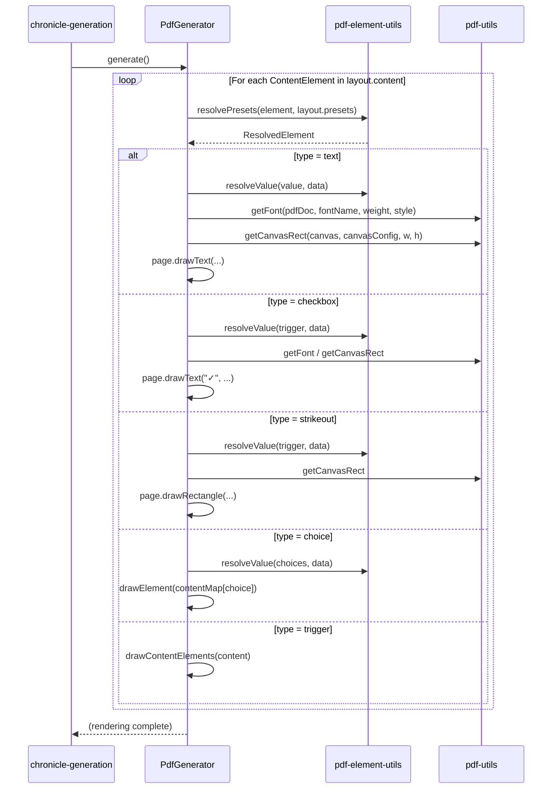

### Chronicle Export (Zip Archive)

The chronicle export feature bundles all generated PDFs into a single zip archive for convenient distribution:

1. **Create** — `createArchive()` returns a new `JSZip` instance at the start of generation
2. **Collect** — Each successful PDF is added via `addPdfToArchive()` with automatic filename deduplication (appends `_2`, `_3`, etc. when names collide)
3. **Store** — `storeArchive()` finalizes the zip as base64 and saves it to the Party actor's flags under `pfs-chronicle-generator.chronicleZip`
4. **Download** — `downloadArchive()` decodes base64 → `Uint8Array` → `Blob`, generates a filename from scenario name + event date + timestamp, and triggers a browser save via `file-saver`
5. **Clear** — `clearArchive()` removes the zip flag when the form is cleared

The Export button is enabled after generation if an archive exists. `hasArchive()` checks for a non-empty zip flag on the Party actor.

### Chat Notifications

After chronicle generation completes, two chat messages are posted:

1. **Public message** — Lists the scenario name, character names that received chronicles, and download instructions ("Open your character sheet → Society tab → Download Chronicle button")
2. **GM whisper** — Informs the GM that a zip archive is available for download from the Party sheet's Society tab

Both messages use `ChatMessage.create()` with `speaker.alias` set to "PFS Chronicle Generator". Each message has independent error handling so a failure in one does not prevent the other.

### Session Report Export

The session report feature assembles a JSON payload matching the schema expected by the RPG Chronicles browser plugin that automates the Paizo.com session reporting form:

1. **Validate** — `validateSessionReportFields()` checks required fields
2. **Build** — `buildSessionReport()` assembles `SessionReport` from `SessionReportBuildParams`:
   - Constant fields: `gameSystem: 'PFS2E'`, `generateGmChronicle: false`
   - GM fields: `gmOrgPlayNumber` from PFS number, `repEarned` from chosen faction reputation
   - Reporting flags: `reportingA`–`reportingD` booleans
   - Scenario: constructed from layout ID via `buildScenarioIdentifier()`
   - Sign-ups: one per party member with character name, org play number, character number, faction, `consumeReplay`, and `repEarned`
   - Bonus reputation: entries for each faction with non-zero reputation values
   - Game date: event date + current time rounded to nearest half-hour via `buildGameDateTime()`
3. **Serialize** — `serializeSessionReport()` converts to JSON, then encodes as UTF-16LE bytes and base64 via `encodeUtf16LeBase64()` (RPG Chronicles expects UTF-16LE, not plain ASCII base64)
4. **Copy** — Written to clipboard via `navigator.clipboard.writeText()`

Holding Option/Alt while clicking copies raw JSON instead of base64 (useful for debugging).

### Form State Management

Form data is auto-saved to Foundry world settings on every field change via `saveFormData()`. On form render, saved data is loaded and used to pre-populate fields. The Clear button resets to smart defaults based on adventure type:
- **Bounty**: 1 XP, 2 treasure bundles, 0 downtime days, 1 faction rep
- **Quest**: 2 XP, 4 treasure bundles, 4 downtime days, 2 faction rep
- **Scenario** (default): 4 XP, 8 treasure bundles, 8 downtime days, 4 faction rep

Clear preserves the GM PFS number, scenario name, event code, chronicle path, season, and layout selections. It also clears any stored zip archive.

Collapsible section states are persisted separately to `localStorage`.

The `debugMode` setting (registered in `registerSettings()`) gates verbose debug output through `logger.ts`. When enabled, debug messages are printed to the browser console with the `[PFS Chronicle]` prefix.

### Coordinate System

All layout positions use percentage-based coordinates relative to a canvas region. Canvases can be nested (a canvas positioned relative to its parent canvas). `getCanvasRect()` in `pdf-utils.ts` resolves the parent chain to produce absolute page coordinates for PDF rendering.

## Templates

| Template | Purpose |
|----------|---------|
| `templates/party-chronicle-filling.hbs` | Main party chronicle form rendered inside the Foundry party sheet's Society tab. Contains shared fields (event details, reputation, rewards), per-character sections (society ID, earned income, notes), and action buttons (save, clear, generate, copy session report, export archive). |

## Static Assets

| Directory | Purpose |
|-----------|---------|
| `layouts/` | Layout JSON files organized by game system (`pfs2/`) and season (`s1/`–`s7/`, plus bounties, quests, specials). See `LAYOUT_FORMAT.md`. |
| `modules/` | Chronicle PDF assets organized by season module (year 5, 6, 7). |
| `css/` | Stylesheet for the party chronicle form (`css/style.css`). |
| `dist/` | Compiled JavaScript output (entry point: `dist/main.js`, ESM format with sourcemap). |
| `templates/` | Handlebars templates for the party chronicle form and layout designer. |

## Build and Dependencies

### Build System

The project uses `esbuild` to bundle TypeScript source into a single ESM module:

```bash
esbuild scripts/main.ts --bundle --outfile=dist/main.js --format=esm --sourcemap
```

The output `dist/main.js` is referenced in `module.json` as the module's `esmodules` entry point. Foundry VTT loads it as an ES module at runtime.

### Runtime Dependencies

| Package | Purpose |
|---------|---------|
| `pdf-lib` | PDF document manipulation — loading blank PDFs, drawing text/shapes/checkboxes |
| `@pdf-lib/fontkit` | Font subsetting for custom fonts in PDF generation |
| `jszip` | Zip archive construction for bundling multiple chronicle PDFs |
| `file-saver` | Browser file download triggers (`saveAs`) for PDFs and zip archives |
| `js-yaml` | YAML parsing (used for legacy layout format support) |

### Dev Dependencies

| Package | Purpose |
|---------|---------|
| `typescript` | TypeScript compiler |
| `esbuild` | Fast bundler for development and production builds |
| `jest` / `ts-jest` | Test runner and TypeScript transform |
| `jest-environment-jsdom` | DOM environment for tests |
| `fast-check` | Property-based testing framework |
| `eslint` / `typescript-eslint` | Linting with type-aware rules |
| `jscpd` | Copy/paste detection for DRY enforcement |
| `fvtt-types` | Foundry VTT TypeScript type definitions |

### Foundry VTT Module Metadata

Defined in `module.json`:
- **ID**: `pfs-chronicle-generator`
- **Compatibility**: Foundry v13
- **System**: PF2e
- **Entry point**: `dist/main.js` (ESM)
- **Styles**: `css/style.css`
