# Foundry VTT Module Architecture

## Purpose

The PFS Chronicle Generator is a Foundry VTT module (Foundry v13+, PF2e and SF2e systems) that lets Game Masters fill in and generate Pathfinder Society and Starfinder Society chronicle sheets as PDFs for each party member — plus an optional GM character. It renders a form inside the Foundry party sheet's "Society" tab, validates input, calculates derived values (earned income, reputation, treasure bundles / credits awarded), generates filled PDFs using `pdf-lib`, bundles them into a downloadable zip archive via `fflate`, posts chat notifications, and exports session reports for Paizo.com. A runtime game system detection layer selects system-specific behavior (currency formatting, income tables, XP rules) for Pathfinder 2e vs Starfinder 2e.

## High-Level Data Flow

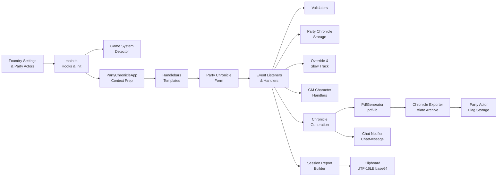

## Source Tree

```
scripts/
├── main.ts                          Entry point (Hooks, settings, form rendering)
├── LayoutStore.ts                   Layout discovery, loading, caching, inheritance
├── PartyChronicleApp.ts             Handlebars context preparation (ApplicationV2)
├── PdfGenerator.ts                  PDF rendering engine (pdf-lib)
├── globals.d.ts                     Ambient global declarations (game)
│
├── constants/
│   └── dom-selectors.ts             Centralized DOM selector constants
│
├── handlers/
│   ├── character-sheet-handlers.ts  Download/Delete Chronicle on character sheets
│   ├── chat-notifier.ts             Chat messages after chronicle generation
│   ├── chronicle-exporter.ts        Zip archive construction, storage, download
│   ├── chronicle-generation.ts      PDF generation orchestrator
│   ├── clear-button-handlers.ts     Clear button logic, adventure defaults, field reset
│   ├── collapsible-section-handlers.ts  Collapsible form section toggle/persist
│   ├── event-listener-helpers.ts    DOM event listener wiring
│   ├── form-data-extraction.ts      DOM → PartyChronicleData extraction
│   ├── form-initialization.ts       Form render orchestration, post-render init
│   ├── gm-character-handlers.ts     GM character drop zone, clear, PFS ID validation
│   ├── override-handlers.ts         Override XP/currency checkbox toggle logic
│   ├── party-chronicle-handlers.ts  Core form interaction handlers
│   ├── party-sheet-tab-handlers.ts  Society tab injection, tab/scroll/focus state
│   ├── session-report-handler.ts    "Copy Session Report" button handler
│   ├── shared-rewards-handlers.ts   Treasure bundle, credits, earned income displays
│   ├── sidebar-resize-handlers.ts   Drag-to-resize shared rewards sidebar
│   └── validation-display.ts        Inline validation error rendering
│
├── model/
│   ├── collapse-state-storage.ts    localStorage persistence for collapse state
│   ├── faction-names.ts             Faction abbreviation → full name lookup
│   ├── layout.ts                    Layout JSON schema interfaces
│   ├── party-chronicle-mapper.ts    Form data → ChronicleData mapping
│   ├── party-chronicle-storage.ts   Foundry world settings persistence
│   ├── party-chronicle-types.ts     Core type definitions
│   ├── party-chronicle-validator.ts Shared + per-character field validation
│   ├── reputation-calculator.ts     Multi-line reputation string calculation
│   ├── scenario-identifier.ts       Layout ID → Paizo scenario ID parsing
│   ├── session-report-builder.ts    SessionReport assembly
│   ├── session-report-serializer.ts JSON → UTF-16LE base64 serialization
│   ├── session-report-types.ts      SessionReport/SignUp/BonusRep interfaces
│   └── validation-helpers.ts        Reusable validation primitives
│
└── utils/
    ├── currency-formatter.ts        System-aware currency formatting (gp / Credits)
    ├── earned-income-calculator.ts  Earned income + downtime days calculation
    ├── earned-income-form-helpers.ts  DOM helpers for earned income fields
    ├── filename-utils.ts            Filename sanitization and generation
    ├── game-system-detector.ts      Pathfinder vs Starfinder runtime detection
    ├── layout-utils.ts              Layout-specific form field updates
    ├── logger.ts                    Centralized logging (debug/warn/error)
    ├── pdf-element-utils.ts         Preset resolution and param references
    ├── pdf-utils.ts                 Font loading, color mapping, canvas rects
    ├── summary-utils.ts             Collapsible section summary text
    └── treasure-bundle-calculator.ts  Gold piece / credits calculation from bundles
```


## Module Roles

### Entry Points

| Module | Role |
|--------|------|
| `main.ts` | Foundry `Hooks.on('init')` and `Hooks.on('ready')` entry point. Registers world settings (debug mode, party chronicle data storage). Registers Handlebars helpers for task level options, treasure bundle values, credits awarded, and currency formatting. Initializes `LayoutStore` on ready. Delegates rendering to `party-sheet-tab-handlers.ts` (party sheet Society tab) and `character-sheet-handlers.ts` (individual character sheet buttons). Registers hooks for both PF2e and SF2e sheet types (`renderPartySheetPF2e`, `renderPartySheetSF2e`, `renderCharacterSheetPF2e`, `renderCharacterSheetSF2e`). Re-exports `renderPartyChronicleForm` from `form-initialization.ts` for backward compatibility. |
| `PartyChronicleApp.ts` | Prepares the Handlebars template context for the party chronicle form. Loads saved data, maps party actors to form fields, resolves layout-specific options, resolves the GM character actor (if assigned), detects the active game system, and checks whether a zip archive exists on the Party actor. Used only for context preparation (`_prepareContext`), not for rendering — event listeners are attached in `form-initialization.ts` (hybrid ApplicationV2 pattern). |

### Handlers (`scripts/handlers/`)

| Module | Role |
|--------|------|
| `event-listener-helpers.ts` | Attaches all DOM event listeners: season/layout dropdowns, form fields, treasure bundle/downtime/earned income selects, buttons (save, clear, generate, copy session report, export archive), portrait clicks, file picker, collapsible sections, override checkboxes, GM character drop zone, and sidebar resize handle. Exports `PartyActor`, `PartySheetApp`, and `CharacterSheetApp` interfaces. Re-exports `attachClearButtonListener` from `clear-button-handlers.ts` and sidebar resize helpers from `sidebar-resize-handlers.ts`. |
| `form-initialization.ts` | Orchestrates form rendering and post-render initialization. Contains `renderPartyChronicleForm()` — the main entry point that creates a `PartyChronicleApp` for context preparation, renders the Handlebars template, attaches all event listeners, and initializes form state (layout fields, display values, collapsible sections, override states, slow track displays, sidebar width, validation). |
| `party-sheet-tab-handlers.ts` | Manages the injected "Society" tab on the party sheet for both PF2e and SF2e. Creates the tab button, injects the tab container, rebinds the Foundry Tabs controller, and preserves UI state (active tab, scroll positions, focus state) across re-renders. Filters party members to character actors (excluding minions and eidolons). |
| `character-sheet-handlers.ts` | Adds "Download Chronicle" and "Delete Chronicle" (GM-only) buttons to the PFS tab on individual character sheets for both PF2e and SF2e systems. Downloads use `file-saver` to trigger browser save dialogs. |
| `party-chronicle-handlers.ts` | Core form interaction handlers: season/layout changes, field auto-save, treasure bundle display updates, downtime days calculation, earned income display, chronicle path file picker, and form data persistence. Re-exports display update functions from `shared-rewards-handlers.ts` for backward compatibility. |
| `shared-rewards-handlers.ts` | Display update functions for the shared rewards section: treasure bundle gold/credit displays, credits awarded displays (Starfinder), downtime days, XP-for-season defaults, earned income displays, and slow track display adjustments (halved XP labels, earned income, treasure bundle gold, notes annotations). Extracted from `party-chronicle-handlers.ts`. |
| `chronicle-generation.ts` | Orchestrates PDF generation for all party members (and the GM character, if assigned). Validates fields, loads layout configuration, extracts shared/unique fields, maps to chronicle data, invokes `PdfGenerator` per character, collects each PDF into a zip archive via `chronicle-exporter`, stores the archive on the Party actor, and posts chat notifications via `chat-notifier`. |
| `chronicle-exporter.ts` | Zip archive lifecycle using `fflate`: `createArchive()` → `addPdfToArchive()` (with filename deduplication) → `storeArchive()` (base64 on Party actor flags) → `downloadArchive()` (atob → Blob → FileSaver.saveAs). Also provides `hasArchive()`, `clearArchive()`, and `generateZipFilename()`. |
| `chat-notifier.ts` | Posts Foundry VTT chat messages after chronicle generation. Sends a public message listing the scenario name and character names with download instructions, plus a GM-only whisper about the zip archive download. Each message has independent error handling. |
| `form-data-extraction.ts` | Reads all form DOM elements and constructs a structured `PartyChronicleData` object with shared fields and per-character fields (including override and slow track states). |
| `validation-display.ts` | Renders validation errors inline on the form, manages the error panel, and enables/disables the Generate button based on validation state. |
| `session-report-handler.ts` | Handles the "Copy Session Report" button click. Orchestrates: validate → build → serialize → clipboard copy. |
| `collapsible-section-handlers.ts` | Manages collapsible form sections: toggle collapse state, persist state to storage, update summary text in collapsed headers. |
| `gm-character-handlers.ts` | Handles the GM Character drop zone: parses Foundry drag-and-drop payloads, validates actor type (must be a character, not already a party member), persists the GM character assignment to storage, and re-renders the form. Also handles the clear button to remove the GM character assignment and validates that the GM character's PFS ID matches the GM's PFS number. |
| `override-handlers.ts` | Manages per-character XP and currency override checkboxes. When checked, hides the calculated display and shows an editable override input. When unchecked, restores the calculated display and resets the override value. `initializeOverrideStates()` restores correct visibility on form load from saved data. |
| `clear-button-handlers.ts` | Handles the "Clear Chronicle Data" button: confirmation dialog, smart adventure-type defaults (bounty/quest/scenario), default character field construction (including override and slow track defaults), and form re-render. Extracted from `event-listener-helpers.ts`. |
| `sidebar-resize-handlers.ts` | Provides drag-to-resize functionality for the shared rewards sidebar. Persists the chosen width in module-level state so it survives Foundry re-renders. |

### Model (`scripts/model/`)

| Module | Role |
|--------|------|
| `party-chronicle-types.ts` | TypeScript interfaces for `SharedFields` (includes `reportingA`–`reportingD` booleans, `downtimeDays`, `gmCharacterActorId`), `UniqueFields` (includes `consumeReplay`, `overrideXp`, `overrideXpValue`, `overrideCurrency`, `overrideCurrencyValue`, `slowTrack`), `PartyChronicleData`, `PartyMember`, `PartyChronicleContext` (includes `hasChronicleZip`, `gmCharacter`, `gmCharacterFields`, `gameSystem`), `ValidationResult`, and `GenerationResult` (includes optional `pdfBytes: Uint8Array` for zip archive collection). |
| `layout.ts` | TypeScript interfaces for `Layout`, `Parameter`, `Canvas`, `Preset`, and `ContentElement` — the layout JSON schema. |
| `party-chronicle-validator.ts` | Validates shared fields and per-character unique fields. Also validates session report fields. Returns `{ valid, errors }`. |
| `validation-helpers.ts` | Reusable validation primitives: date format, society ID format, number range, required string, optional array. |
| `party-chronicle-mapper.ts` | Maps form data (`SharedFields` + `UniqueFields`) into `ChronicleData` objects consumed by `PdfGenerator`. Handles reputation calculation, treasure bundle gold / credits calculation, society ID splitting, override-aware value selection (uses override values when active, calculated values otherwise), and slow track halving (halves XP, reputation, currency, and downtime days when enabled). |
| `party-chronicle-storage.ts` | Persists and loads `PartyChronicleData` to/from Foundry world settings (`game.settings`). |
| `reputation-calculator.ts` | Calculates multi-line reputation strings per character by combining faction-specific values with the chosen faction bonus. |
| `faction-names.ts` | Lookup table mapping faction abbreviation codes (EA, GA, HH, VS, RO, VW) to full names. |
| `scenario-identifier.ts` | Parses layout IDs (e.g., `pfs2.s5-18`, `sfs2.s1-01`) into Paizo scenario identifiers (e.g., `PFS2E 5-18`, `SFS2E 1-01`). Handles both Pathfinder and Starfinder layout ID prefixes. |
| `session-report-types.ts` | TypeScript interfaces for `SessionReport` (includes `reportingA`–`reportingD`, `bonusRepEarned`, `gameSystem` widened to `'PFS2E' | 'SFS2E'`), `SignUp` (includes `consumeReplay`, `isGM: boolean`, `slowTrack`), and `BonusRep`. |
| `session-report-builder.ts` | Assembles a `SessionReport` from `SessionReportBuildParams` (shared fields, per-character fields, actor PFS data, layout ID). Builds sign-ups with faction names (including the GM character sign-up with `isGM: true`), assembles bonus reputation entries for non-zero factions, applies slow track halving to reputation values, and generates ISO 8601 datetime with half-hour rounding via `buildGameDateTime()`. |
| `session-report-serializer.ts` | Serializes a `SessionReport` to JSON. Default mode encodes to UTF-16LE bytes then base64 via `encodeUtf16LeBase64()` for consumption by the RPG Chronicles browser plugin. Option/Alt-click returns raw JSON for debugging. |
| `collapse-state-storage.ts` | Persists collapsible section expand/collapse state to `localStorage`. |


### Utils (`scripts/utils/`)

| Module | Role |
|--------|------|
| `game-system-detector.ts` | Detects whether the active Foundry VTT game system is Pathfinder 2e or Starfinder 2e. Returns `'sf2e'` if `game.system.id === 'sf2e'` or the `sf2e-anachronism` module is active, otherwise `'pf2e'`. Provides `isStarfinder()` and `isPathfinder()` convenience predicates. Also provides `getGameSystemRoot()` which maps game system IDs to layout directory roots (`'pf2e'` → `'pfs2'`, `'sf2e'` → `'sfs2'`). Called at usage sites (not cached) for testability. |
| `currency-formatter.ts` | Pure functions for system-aware currency formatting. Pathfinder: `"10.50 gp"` (2 decimal places). Starfinder: `"105 Credits"` (whole number). Also provides `getCurrencyLabel()` and `getZeroCurrencyDisplay()`. |
| `earned-income-calculator.ts` | Calculates earned income per day based on task level, success level, and proficiency rank. Also calculates downtime days from XP and task level options from character level. Supports both game systems: Pathfinder uses the standard income table; Starfinder uses a derived table (`Math.ceil(value * 10)`) with whole-number Credits. Accepts an optional `gameSystem` parameter on key functions. |
| `earned-income-form-helpers.ts` | DOM helpers for earned income form fields: parameter extraction, character ID parsing, and `createEarnedIncomeChangeHandler()` factory for shared event handler logic. |
| `filename-utils.ts` | Sanitizes actor names for filenames and generates chronicle output filenames from actor name + blank chronicle path. |
| `layout-utils.ts` | Extracts checkbox and strikeout choices from a layout, and dynamically updates layout-specific form fields when the layout selection changes. |
| `logger.ts` | Centralized logging with `[PFS Chronicle]` prefix. `debug()` is gated by the `debugMode` Foundry setting; `warn()` and `error()` always emit. All console output flows through this module. |
| `pdf-utils.ts` | PDF rendering utilities: font resolution (standard + web fonts via CDN), color mapping, and canvas rectangle calculation with parent chain resolution. |
| `pdf-element-utils.ts` | Resolves preset inheritance chains for content elements, resolves `param:` value references, and provides content element search/collection helpers. |
| `summary-utils.ts` | Generates summary text for collapsible section headers (event details, reputation, shared rewards). |
| `treasure-bundle-calculator.ts` | Calculates gold piece values from treasure bundle counts (Pathfinder) and credits awarded from level (Starfinder). Provides system-aware `calculateCurrencyGained()` and `formatCurrencyValue()` functions. |

### Constants (`scripts/constants/`)

| Module | Role |
|--------|------|
| `dom-selectors.ts` | Centralized DOM selector constants for all form elements, buttons, character fields, and CSS classes. Prevents selector typos across the codebase. |

### Core Classes

| Module | Role |
|--------|------|
| `PdfGenerator.ts` | Renders a filled chronicle PDF using `pdf-lib`. Draws text, multiline text, checkboxes, redactions, lines, choice elements, and trigger elements. Resolves presets and parameter references. Also supports grid overlay and box highlighting for layout debugging. |
| `LayoutStore.ts` | Singleton that discovers, loads, and caches layout JSON files from the Foundry data directory via `FilePicker.browse()`. Supports layout inheritance (child layouts merge with parent layouts via `mergeLayouts()`). Provides season/layout browsing APIs. Uses composite season keys (`gameSystemRoot/seasonName`) to prevent collisions between game systems. `getSeasons()` accepts a required `gameSystemRoot` parameter to filter seasons for the active system. Uses `logger.ts` for all console output. |

### Type Declarations

| Module | Role |
|--------|------|
| `globals.d.ts` | Declares `game` as an ambient global variable. Required because Foundry VTT injects `game` at runtime and it is not available through normal module imports. |

## Dependency Flow

The dependency graph is split into focused diagrams by concern. Each diagram shows one slice of the architecture with its immediate dependencies.

### Entry Points → Top-Level Modules

`main.ts` is the sole Foundry Hooks entry point. It delegates to handler modules for sheet rendering, the layout store, and Handlebars helpers.

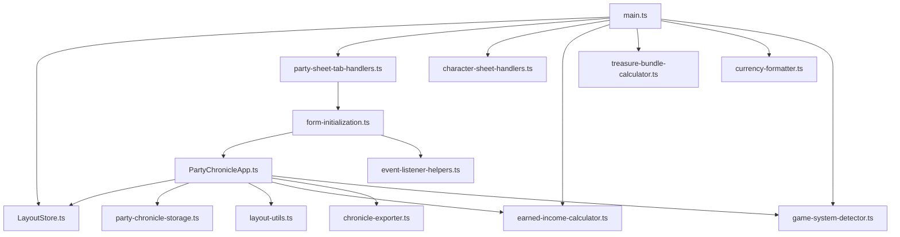

### Event Listener Wiring

`event-listener-helpers.ts` is the central wiring point between the form and all handler modules. It attaches DOM listeners and delegates to specialized handlers. `form-initialization.ts` orchestrates the attachment and post-render initialization.

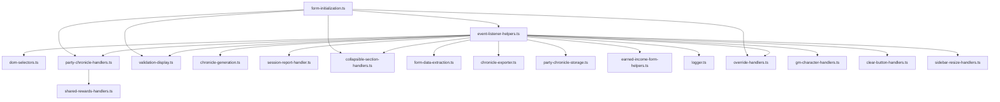

### Chronicle Generation Pipeline

`chronicle-generation.ts` orchestrates validation, PDF rendering, zip archiving, and chat notification.

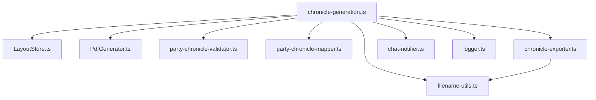

### PDF Rendering

`PdfGenerator.ts` draws content elements onto PDF pages using layout definitions, preset resolution, and font/color utilities.

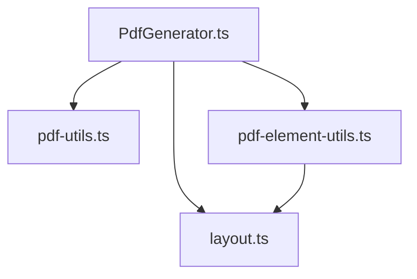

### Form Interaction Handlers

`party-chronicle-handlers.ts` handles field changes, auto-save, and display updates. It reads form data and writes to storage.

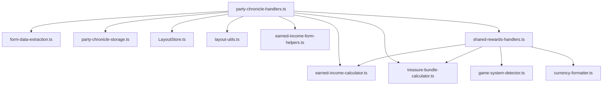

### Session Report Pipeline

`session-report-handler.ts` validates, builds, serializes, and copies the session report to the clipboard.

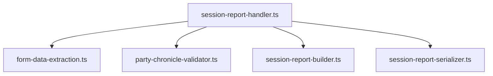

### Model Layer Internal Dependencies

Validation, mapping, and session report assembly depend on types, helpers, and lookup tables.

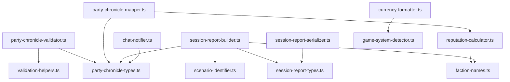

### Collapsible Sections

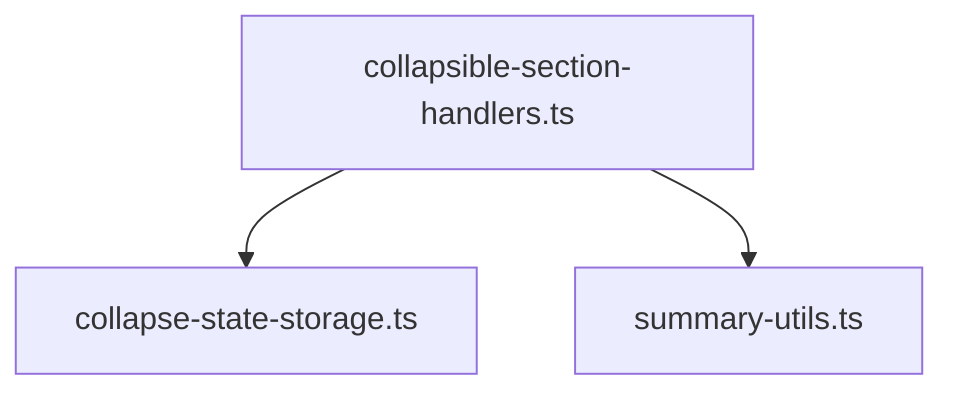

### Cross-Cutting: Logger

`logger.ts` is imported by modules across all layers. It provides `debug()` (gated by `debugMode` setting), `warn()`, and `error()` with a `[PFS Chronicle]` prefix.

```
main.ts, LayoutStore.ts, chronicle-generation.ts, chat-notifier.ts, event-listener-helpers.ts
    └── all import from → logger.ts
```


## Key Concepts

### Foundry VTT Integration

The module hooks into Foundry VTT at two lifecycle points:

- **`Hooks.on('init')`** — Registers world settings (debug mode, party chronicle data storage). Registers Handlebars helpers for task level options, treasure bundle values, credits awarded, and currency formatting.
- **`Hooks.on('ready')`** — Initializes `LayoutStore` by scanning the `layouts/` directory tree via `FilePicker.browse()`.

The module injects UI into two Foundry sheet types, for both PF2e and SF2e systems:

- **`Hooks.on('renderPartySheetPF2e')` / `Hooks.on('renderPartySheetSF2e')`** — Adds a GM-only "Society" tab to the party sheet (handled by `party-sheet-tab-handlers.ts`). Creates the tab button in the sub-nav, creates the tab content container, rebinds the Foundry Tabs controller, filters party members to character actors (excluding minions and eidolons), and calls `renderPartyChronicleForm()` to render the full chronicle form with event listeners. Preserves active tab, scroll positions, and focus state across re-renders.
- **`Hooks.on('renderCharacterSheetPF2e')` / `Hooks.on('renderCharacterSheetSF2e')`** — Adds "Download Chronicle" and "Delete Chronicle" (GM-only) buttons to the PFS tab of individual character sheets (handled by `character-sheet-handlers.ts`). Downloads use `file-saver` to trigger browser save dialogs.

### Hybrid ApplicationV2 Pattern

`PartyChronicleApp` extends Foundry's `ApplicationV2` but is used only for context preparation, not for rendering or event binding. The form is rendered manually via `foundry.applications.handlebars.renderTemplate()` and injected into the party sheet's Society tab. Event listeners are attached in `form-initialization.ts` after rendering, not in `_onRender()`.

This pattern exists because the party chronicle form is embedded inside another application's sheet (the party sheet), not rendered as a standalone dialog. `PartyChronicleApp._prepareContext()` handles the complex logic of loading saved data, mapping party actors to form fields, resolving layout options, resolving the GM character actor, detecting the active game system, and checking for existing zip archives.

### Layout System

Layouts are JSON files organized under `layouts/` by game system root (`pfs2/` for Pathfinder, `sfs2/` for Starfinder) and season (e.g., `s5/`, `s6/`) and category (bounties, quests, specials). Each layout describes:

- **parameters** — User-facing choices (which items to strike out, which checkboxes to check)
- **presets** — Named coordinate/style sets reused across content entries
- **canvas** — Named rectangular regions with percentage-based coordinates, supporting parent-child nesting
- **content** — Rendering instructions that reference parameters and presets

Layouts support inheritance: a child layout specifies a `parent` ID, and `LayoutStore.mergeLayouts()` combines parent and child properties (presets, canvases, parameters, and content arrays are merged). See `LAYOUT_FORMAT.md` for the complete layout JSON specification covering Seasons 1–7.

`LayoutStore` uses composite season keys (e.g., `pfs2/season5`, `sfs2/season1`) to prevent collisions between same-named seasons under different game system roots. Each season and layout entry is tagged with its `gameSystemRoot` during discovery. `getSeasons()` requires a `gameSystemRoot` parameter to filter seasons for the active game system, ensuring only relevant seasons and layouts appear in the dropdowns.

### PDF Generation Pipeline

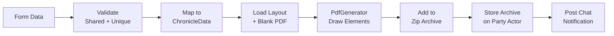

For each party member, the pipeline:
1. Validates shared and character-specific fields
2. Maps form data to `ChronicleData` (including reputation calculation, treasure bundle gold, earned income)
3. Loads the selected layout and blank chronicle PDF
4. Creates a `PdfGenerator` instance that iterates over layout content elements
5. Resolves preset inheritance and parameter references for each element
6. Draws text, checkboxes, redactions, lines, and choice elements onto the PDF
7. Saves the filled PDF as base64 to the character actor's flags
8. Adds the raw PDF bytes to a `JSZip` archive (with filename deduplication)

After all characters are processed:
9. Stores the finalized zip archive as base64 on the Party actor's flags
10. Posts a public chat message listing characters with ready chronicles
11. Posts a GM-only whisper about the zip archive download

#### PDF Generation Sequence

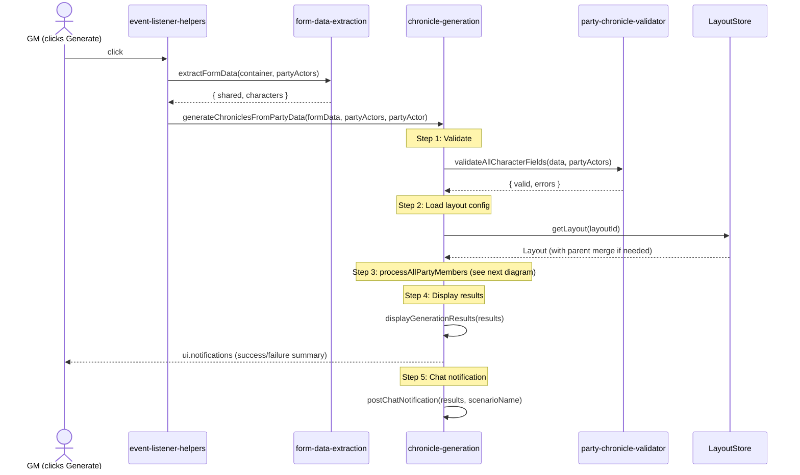

#### Per-Character Processing (processAllPartyMembers)

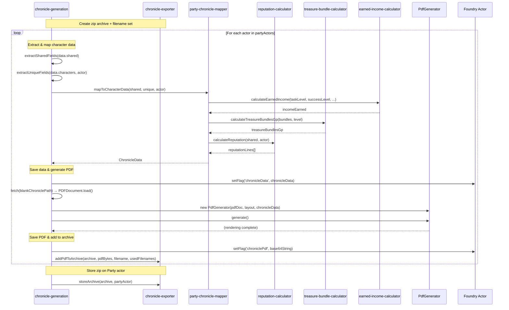


#### PdfGenerator.generate() Detail

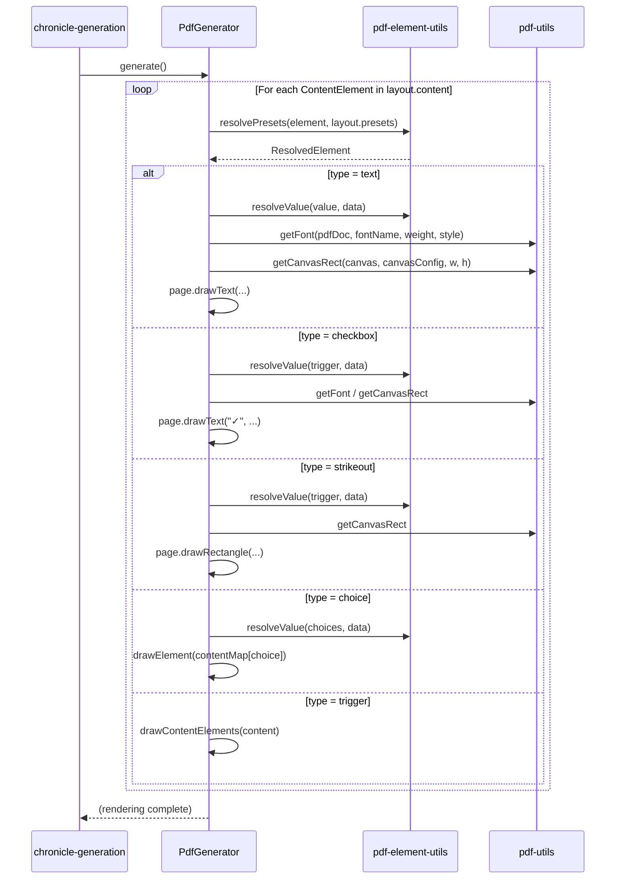

### Chronicle Export (Zip Archive)

The chronicle export feature bundles all generated PDFs into a single zip archive for convenient distribution:

1. **Create** — `createArchive()` returns a new `ZipArchive` instance (a `Map<string, Uint8Array>`) at the start of generation
2. **Collect** — Each successful PDF is added via `addPdfToArchive()` with automatic filename deduplication (appends `_2`, `_3`, etc. when names collide)
3. **Store** — `storeArchive()` finalizes the zip via `fflate.zipSync()`, encodes as base64, and saves it to the Party actor's flags under `pfs-chronicle-generator.chronicleZip`
4. **Download** — `downloadArchive()` decodes base64 → `Uint8Array` → `Blob`, generates a filename from scenario name + event date + timestamp, and triggers a browser save via `file-saver`
5. **Clear** — `clearArchive()` removes the zip flag when the form is cleared

The Export button is enabled after generation if an archive exists. `hasArchive()` checks for a non-empty zip flag on the Party actor.

### Chat Notifications

After chronicle generation completes, two chat messages are posted:

1. **Public message** — Lists the scenario name, character names that received chronicles, and download instructions ("Open your character sheet → Society tab → Download Chronicle button")
2. **GM whisper** — Informs the GM that a zip archive is available for download from the Party sheet's Society tab

Both messages use `ChatMessage.create()` with `speaker.alias` set to "PFS Chronicle Generator". Each message has independent error handling so a failure in one does not prevent the other.

### Session Report Export

The session report feature assembles a JSON payload matching the schema expected by the RPG Chronicles browser plugin that automates the Paizo.com session reporting form:

1. **Validate** — `validateSessionReportFields()` checks required fields
2. **Build** — `buildSessionReport()` assembles `SessionReport` from `SessionReportBuildParams`:
   - Constant fields: `gameSystem: 'PFS2E'`, `generateGmChronicle: false`
   - GM fields: `gmOrgPlayNumber` from PFS number, `repEarned` from chosen faction reputation
   - Reporting flags: `reportingA`–`reportingD` booleans
   - Scenario: constructed from layout ID via `buildScenarioIdentifier()`
   - Sign-ups: one per party member with character name, org play number, character number, faction, `consumeReplay`, and `repEarned`
   - Bonus reputation: entries for each faction with non-zero reputation values
   - Game date: event date + current time rounded to nearest half-hour via `buildGameDateTime()`
3. **Serialize** — `serializeSessionReport()` converts to JSON, then encodes as UTF-16LE bytes and base64 via `encodeUtf16LeBase64()` (RPG Chronicles expects UTF-16LE, not plain ASCII base64)
4. **Copy** — Written to clipboard via `navigator.clipboard.writeText()`

Holding Option/Alt while clicking copies raw JSON instead of base64 (useful for debugging).

### Form State Management

Form data is auto-saved to Foundry world settings on every field change via `saveFormData()`. On form render, saved data is loaded and used to pre-populate fields. The Clear button resets to smart defaults based on adventure type:
- **Bounty**: 1 XP, 2 treasure bundles, 0 downtime days, 1 faction rep
- **Quest**: 2 XP, 4 treasure bundles, 4 downtime days, 2 faction rep
- **Scenario** (default): 4 XP, 8 treasure bundles, 8 downtime days, 4 faction rep

Clear preserves the GM PFS number, scenario name, event code, chronicle path, season, and layout selections. It also clears any stored zip archive.

Collapsible section states are persisted separately to `localStorage`.

#### Per-Character Overrides

Each character card includes optional XP and currency override checkboxes. When an override is enabled, the calculated display is hidden (via `.override-hidden` CSS class) and an editable input is shown. When disabled, the calculated display is restored and the override value resets to zero. Override values, when active, are used as-is in chronicle generation and session reporting instead of the calculated values. `initializeOverrideStates()` restores correct visibility on form load from saved data.

#### Slow Track

A per-character "Slow Track" checkbox halves XP, all reputation values, currency gained, and downtime days for that character. The checkbox appears on the same line as "Consume Replay" and is hidden for Starfinder Society (`sf2e`). Override interactions are respected: override XP and override currency values are used as-is when active, while reputation and downtime days are still halved. Display updates (XP labels, earned income, treasure bundle gold, notes annotations) are applied in real-time when the checkbox is toggled.

#### GM Character

The GM can optionally assign a GM character by dragging an actor onto the GM Character drop zone. The GM character is validated (must be a character type, not already a party member) and integrated as a parallel data path alongside party members through all pipelines: data entry, chronicle generation, session reporting, and clear. The GM character's PFS ID is validated against the GM's PFS number. The GM character sign-up in the session report has `isGM: true`.

The `debugMode` setting (registered in `registerSettings()`) gates verbose debug output through `logger.ts`. When enabled, debug messages are printed to the browser console with the `[PFS Chronicle]` prefix.

### Game System Detection

The module supports both Pathfinder 2e and Starfinder 2e from a single codebase. `game-system-detector.ts` determines the active system at runtime:

- Returns `'sf2e'` if `game.system.id === 'sf2e'` OR if the `sf2e-anachronism` compatibility module is active
- Returns `'pf2e'` otherwise

System-specific behavior branches on the detected system at usage sites (not cached at module load) for testability:

| Concern | Pathfinder 2e | Starfinder 2e |
|---------|---------------|---------------|
| Currency | Gold pieces (`gp`), 2 decimal places | Credits, whole numbers |
| Income table | Standard PF2e income table | Derived table (`Math.ceil(value * 10)`) |
| XP | Variable (1/2/4 based on adventure type) | Fixed at 4 |
| Treasure bundles | Shown, gold piece values | Hidden; credits awarded from level table |
| Slow Track | Available | Hidden |
| Layout root | `pfs2/` | `sfs2/` |
| Session report `gameSystem` | `'PFS2E'` | `'SFS2E'` |
| Scenario ID prefix | `PFS2E` | `SFS2E` |

### Coordinate System

All layout positions use percentage-based coordinates relative to a canvas region. Canvases can be nested (a canvas positioned relative to its parent canvas). `getCanvasRect()` in `pdf-utils.ts` resolves the parent chain to produce absolute page coordinates for PDF rendering.

## Templates

| Template | Purpose |
|----------|---------|
| `templates/party-chronicle-filling.hbs` | Main party chronicle form rendered inside the Foundry party sheet's Society tab. Contains shared fields (event details, reputation, rewards), per-character sections (society ID, earned income, notes), and action buttons (save, clear, generate, copy session report, export archive). |

## Static Assets

| Directory | Purpose |
|-----------|---------|
| `layouts/` | Layout JSON files organized by game system root (`pfs2/` for Pathfinder, `sfs2/` for Starfinder) and season (bounties, quests, specials). See `LAYOUT_FORMAT.md`. |
| `modules/` | Chronicle PDF assets organized by season module (year 5, 6, 7). |
| `css/` | Stylesheet for the party chronicle form (`css/style.css`). |
| `dist/` | Compiled JavaScript output (entry point: `dist/main.js`, ESM format with sourcemap). |
| `templates/` | Handlebars templates for the party chronicle form and layout designer. |

## Build and Dependencies

### Build System

The project uses `esbuild` to bundle TypeScript source into a single ESM module:

```bash
esbuild scripts/main.ts --bundle --outfile=dist/main.js --format=esm --sourcemap
```

The output `dist/main.js` is referenced in `module.json` as the module's `esmodules` entry point. Foundry VTT loads it as an ES module at runtime.

### Runtime Dependencies

| Package | Purpose |
|---------|---------|
| `pdf-lib` | PDF document manipulation — loading blank PDFs, drawing text/shapes/checkboxes |
| `fflate` | Synchronous zip archive construction for bundling multiple chronicle PDFs |
| `file-saver` | Browser file download triggers (`saveAs`) for PDFs and zip archives |
| `js-yaml` | YAML parsing (used for legacy layout format support) |

### Dev Dependencies

| Package | Purpose |
|---------|---------|
| `typescript` | TypeScript compiler |
| `esbuild` | Fast bundler for development and production builds |
| `jest` / `ts-jest` | Test runner and TypeScript transform |
| `jest-environment-jsdom` | DOM environment for tests |
| `fast-check` | Property-based testing framework |
| `eslint` / `typescript-eslint` | Linting with type-aware rules |
| `jscpd` | Copy/paste detection for DRY enforcement |
| `fvtt-types` | Foundry VTT TypeScript type definitions |

### Foundry VTT Module Metadata

Defined in `module.json`:
- **ID**: `pfs-chronicle-generator`
- **Title**: Pathfinder & Starfinder Society Chronicle Generator
- **Compatibility**: Foundry v13+, verified v14
- **Systems**: PF2e, SF2e
- **Entry point**: `dist/main.js` (ESM)
- **Styles**: `css/style.css`
