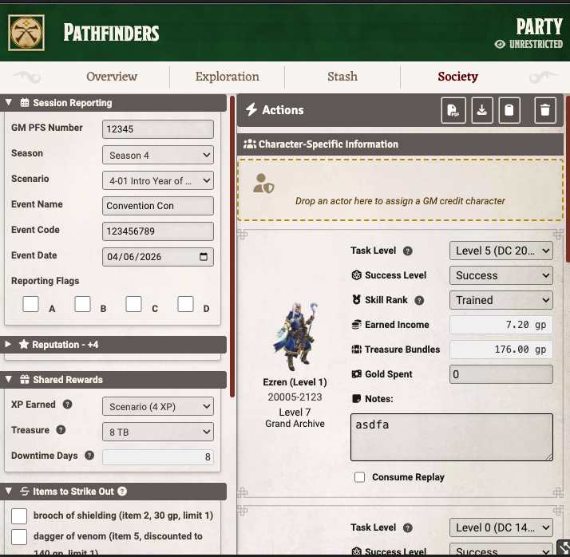
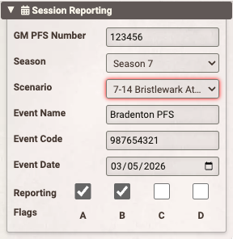
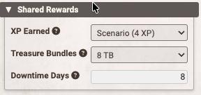
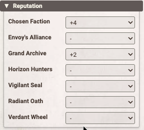
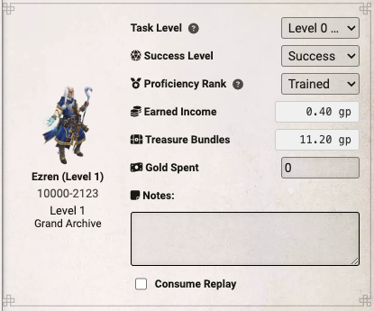
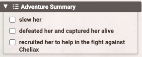
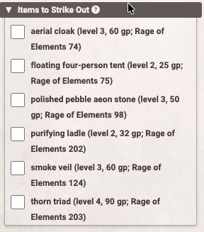
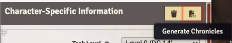
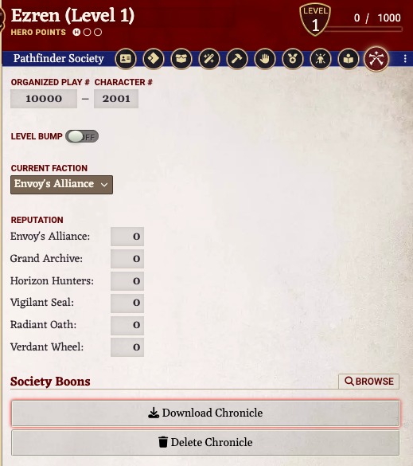

<div align="center">

# Pathfinder Society Chronicle Generator

### Generate chronicles for your entire party with one click

*A Foundry VTT module that streamlines chronicle generation for Pathfinder Society GMs*

*Written with AI assistance. See below for a statement about the use of AI in this project*


[](https://sonarcloud.io/summary/new_code?id=scooper4711_pfs-chronicle-generator)
[](https://sonarcloud.io/summary/new_code?id=scooper4711_pfs-chronicle-generator)
[](https://sonarcloud.io/summary/new_code?id=scooper4711_pfs-chronicle-generator)

---

</div>

## 📦 Installation

### Method 1: Install from Foundry VTT (Recommended)

1. Open Foundry VTT and navigate to the **Add-on Modules** tab
2. Click **Install Module**
3. Search for "Pathfinder Society Chronicle Generator"
4. Click **Install**

### Method 2: Install via Manifest URL

1. Open Foundry VTT and navigate to the **Add-on Modules** tab
2. Click **Install Module**
3. Paste the following manifest URL into the field at the bottom:
   ```
   https://github.com/scooper4711/pfs-chronicle-generator/releases/latest/download/module.json
   ```
4. Click **Install**

> The manifest URL always points to the latest release, so Foundry VTT can automatically check for updates.

### Requirements

- **Foundry VTT**: Version 13
- **Game System**: Pathfinder 2e (PF2e)

---

## ✨ Features

<table>
<tr>
<td width="50%">

**🎯 Party Chronicle Generation**

Fill out one form for the entire party easily from the party sheet

</td>
<td width="50%">

**🧮 Automatic Calculations**

Treasure bundles, earned income, and reputation calculated automatically

</td>
</tr>
<tr>
<td width="50%">

**🎲 Smart Defaults**

Detects Bounties, Quests, and Scenarios and sets appropriate defaults

</td>
<td width="50%">

**📋 Pre-configured Layouts**

Includes layouts for many PFS scenarios - just select and go

</td>
</tr>
<tr>
<td width="50%">

**🔧 Generic Layout Support**

Generate chronicles for any scenario, even without a specific layout

</td>
<td width="50%">

**📥 Player Downloads**

Players download chronicles directly from their character sheets

</td>
</tr>
</table>

---

## 🚀 Quick Start for GMs

> **Step-by-step guide to generating chronicles for your party**

### 1️⃣ Make sure the players fill in their PFS ids on their character sheet

The Chronicle Generation process uses that information when filling out the chronicle.

### 2️⃣ Open the Party Sheet

Open your party sheet and click on the **Society** tab.



### 3️⃣ Select Your Chronicle Layout

The module includes pre-configured layouts for many scenarios. When you select a scenario from the dropdown, the appropriate chronicle PDF is automatically selected.

If your scenario isn't in the list, you can:
- Use the **Generic** layout (works for any scenario, but doesn't support checkboxes or strikeouts)
- Browse for a chronicle PDF manually using the file picker

### 4️⃣ Fill Out the Form

The form has several sections:

<table>
<tr>
<td width="50%" valign="top">

**📝 Event Information**

- GM PFS Number
- Season
- Scenario Name (e.g., "5-03: Heidmarch Heist")
- Event Code
- Event Date

</td>
<td width="50%" valign="top">



</td>
</tr>

<tr>
<td width="50%" valign="top">

**💰 Rewards** (automatically calculated based on scenario type)

- XP Earned
- Treasure Bundles
- Downtime Days

</td>
<td width="50%" valign="top">



</td>
</tr>

<tr>
<td width="50%" valign="top">

**⭐ Reputation** (automatically calculated)

- Base reputation for the player's chosen faction
- Bonus reputation for completing faction specific goals

</td>
<td width="50%" valign="top">



</td>
</tr>

<tr>
<td width="50%" valign="top">

**👤 Character-Specific Information**

- Society ID (entered on the Actor sheet)
- Level (entered on the Actor sheet)
- Earned Income (automatically calculated based on downtime activities)
- Gold Spent (optional)
- Notes (optional)

</td>
<td width="50%" valign="top">



</td>
</tr>

<tr>
<td width="50%" valign="top">

**✅ Adventure Summary**

- Fill in the checkboxes from the adventure summary to track what the party accomplished
- Only displayed if there are checkboxes to fill in
- Uses the lead text immediately following the checkbox

</td>
<td width="50%" valign="top">



</td>
</tr>

<tr>
<td width="50%" valign="top">

**❌ Items to Strike Out**

- Black out the items from the higher level tier if running on the lower level
- Black out items not encountered
- Only displayed if there are items that can be struck out
- Uses the text of the item on the form

</td>
<td width="50%" valign="top">



</td>
</tr>
</table>

### 5️⃣ Generate Chronicles

Click the **Generate Chronicles** button. The module will:
- ✅ Validate all required fields
- 📄 Generate a PDF chronicle for each party member
- 📎 Attach the chronicles to each character sheet



### 6️⃣ Players Download Their Chronicles

Players can now open their character sheets, go to the **PFS** tab, and click **Download Chronicle** to get their PDF.



---

## 🧮 Automatic Calculations

> **Save time with built-in calculators**

### 💎 Treasure Bundles → Gold

Treasure bundles are automatically converted to gold based on each character's level. The conversion follows the official PFS guidelines.

### 💰 Earned Income

When players use downtime days to Earn Income:
1. Select the task level (usually character level - 2)
2. Select the success level (Critical Success, Success, Failure, Critical Failure)
3. Select proficiency rank (Trained, Expert, Master, Legendary)

The module automatically calculates the gold earned based on these selections and the number of downtime days.

### ⭐ Reputation

Enter the reputation values for each faction, and the module will format them correctly on the chronicle. You can also select which faction gets the bonus reputation from the scenario.

---

## 🎲 Scenario Types

> **Smart defaults based on scenario type**

| Type | XP | Treasure Bundles | Downtime Days | Reputation |
|------|:--:|:----------------:|:-------------:|:----------:|
| **Bounty** | 1 | 2 | 0 | 1 |
| **Quest** | 2 | 4 | 4 | 2 |
| **Scenario** | 4 | 8 | 8 | 4 |

> The module detects the type by looking for "Bounty" or "Quest" in the scenario name.

---

## 🔧 Generic Layout

> **Works with any chronicle PDF, even without a specific layout**

If the module doesn't have a specific layout for your scenario, you can use the **Generic** layout. This works for any chronicle but has some limitations:

<table>
<tr>
<td width="50%" valign="top">

**✅ Supported:**
- Character information (name, Society ID, level)
- Event information (GM, scenario name, event code, date)
- XP gained
- Gold gained and spent
- Treasure bundles
- Earned income
- Reputation
- Notes

</td>
<td width="50%" valign="top">

**❌ Not Supported:**
- Adventure summary checkboxes
- Strikeout items (boons, items, etc.)

</td>
</tr>
</table>

**To use the Generic layout:**
1. Select "Generic" from the layout dropdown
2. Browse for your chronicle PDF using the file picker
3. Fill out the form and generate as normal

---

## 🎨 Layout Designer (Advanced)

> **Create custom layouts for new scenarios**

If you need to create a layout for a new chronicle, the module includes a Layout Designer tool. This is an advanced feature for users who want to add support for new scenarios.

**To access it:**
1. Go to **Configure Settings** → **Module Settings**
2. Find **PFS Chronicle Generator**
3. Click **Select Layout**

The Layout Designer lets you define where each field should appear on the chronicle PDF. You can draw grids and boxes to help with positioning.

---

## 💡 Tips and Tricks

### 📂 Collapsible Sections

Click on section headers to collapse/expand them. This makes it easier to focus on one section at a time.

### 💾 Auto-Save

The form automatically saves as you type, so you won't lose your work if you accidentally close the tab.

### 🔄 Clear Button

The **Clear** button resets the form but preserves:
- GM PFS Number
- Scenario Name
- Event Code
- Chronicle Path
- Season and Layout selections

It also sets smart defaults based on the scenario type (Bounty, Quest, or Scenario).

### 🖼️ Portrait Clicks

Click on a character's portrait to open their character sheet.

---

## 👥 For Players

### 📥 Viewing Your Chronicle

1. Open your character sheet
2. Go to the **PFS** tab
3. Click **Download Chronicle** to save the PDF

### 🗑️ Deleting a Chronicle

If the GM needs to regenerate your chronicle (for example, if there was an error), they can click the **Delete Chronicle** button on your character sheet's PFS tab. This will remove the old chronicle so a new one can be generated.

---

## 🔧 Troubleshooting

### ⚠️ "Blank chronicle PDF path is not set"

Make sure you've selected a layout with official module support, or browsed for a chronicle PDF using the file picker.

### ❌ "Validation failed"

Check that all required fields are filled out:
- GM PFS Number
- Scenario Name
- Event Code
- Event Date
- Character Name (for each character)
- Society ID (for each character)
- Level (for each character)

### 🚫 Chronicles not generating

1. Check the browser console (F12) for error messages
2. Make sure the chronicle PDF file exists and is accessible
3. Try using the Generic layout to see if it's a layout-specific issue

---

## 🤝 Contributing

We welcome contributions! If you want to add a new layout or fix a bug, please see the [CONTRIBUTING.md](CONTRIBUTING.md) file for development setup, testing, and code quality standards.

---

## 🦾 Regarding the use of AI:

I used AI as a coding assistant while building this. I'm a software engineer with over 35 years of professional experience. I could have written every line myself, but AI let me move faster. I drove the architecture and design decisions, followed industry best practices for code quality, and made sure everything is human-readable and maintainable. I have SonarCloud.io quality gates which must be met prior to releasing a new version.

If you don't want to use tools written by AI, then I respect that decsion. That's why I'm transparent about it. You can make up your own mind.

---

## 🙏 Acknowledgments

Thank you to [SonarCloud](https://sonarcloud.io) for helping the open source community by making their product free for open source projects like mine.

Special thanks to [razanur37's PFS Chronicle Filler](https://razanur37.github.io/pfscf/) for inspiration and the foundation this module was built upon. The layout file format, the concept of automated chronicle generation, and many of the layout files for earlier seasons and adventure paths came from that project.

---

## 📄 License

This module is licensed under the MIT License.
