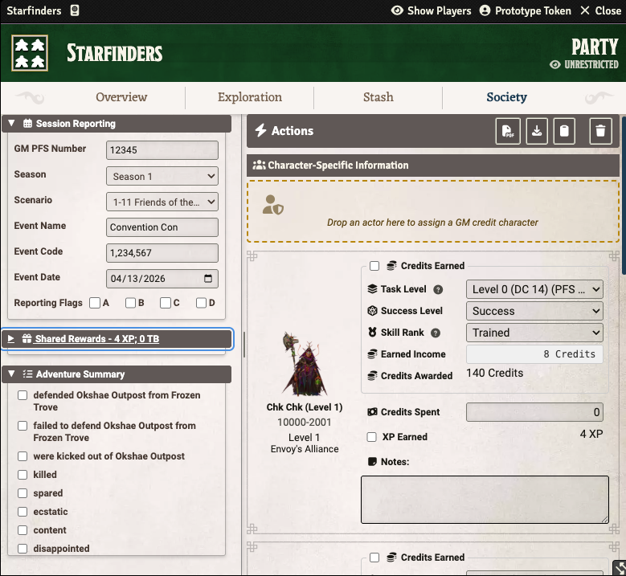

<div align="center">

# Pathfinder & Starfinder Society Chronicle Generator

### Generate chronicles for your entire party with one click

*A Foundry VTT module that streamlines chronicle generation for Pathfinder Society and Starfinder Society GMs*

*Written with AI assistance. See below for a statement about the use of AI in this project*


[](https://sonarcloud.io/summary/new_code?id=scooper4711_pfs-chronicle-generator)
[](https://sonarcloud.io/summary/new_code?id=scooper4711_pfs-chronicle-generator)
[](https://sonarcloud.io/summary/new_code?id=scooper4711_pfs-chronicle-generator)


---

</div>

## 📦 Installation

### Method 1: Install from Foundry VTT (Recommended)

1. Open Foundry VTT and navigate to the **Add-on Modules** tab
2. Click **Install Module**
3. Search for "Pathfinder Society Chronicle Generator"
4. Click **Install**

### Method 2: Install via Manifest URL

1. Open Foundry VTT and navigate to the **Add-on Modules** tab
2. Click **Install Module**
3. Paste the following manifest URL into the field at the bottom:
   ```
   https://github.com/scooper4711/pfs-chronicle-generator/releases/latest/download/module.json
   ```
4. Click **Install**

> The manifest URL always points to the latest release, so Foundry VTT can automatically check for updates.

### Requirements

- **Foundry VTT**: Version 13 or 14
- **Game System**: Pathfinder 2e (PF2e) or Starfinder 2e (SF2e or PF2e with [SF2e Anachronism](https://foundryvtt.com/packages/sf2e-anachronism))

---

## ✨ Features

<table>
<tr>
<td width="50%">

**🎯 Party Chronicle Generation**

Fill out one form for the entire party easily from the party sheet

</td>
<td width="50%">

**🧮 Automatic Calculations**

Treasure bundles, earned income, and reputation calculated automatically

</td>
</tr>
<tr>
<td width="50%">

**🎲 Smart Defaults**

Detects Bounties, Quests, and Scenarios and sets appropriate defaults

</td>
<td width="50%">

**📋 Starfinder Society Support**

Automatically detects if you're running Starfinder and updates the
display and rules to Starfinder Society.

</td>
</tr>
<tr>
<td width="50%">

**🧑‍💼 GM Credit Character**

Drag and drop your GM character to generate a chronicle and include it in session reporting

</td>
<td width="50%">

**📥 Player Downloads**

Players download chronicles directly from their character sheets

</td>
</tr>
<tr>
<td width="50%">

**🌐 Session Reporting**

Copy session data to your clipboard and use the [PFS Session Reporter](https://chromewebstore.google.com/detail/pfs-session-reporter/mhfkjabbfmolcpaimeanfajgfjinopmn) browser extension to auto-fill the Paizo reporting form

</td>
<td width="50%">

**📋 Pre-configured Layouts**

Includes layouts for many PFS and SFS scenarios - just select and go

</td>
</tr>
</table>

---

## 🚀 Quick Start for GMs

> **Step-by-step guide to generating chronicles for your party**

### 1️⃣ Make sure the players fill in their PFS ids on their character sheet

The Chronicle Generation process uses that information when filling out the chronicle.

### 2️⃣ Open the Party Sheet

Open your party sheet and click on the **Society** tab.


### 3️⃣ Select Your Chronicle Layout

The module includes pre-configured layouts for many scenarios. When you select a scenario from the dropdown, the appropriate chronicle PDF is automatically selected.

If your scenario isn't in the list, you can:
- Browse for a chronicle PDF manually using the file picker

### 4️⃣ Fill Out the Form

The form has several sections:

<table>
<tr>
<td width="50%" valign="top">

**📝 Event Information**

- GM PFS Number
- Season
- Scenario Name (e.g., "5-03: Heidmarch Heist")
- Event Code
- Event Date

</td>
<td width="50%" valign="top">


</td>
</tr>

<tr>
<td width="50%" valign="top">

**💰 Rewards** (automatically calculated based on scenario type)

- XP Earned
- Treasure Bundles
- Downtime Days

</td>
<td width="50%" valign="top">


</td>
</tr>

<tr>
<td width="50%" valign="top">

**⭐ Reputation** (automatically calculated)

- Base reputation for the player's chosen faction
- Bonus reputation for completing faction specific goals

</td>
<td width="50%" valign="top">


</td>
</tr>

<tr>
<td width="50%" valign="top">

**👤 Character-Specific Information**

- Society ID (entered on the Actor sheet)
- Level (entered on the Actor sheet)
- Earned Income (automatically calculated based on downtime activities)
- Gold Spent (optional)
- Notes (optional)

</td>
<td width="50%" valign="top">


</td>
</tr>

<tr>
<td width="50%" valign="top">

**✅ Adventure Summary**

- Fill in the checkboxes from the adventure summary to track what the party accomplished
- Only displayed if there are checkboxes to fill in
- Uses the lead text immediately following the checkbox

</td>
<td width="50%" valign="top">


</td>
</tr>

<tr>
<td width="50%" valign="top">

**❌ Items to Strike Out**

- Black out the items from the higher level tier if running on the lower level
- Black out items not encountered
- Only displayed if there are items that can be struck out
- Uses the text of the item on the form

</td>
<td width="50%" valign="top">


</td>
</tr>
</table>

### 5️⃣ Generate Chronicles

Click the **Generate Chronicles** button. The module will:
- ✅ Validate all required fields
- 📄 Generate a PDF chronicle for each party member
- 📎 Attach the chronicles to each character sheet


### 6️⃣ Players Download Their Chronicles

Players can now open their character sheets, go to the **PFS** tab, and click **Download Chronicle** to get their PDF.


---

## 🚀 Starfinder Society Support

> **The module automatically detects whether you're running Pathfinder or Starfinder and adapts accordingly**

The module works with both the native SF2e system and the sf2e-anachronism compatibility module. When running Starfinder, the following differences apply:

| Feature | Pathfinder | Starfinder |
|---------|-----------|------------|
| **Currency** | Gold pieces (gp) | Credits |
| **Treasure** | Treasure bundles → gp by level | Flat Credits Awarded by level |
| **XP** | 1 (Bounty), 2 (Quest), or 4 (Scenario) | Always 4 (scenarios only) |
| **Downtime** | Varies by scenario type | Always 8 days |
| **Earned Income** | Standard PF2e table | Standard SF2e table |
| **Reputation** | Per-faction tracking | Hidden (not used in SFS) |
| **Season Filtering** | Shows only PFS seasons | Shows only SFS seasons |

No configuration is needed — the module reads `game.system.id` at runtime and adjusts all labels, calculations, and UI elements automatically.



---

## 🧮 Automatic Calculations

> **Save time with built-in calculators**

### 💎 Treasure Bundles → Gold (Pathfinder) / Credits Awarded (Starfinder)

In Pathfinder, treasure bundles are automatically converted to gold based on each character's level, following the official PFS guidelines.

In Starfinder, each character receives a flat Credits Awarded amount based on their level — no treasure bundle input needed.

### 💰 Earned Income

When players use downtime days to Earn Income:
1. Select the task level (usually character level - 2)
2. Select the success level (Critical Success, Success, Failure, Critical Failure)
3. Select proficiency rank (Trained, Expert, Master, Legendary)

The module automatically calculates the gold (Pathfinder) or Credits (Starfinder) earned based on these selections and the number of downtime days. Starfinder values are 10× the Pathfinder table, rounded up to whole Credits.

### ⭐ Reputation (Pathfinder only)

Enter the reputation values for each faction, and the module will format them correctly on the chronicle. You can also select which faction gets the bonus reputation from the scenario. The reputation section is hidden when running Starfinder.

---

## 🎲 Scenario Types

> **Smart defaults based on scenario type**

### Pathfinder Society

| Type | XP | Treasure Bundles | Downtime Days | Reputation |
|------|:--:|:----------------:|:-------------:|:----------:|
| **Bounty** | 1 | 2 | 0 | 1 |
| **Quest** | 2 | 4 | 4 | 2 |
| **Scenario** | 4 | 8 | 8 | 4 |

> The module detects the type from the scenario name: names starting with "B" followed by a number are Bounties, "Q" followed by a number are Quests, and everything else defaults to Scenario.

### Starfinder Society

| Type | XP | Credits Awarded | Downtime Days |
|------|:--:|:---------------:|:-------------:|
| **Scenario** | 4 | By character level | 8 |

> Starfinder Society has only scenarios — no bounties or quests. Credits Awarded is a flat amount determined by each character's level (see the [Starfinder Society Guide](https://paizo.com) for the full table).

---

## 🧑‍💼 GM Credit Character

> **Generate a chronicle for your own character as GM**

If you're running a session for GM credit, you can include your own character in the chronicle generation and session reporting workflow.

### How to assign a GM character

1. Open the party sheet's **Society** tab
2. At the top of the character list, you'll see a **GM Character Drop Zone**
3. Drag and drop your character actor from the sidebar onto the drop zone
4. Your character appears with a "GM Credit" label, visually distinct from the party members

### What the GM character gets

- All the same data entry fields as party members (task level, success level, proficiency rank, earned income, gold spent, notes)
- Shared reward settings (XP, treasure bundles, downtime, reputation) applied automatically
- A filled chronicle PDF included in the generated zip alongside party member chronicles
- The chronicle saved to the actor's flags so you can download it from the character sheet

### Session reporting

When you click **Copy Session Report**, the GM character is included in the `signUps` array with `isGM: true`. The [PFS Session Reporter](https://chromewebstore.google.com/detail/pfs-session-reporter/mhfkjabbfmolcpaimeanfajgfjinopmn) browser extension uses this flag to populate the GM credit fields on the Paizo reporting form automatically.

### PFS ID validation

The module validates that your GM character's PFS ID (from the actor sheet) matches the GM PFS Number entered in the session info section. If they don't match, you'll see a validation error before generating chronicles or copying the session report.

### Managing the GM character

- To clear the assignment, click the **clear** button on the GM character section
- To replace it, drag a different character onto the section
- The assignment persists across form reloads — no need to re-assign each time
- The **Clear Data** button removes the GM character along with all other form data

### Restrictions

- Only character actors are accepted (not familiars, NPCs, or vehicles)
- The GM character cannot be an actor that is already in the party member list

---

## 💡 Tips and Tricks

### 📂 Collapsible Sections

Click on section headers to collapse/expand them. This makes it easier to focus on one section at a time.

### 💾 Auto-Save

The form automatically saves as you type, so you won't lose your work if you accidentally close the tab.

### 🔄 Clear Button

The **Clear** button resets the form but preserves:
- GM PFS Number
- Scenario Name
- Event Code
- Chronicle Path
- Season and Layout selections

It also sets smart defaults based on the scenario type (Bounty, Quest, or Scenario).

### 🖼️ Portrait Clicks

Click on a character's portrait to open their character sheet.

---

## 👥 For Players

### 📥 Viewing Your Chronicle

1. Open your character sheet
2. Go to the **PFS** tab
3. Click **Download Chronicle** to save the PDF

### 🗑️ Deleting a Chronicle

If the GM needs to regenerate your chronicle (for example, if there was an error), they can click the **Delete Chronicle** button on your character sheet's PFS tab. This will remove the old chronicle so a new one can be generated.

---

## 🔧 Troubleshooting

### Displaying Starfinder version but you want Pathfinder

PFS/SFS Chronicle generator will display the Starfinder version if you are running with the Starfinder System
or if you have the module Starfinder Anachronisims active in your Pathfinder system. If you want to display
Pathfinder Society version of this module, deactivate the Starfinder Anachronisms module.

### ⚠️ "Blank chronicle PDF path is not set"

Make sure you've selected a layout with official module support, or browsed for a chronicle PDF using the file picker.

### ❌ "Validation failed"

Check that all required fields are filled out:
- GM PFS Number
- Scenario Name
- Event Code
- Event Date
- Character Name (for each character)
- Society ID (for each character)
- Level (for each character)

### 🚫 Chronicles not generating

1. Check the browser console (F12) for error messages
2. Make sure the chronicle PDF file exists and is accessible
3. Try using a different layout to see if it's a layout-specific issue

---

## 🤝 Contributing

We welcome contributions! If you want to add a new layout or fix a bug, please see the [CONTRIBUTING.md](CONTRIBUTING.md) file for development setup, testing, and code quality standards.

---

## 🦾 Regarding the use of AI:

I used AI as a coding assistant while building this. I'm a software engineer with over 35 years of professional experience. I could have written every line myself, but AI let me move faster. I drove the architecture and design decisions, followed industry best practices for code quality, and made sure everything is human-readable and maintainable. I have SonarCloud.io quality gates which must be met prior to releasing a new version.

If you don't want to use tools written by AI, then I respect that decsion. That's why I'm transparent about it. You can make up your own mind.

---

## 🙏 Acknowledgments

Thank you to GreyWolf and TMK - for your beta testing and excellent input on features and functionality. Without you two, this module would never have seen the light of day!

Thank you to [SonarCloud](https://sonarcloud.io) for helping the open source community by making their product free for open source projects like mine.

Special thanks to [razanur37's PFS Chronicle Filler](https://razanur37.github.io/pfscf/) for inspiration and the foundation this module was built upon. The layout file format and the concept of how to do automated chronicle generation came from that project.

---

## 📄 License

This module is licensed under the MIT License.

---

## ⚖️ Community Use Policy

This FoundryVTT Module (PFS Chronicle Generator) uses trademarks and/or copyrights owned by Paizo Inc., used under Paizo's Community Use Policy (paizo.com/licenses/communityuse). We are expressly prohibited from charging you to use or access this content. PFS Chronicle Generator is not published, endorsed, or specifically approved by Paizo. For more information about Paizo Inc. and Paizo products, visit paizo.com.
