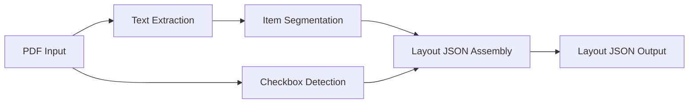
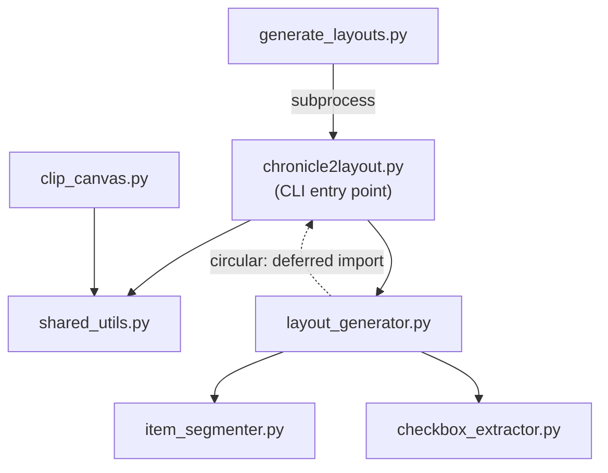

# chronicle2layout Architecture

## Purpose

`chronicle2layout` converts Pathfinder Society PDF chronicle sheets into layout JSON files. These JSON files describe where form fields, items, and checkboxes are positioned on the PDF, enabling the PFS Chronicle Generator Foundry VTT module to render filled chronicles.

## Processing Pipeline

The core pipeline transforms a PDF into a layout JSON through four stages:



1. **Text Extraction** (`chronicle2layout.py`) — Opens the PDF, resolves the extraction region, groups words into lines by y-coordinate proximity, and returns percentage-based coordinates.

2. **Checkbox Detection** (`checkbox_extractor.py`) — Scans PDF text for checkbox Unicode characters (□, ☐, ☑, ☒) and extracts associated labels by reading subsequent words.

3. **Item Segmentation** (`item_segmenter.py`) — Streams tokens across extracted text lines, tracking parenthesis depth to determine where one item ends and the next begins.

4. **Layout JSON Assembly** (`layout_generator.py`) — Combines items and checkboxes into the final layout structure with parameters, presets, and content entries.

## Module Roles

### Core Pipeline

| Module | Role |
|--------|------|
| `chronicle2layout.py` | CLI entry point. Parses arguments, extracts text lines from PDF regions, orchestrates layout generation. |
| `layout_generator.py` | Assembles the final layout JSON from extracted items and checkboxes. Calls item segmenter and checkbox extractor. |
| `item_segmenter.py` | Splits extracted text lines into individual item entries using parenthesis-based heuristics. |
| `checkbox_extractor.py` | Detects checkbox characters in PDF text and extracts their labels. |
| `shared_utils.py` | Single source of truth for layout file resolution, canvas coordinate transforms, and PDF image rendering. |

### Utilities

| Module | Role |
|--------|------|
| `clip_canvas.py` | Clips a canvas region from a PDF and saves it as PNG. Useful for debugging canvas coordinates. |
| `generate_layouts.py` | Batch processes chronicles across multiple seasons, invoking `chronicle2layout.py` as a subprocess for each PDF. |

## Dependency Flow



Note: `layout_generator.py` imports `extract_text_lines` from `chronicle2layout.py` using a deferred import inside `generate_layout_json()` to avoid a circular dependency.

## Key Concepts

### Canvases

A **canvas** is a named rectangular region within a layout, defined as percentage coordinates of its parent canvas (or the full page). Canvases form a hierarchy — the `items` canvas might be nested inside a `main` canvas.

`transform_canvas_coordinates()` in `shared_utils.py` resolves the parent chain to produce absolute page-level percentages.

### Coordinate Systems

Two coordinate systems are used:

- **Absolute (PDF points)** — Raw coordinates from PyMuPDF text extraction. Origin at top-left of the page.
- **Percentage-based** — Coordinates as percentages of a region (canvas) or the full page. Used in layout JSON output and for cross-PDF compatibility.

Text extraction converts from absolute to percentage-based coordinates relative to the extraction region. The layout JSON stores all positions as percentages.

### Layout JSON Structure

```json
{
  "id": "pfs2.s6-07",
  "description": "6-07 Rotten Apples",
  "parent": "pfs2.season6",
  "defaultChronicleLocation": "modules/.../chronicle.pdf",
  "parameters": { },
  "presets": { },
  "content": [ ]
}
```

- **parameters** — Define user-facing choices (which items to strike out, which checkboxes to check)
- **presets** — Named coordinate sets reused across content entries
- **content** — Rendering instructions that reference parameters and presets

## CLI Interface

```
chronicle2layout.py <pdf> [options]
```

The CLI reads a single PDF, extracts items and checkboxes, and outputs layout JSON. Region coordinates are resolved in order: `--region` argument → parent layout canvas lookup → built-in defaults.

See `README.md` for full usage examples.

## Tools Directory

The `tools/` directory contains Season 4-specific scripts:

| Script | Purpose |
|--------|---------|
| `extract_season4_canvases.py` | Renders PDF pages and extracts canvas region images for manual inspection. |
| `extract_season4_content.py` | Detects grey form-field boxes and extracts text content from Season 4 chronicles. |
| `build_season4_layout.py` | Assembles a Season 4 layout JSON from `season4_template.json` and extracted content. |
| `season4_template.json` | Template data structure for Season 4 layout generation. |

These tools import shared functions (`render_page_to_image`, `words_positions`, `find_grey_boxes`) from `shared_utils.py`.
